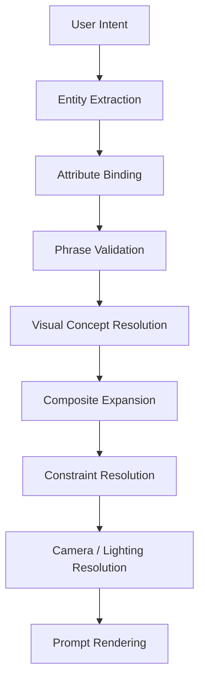

# SD Prompt Studio design documentation

SD Prompt Studio is not a tag concatenator. It is designed as a **Visual Concept Compiler** that converts user intent into a model-oriented visual concept graph, resolves constraints and relations, and only then renders a prompt.

The compiler preserves learned phrases, distinguishes human meaning from observed model behavior, and treats axes, components, and constraints as an intermediate representation—not as claims about a model's internal implementation.

## Reading order

1. [Visual Concept Compiler](architecture/Visual_Concept_Compiler.md): architecture, resolver flow, design principles, and concept graph.
2. [Concept Dictionary](dictionary/Concept_Dictionary.md): dictionary records, concept types, state affinity, evidence, and expansion rules.
3. Engine specifications:
   - [Human Engine](engines/Human_Engine.md)
   - [Hair Engine](engines/Hair_Engine.md)
   - [Pose Engine](engines/Pose_Engine.md)
   - [Camera Engine](engines/Camera_Engine.md)
   - [Lighting Engine](engines/Lighting_Engine.md)
   - [Object Engine](engines/Object_Engine.md)
   - [Relation Engine](engines/Relation_Engine.md)
4. [PromptNode types](schemas/PromptNode.ts): TypeScript intermediate-representation proposal.
5. Research evidence:
   - [Research Log](research/Research_Log.md)
   - [Pose Research](research/Pose_Research.md)
   - [Camera Research](research/Camera_Research.md)
   - [Lighting Research](research/Lighting_Research.md)
   - [Relation Research](research/Relation_Research.md)
6. Research Explorer:
   - [Architecture](research/research-explorer-design.md)
   - [Frontend UI Contract](research/research-explorer-ui-design.md)
   - [Integration Validation](research/research-explorer-integration-validation.md)
7. Team development:
   - [Operating Model](team/00-operating-model.md)
   - [Architect Team Charter](team/01-architect-team-charter.md)
   - [Backend Implementer Charter](team/02-backend-implementer-charter.md)
   - [Frontend Implementer Charter](team/03-frontend-implementer-charter.md)
   - [Worker Charter](team/04-worker-charter.md)
   - [Worktree and Branch Rules](team/05-worktree-and-branch-rules.md)
   - [Handoff Template](team/06-handoff-template.md)
   - [Task Assignment Template](team/07-task-assignment-template.md)
   - [Integrated Lead Charter](team/08-integrated-lead-charter.md)
   - [Development Routing Contract](team/09-development-routing-contract.md)
   - [Research Operations Routing Contract](team/10-research-operations-routing-contract.md)
   - [Delegation and Result Contract](team/11-delegation-and-result-contract.md)
   - [Integrated Completion Report Template](team/12-integrated-completion-report-template.md)

## Status vocabulary

The source material mixes observations, hypotheses, design decisions, and future work. These documents keep them separate:

| Label | Meaning |
|---|---|
| **Specification** | Current compiler-side design decision. It can be implemented without claiming model universality. |
| **Observed** | Result recorded in the supplied experiments. It remains checkpoint/context dependent. |
| **Hypothesis** | Interpretation that still needs confirmation or counterexamples. |
| **Unverified** | Candidate or behavior not sufficiently tested. |
| **Superseded** | Historical interpretation retained for traceability but replaced by later evidence. |

## Source and precedence

Primary source: `SD_Prompt_Studio_完全統合引継ぎ資料_v5.1_原文保持版.txt`, dated 2026-07-14. It contains the v3.0 Part4–Part5 report followed by a Part6 v5.1 addendum. Where statements conflict, the source explicitly makes the Part6 addendum authoritative. Superseded conclusions remain in the research documents rather than being silently removed.

Existing experimental documents in this repository remain useful supporting material. In particular, [Smart Prompt Engine Draft](Smart_Prompt_Engine_Design_Draft.md), [Tag Role Model](Tag_Role_Model.md), [Prompt Experiment Log](Prompt_Experiment_Log.md), [Prompt Expansion](prompt-expansion.md), and [Prompt Ordering](prompt-ordering.md) are not overwritten by this reorganization.

## Scope boundary

These are design documents and proposed schemas. They do not assert that the current application already implements every resolver. Model/checkpoint dependence, sample size, activation variance, and unverified behavior must remain visible when rules are promoted into runtime data.
