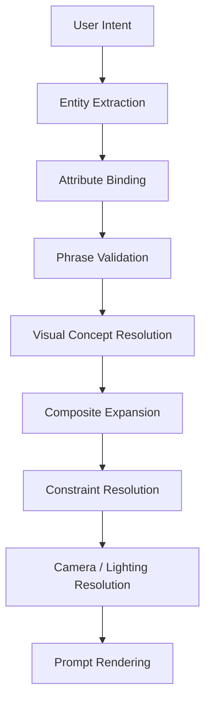
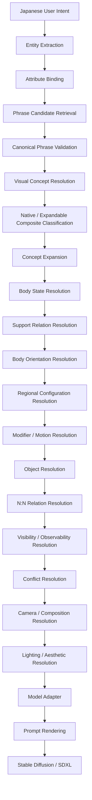
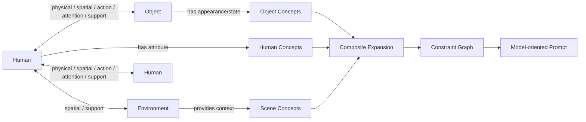

# Visual Concept Compiler

## Purpose

The compiler turns human intent into a resolvable visual scene rather than merely recommending or sorting tags. Its output must preserve entities, attribute ownership, learned phrases, component structure, support and visibility requirements, relations, conflicts, and known cross-domain effects.

The earlier **Prompt Compiler / Constraint Solver** framing remains part of the history, but Part6 expands the current architecture to a **Visual Concept Graph Compiler / Visual Scene Compiler**:

```text
Visual Scene Compiler
= Entity Resolver
+ Visual Concept Resolver
+ Concept Expander
+ Constraint Solver
+ Relation Graph Resolver
+ Model Adapter
+ Prompt Renderer
```

## Normative high-level flow



The detailed resolver flow is:



The short flow is normative at subsystem boundaries. The detailed flow defines the current recommended ordering within those boundaries.

## Design principles

### Preserve phrases

The minimum semantic unit is a learned phrase, not an isolated word. `silver hair`, `bob cut`, `twin braids`, `braided ponytail`, `silver undercut`, and `reaching toward viewer` must not be split merely because they contain multiple tokens. Native composites remain intact unless evidence supports an expandable representation.

The working hypothesis is that Stable Diffusion models rely substantially on learned phrases, proximity, and co-occurrence clusters rather than ordinary grammar alone.

### Separate domain from role

`domain` answers what a concept concerns, such as hair, camera, pose, lighting, or quality. `role` answers how it acts in the prompt, such as core, attribute, structure, state, constraint, modifier, effect, relation, interaction, or composite.

Examples:

- `full body`: camera domain; framing/visibility structure role.
- `standing`: pose domain; body-state constraint role.
- `masterpiece`: quality/aesthetic domain; global aesthetic effect role.

### Separate resolver order from rendered order

The compiler must resolve required regions, body state, support, orientation, camera, conflicts, and cross-domain effects before rendering a string. Prompt position can influence activation, but string ordering cannot substitute for semantic resolution.

### Resolve constraints before effects

State and visibility constraints outrank aesthetic effects. For example, `standing` can hold a full-body pose against the floor-pose bias observed with `masterpiece`. Conversely, an unobservable state must not be reported as visually proven: `standing + upper body` may be semantically valid while the legs and feet that would prove standing remain outside the frame.

### Derive camera from visual requirements

Camera is not a decoration appended at the end. Outfit, pose, interaction, and hair may impose visibility or spatial requirements. `black boots` requires lower legs and feet; `standing` forbids resolving that requirement by sitting; `upper body` hides the evidence. A compatible solution may require `full body`.

### Keep axes orthogonal where evidence supports it

Framing, horizontal angle, vertical angle, roll, focus target, crop/visibility, composition, subject placement, viewer relation, and body orientation are separate concepts even when one phrase affects several of them. `front view + from above` demonstrates that horizontal and vertical camera angles can combine.

### Treat axes and components as compiler abstractions

Do not claim that an `Axis`, `Component`, or `Constraint` object literally exists inside a model. These structures are an intermediate representation for observed generation behavior.

### Investigate top-down

Research representative phrases, sample neighboring phrases into the emerging structure, and deeply investigate only exceptions. Stop when a phrase fits the existing structure, compiler handling is determined, and behavior matches the representative. Continue when it leaks strongly into another axis, changes with ordering, activates only in combination, misses its expected range, or changes unrelated domains.

## Concept graph



Entities are nodes. Relations are directed or undirected edges. Concepts can expand into required and optional components. The graph must support multiple humans, objects, and environment regions with N:N relations.

## Resolution model

### Entity and attribute binding

Scene-wide tag bags are insufficient for multiple subjects. Each human and object owns an attribute bundle. A relation references explicit source, target, and optionally an object or environment node.

### Composite handling

- `native_composite`: keep the canonical phrase because decomposition does not reproduce the learned visual cluster. Examples include `twin braids` and the seated cluster observed for `legs crossed`.
- `expandable_composite`: retain the user-facing concept while expanding into model-oriented components when the completed phrase is weak. The open-leg forward fold is the primary verified design example.
- `exception`: preserve the phrase and its known multi-axis behavior; do not force it into a pure axis. Examples include `worm eye view`, `knee shot`, and `bust shot`.

### Visibility and observability

The resolver tracks required, preferred, forbidden, and evidence regions. It must resolve three separate questions:

1. **Semantic validity**: whether the concept is structurally valid after state, support, orientation, and conflict resolution.
2. **Visual observability**: whether the selected framing can show the regions needed to observe the concept.
3. **Evidence strength**: whether the visible regions provide enough information to verify that the concept or state is present.

For `standing + upper body`, standing is semantically valid but visual observability is low because its evidence regions—especially legs and feet—are outside the frame. The resolver must not convert missing visual evidence into a semantic conflict or report the state as visually proven.

Unresolved visibility can suppress a requested concept or transfer an attribute. In the recorded `upper body + standing + black boots` case, boots disappeared and black transferred to waist/skirt/pants; `full body + standing + black boots` allowed all elements.

### Conflict and fallback

Conflicts include same-axis exclusions, incompatible states, visibility impossibility, relation ownership ambiguity, and cross-domain pressure. The compiler may warn, suppress, choose a compatible framing, or use a documented fallback. It must not invent `contains` relationships or expansion components without validated dictionary evidence.

### Camera, lighting, and aesthetic effects

Camera creates the visible/spatial solution. Lighting and aesthetic phrases can alter subject scale, scene structure, pose, and composition; therefore they are resolved after core constraints but before rendering. `soft lighting` has a portrait/large-subject bias; `studio lighting` may expand a wide scene into visible studio/stage structure. `masterpiece` is treated as a strong aesthetic composition/pose effect, not a pure quality token.

## Rendered prompt order

The current provisional string order is:

1. detail/resolution cluster;
2. subject/species;
3. appearance;
4. hair;
5. face/eyes;
6. outfit;
7. body state;
8. body orientation;
9. limb pose;
10. interaction;
11. camera framing;
12. camera horizontal angle;
13. camera vertical angle;
14. composition/focus/crop;
15. background/location;
16. lighting;
17. evaluation/aesthetic cluster;
18. effects.

`masterpiece` and `best quality` should not default to the front. `soft lighting` is not assumed harmless. This order remains provisional and does not replace the resolver.

## Compatibility requirements

Implementation must preserve canonical phrase IDs, explicit user selections, weights, character/scene ownership, prompt-group ordering, model strategies, and `BREAK` behavior. Engine-added nodes must retain provenance so Preview can distinguish selected, expanded, suppressed, and rendered concepts.

## Open work

- Bridge/wheel pose with explicit supine orientation.
- Split direction alternatives, knees-up/chest, cross-legged/lotus, handstand, high kick, cartwheel, representative gymnastics/yoga, bicycle, motorcycle, and horse riding.
- Object/equipment catalog, then lighting and effects.
- Auto Research Assistant and Japanese scene compilation.
- More complex multi-subject relations, including precise gaze and subtle expression assignment.
