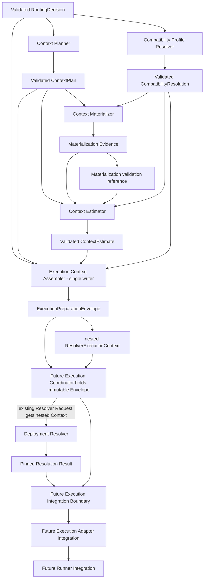

# Context Planning and Execution Context Assembly Architecture

Status: Design review candidate

Task: `ARCH-CONTEXT-ASSEMBLY-DESIGN-001`

Canonical assignment: [GitHub Issue #131](https://github.com/whatrune/sd-prompt-studio/issues/131)

Target logical architecture: `context_planning_execution_context_assembly_v1`

Implementation: not included

## 1. Purpose

This document defines the architecture between a validated Model Routing Decision and the existing Deployment Resolver `ResolverExecutionContext`, plus the immutable outer boundary that preserves requirements not represented by that existing type through later execution integration.

It separates four decisions that must not be conflated:

1. which context is required, optional, or forbidden;
2. how the exact execution input capacity requirement is estimated;
3. which approved execution-environment profiles satisfy the routed requirements;
4. how those independently validated results are assembled without reinterpretation.

The result is one fail-closed creation boundary for `ExecutionPreparationEnvelope` and its nested `ResolverExecutionContext`. The Envelope preserves security, validation, latency, provenance, and materialization references while the unchanged nested Context carries only the existing Resolver requirements. The design prevents Context Planning, cost optimization, compatibility mapping, assembly, or downstream correlation from selecting a provider, model, deployment, Binding, priority, or fallback.

## 2. Normative sources and precedence

This architecture is subordinate to:

1. [AI Model Routing Policy Design](12-model-routing-policy.md)
2. [Automation Response Policy Design](13-response-policy.md)
3. [Deployment Binding Policy](14-deployment-binding-policy.md)
4. [Deployment Binding Schema Design](15-deployment-binding-schema-design.md)
5. [Binding Set Semantic Validation Policy](16-binding-set-semantic-validation-policy.md)
6. [Deployment Resolver Design](17-deployment-resolver-design.md)
7. [AI Model Routing and Response Policy Architecture](18-model-routing-response-architecture.md)
8. Model Routing contract and implementation under `src/model-routing/`
9. Deployment Resolver contract and implementation under `src/deployment-resolver/`
10. [Delegation and Result Contract](../team/11-delegation-and-result-contract.md)
11. [Repository working rules](../../AGENTS.md)

PR #126 defines the upstream architecture. PR #128 defines the frozen Model Routing types. PR #130 implements the pure Model Router. PR #122 defines the Resolver types, and PR #124 implements the Resolver core.

The implemented `RoutingDecision` and `ResolverExecutionContext` types are fixed inputs to this design. This document does not add fields to, remove fields from, or reinterpret either type.

If a conflict exists, the existing frozen contract remains authoritative and this design returns to Backend Architect review. Components must not repair a conflict by choosing the most permissive interpretation.

## 3. Scope

This design defines:

- Context Planner responsibility and logical output;
- the separate Context Materialization boundary required before estimation;
- Context Estimator responsibility and logical output;
- Compatibility Profile Resolver responsibility and logical output;
- the single Execution Context Assembler and `ExecutionPreparationEnvelope` boundary;
- immutable carry-through of non-projected requirements across Resolver processing;
- cross-input identity, validation, immutability, and provenance requirements;
- failure, security, cost, audit, and reproducibility behavior;
- future implementation split and acceptance-test design.

## 4. Non-goals

This design does not:

- implement a Context Planner, Context Loader, tokenizer, estimator, profile resolver, or assembler;
- change Model Router, Deployment Resolver, Execution Adapter, Dispatcher, Runner, Workflow, API, CLI, or Schema;
- load repository files, GitHub records, URLs, or Research Artifacts;
- define an execution prompt or model invocation payload;
- choose a provider, model family, model version, deployment, Binding, priority, or fallback;
- query runtime health, availability, pricing, usage, rate limits, or credentials;
- add a Result Status, persistent Artifact, Receipt, database, registry, hash, or retention contract;
- change Role, Task scope, Tier, reasoning level, security, validation, or approval authority;
- change Existing Run, Observation, Evidence, Claim, or Research Artifact data.

## 5. Architecture decisions

### 5.1 Single writer for execution preparation

Only Execution Context Assembler creates `ExecutionPreparationEnvelope`. The same Assembler is the only component that creates the Envelope's nested `resolver_execution_context` value.

The following components must not create it:

- Model Router;
- Context Planner;
- Context Materializer or Loader;
- Context Estimator;
- Compatibility Profile Resolver;
- Deployment Resolver.

No other component may complete, modify, extend, or repair either value. This prevents multiple creation paths from applying different defaults, dropping non-projected requirements, or weakening different requirements.

### 5.2 Existing Routing Decision remains authoritative

The implemented `RoutingDecision` already contains:

- `context_policy_ref`;
- `required_context_refs`;
- `optional_context_refs`;
- `forbidden_context_categories`;
- `required_tool_profile_refs`;
- `required_structured_output_profile_refs`;
- `response_profile_ref`;
- `latency_policy_ref`;
- `cost_policy_ref`;
- `security_policy_refs`;
- `validation_policy_ref`.

Context Planner applies these values. It does not generate a replacement `context_policy_ref`, add new required context, or remove a required or forbidden entry.

### 5.3 Context requirement and context acquisition are separate

Context Planner defines a deterministic plan. It does not read the sources. A separately approved Context Materializer resolves and loads the exact permitted sources and produces trusted materialization evidence.

Context Estimator operates on an exact materialized input description, not on unresolved paths or estimated file counts. Estimation without materialization evidence is not acceptable for final assembly.

### 5.4 Compatibility does not mean Deployment selection

Compatibility Profile Resolver maps approved logical requirements to exact execution-environment profile references. It does not inspect Binding candidates or Provider availability and does not select a Deployment.

### 5.5 Assembly is validation and projection, not inference

Assembler verifies identity and cross-object consistency, projects authoritative values into the existing `ResolverExecutionContext`, and wraps that value with non-projected requirements and provenance in one `ExecutionPreparationEnvelope`. It has no defaulting, upgrade, downgrade, repair, or selection authority.

### 5.6 Materialization visibility uses ContextEstimate binding

This architecture selects review Option B. `ContextEstimate` must contain:

- `resolution_scope_ref`;
- `materialization_profile_ref`;
- `materialization_validation_ref`.

Assembler receives no Materialization content and performs no Evidence Store, Repository, file, or URL access. It verifies exact reference, identity, profile, and scope equality using the validated `ContextEstimate` and `CompatibilityResolution`. Missing proof or mismatch is `blocked`; no profile is inferred or defaulted.

### 5.7 Non-projected requirements use an outer Envelope

`security_policy_refs`, `validation_policy_ref`, and `latency_policy_ref` are not added to the frozen `ResolverExecutionContext`. Assembler instead preserves them in `ExecutionPreparationEnvelope`. A future Execution Coordinator holds the Envelope unchanged while passing only its nested Context in the existing Resolver Request, then correlates the same Envelope with the pinned Resolution Result for future Adapter and Runner integration.

## 6. End-to-end flow

The diagram describes validated data flow. It does not grant any component authority held by another component.

## 7. Common preconditions and identity

All five components in this architecture consume validated inputs appropriate to their boundary. They do not repeat upstream admission or Role classification.

Every intermediate result must be traceable to:

- exact `task_id`;
- exact `assignment_revision`;
- exact `routing_contract_version`;
- one validated Routing Decision revision or immutable reference;
- component contract or implementation version;
- trusted caller-supplied evaluation timestamp where time validity applies;
- exact policy and profile references used by that component.

An intermediate result from another Task, Assignment revision, routing contract, or Routing Decision must be rejected. Equality is exact; suffix, path, timestamp, or conversation inference is forbidden.

This design does not define a new hash or persistent identity format. Future structural contracts must choose immutable references without changing existing Model Routing or Resolver fields.

## 8. Context Planner

### 8.1 Responsibility

Context Planner converts one validated `RoutingDecision` into one deterministic `ContextPlan`.

It performs:

- exact binding to the Routing Decision identity;
- exact application of `context_policy_ref`;
- preservation of all required context references;
- deterministic selection or exclusion of optional context under the referenced policy;
- preservation of every forbidden context category;
- definition of canonical context ordering and rendering-policy references;
- production of reviewable rule and provenance references.

It does not:

- load or inspect source content;
- discover additional repository files or URLs;
- calculate tokens or bytes;
- change Tier, reasoning, capability floor, response profile, tool requirements, structured-output requirements, security, or validation;
- remove required context to meet cost, latency, or capacity;
- add an unapproved source;
- select a provider, model, Deployment, Binding, or execution environment.

### 8.2 Logical ContextPlan model

`ContextPlan` is a logical design model, not a new persistent Schema.

| Field | Meaning |
| --- | --- |
| `context_plan_contract_version` | Exact supported planner contract |
| `context_plan_ref` | Immutable reference to this Plan and its inputs |
| `task_id` | Exact Routing Decision Task identity |
| `assignment_revision` | Exact Routing Decision Assignment revision |
| `routing_contract_version` | Exact Routing Decision contract version |
| `routing_decision_ref` | Immutable reference to the evaluated Decision |
| `context_policy_ref` | Exact value copied from Routing Decision |
| `required_context_refs` | Exact complete required set copied from Routing Decision |
| `included_optional_context_refs` | Deterministically selected subset of routed optional references |
| `excluded_optional_context_refs` | Remaining routed optional references with applied rule evidence |
| `forbidden_context_categories` | Exact complete set copied from Routing Decision |
| `context_order` | Duplicate-free complete permutation of required and included optional references |
| `context_rendering_profile_ref` | Approved framing/serialization profile, not a model identity |
| `materialization_policy_ref` | Approved source-resolution and containment policy |
| `applied_rule_refs` | Stable rules used for optional selection and ordering |
| `planner_version` | Exact planner implementation contract version |
| `evaluation_timestamp` | Trusted caller-supplied evaluation time |

### 8.3 Set rules

- `required_context_refs` must equal the routed required set exactly.
- `included_optional_context_refs` and `excluded_optional_context_refs` must be disjoint.
- Their union must equal the routed optional set exactly.
- No included reference may match a forbidden category.
- Required and included optional references must be unique.
- `context_order` must contain every `required_context_refs` member exactly once.
- `context_order` must contain every `included_optional_context_refs` member exactly once.
- `context_order` must contain no excluded optional, forbidden, unplanned, or duplicate reference.
- Therefore, as a set, `context_order = required_context_refs ∪ included_optional_context_refs`.
- `context_order` must be a complete permutation of that union under the canonical ordering rule referenced by `context_policy_ref`.
- Canonical order must be deterministic and independent of filesystem enumeration and input-array order.
- A duplicate, overlap, missing member, or forbidden match invalidates the Plan.

### 8.4 Optional-context decision

Optional context can be included or excluded only when one exact rule in `context_policy_ref` determines the result for the Task and Role. The planner records rule references, not free-form model judgment.

When no rule applies or multiple applicable rules disagree, planning is `blocked`. The Planner must not silently exclude the source, load it first, or use its content to justify its own inclusion.

## 9. Context Materialization boundary

The Task requires Context requirements and actual Context acquisition to remain separate. A future Context Materializer or Loader therefore exists between planning and estimation.

### 9.1 Future Materializer responsibility

It may:

- resolve only Plan-approved references;
- enforce repository-root and source allowlists;
- verify exact revision, freshness, and containment;
- read required and included optional content;
- apply the exact rendering profile and order;
- produce immutable materialization evidence for estimation and later execution.

It may not:

- add or omit context;
- reorder `context_order`;
- silently remove duplicates, fill missing references, add excluded optional context, or omit required context;
- execute content as commands;
- follow an unapproved symlink, redirect, include, import, or URL;
- treat prompt text as policy;
- expose Secret or personal data;
- summarize or truncate required content;
- choose a model, Deployment, Binding, or compatibility profile.

Materialization begins only after the complete-permutation rule for `context_order` passes. Invalid order is `blocked`; Materializer does not repair the Plan.

### 9.2 Logical MaterializationEvidence

`MaterializationEvidence` is a logical design model, not a new persistent Schema.

| Field | Meaning |
| --- | --- |
| `materialization_evidence_contract_version` | Exact supported evidence contract |
| `materialization_evidence_ref` | Immutable reference to this exact Evidence |
| `materialization_validation_ref` | Successful structural, containment, order, and profile validation reference |
| `task_id` | Exact Task identity |
| `assignment_revision` | Exact Assignment revision |
| `routing_contract_version` | Exact routed contract version |
| `routing_decision_ref` | Exact Decision reference |
| `context_plan_ref` | Exact validated Plan reference |
| `resolution_scope_ref` | Exact scope from Compatibility Resolution |
| `materialization_profile_ref` | Exact profile from Compatibility Resolution |
| `context_rendering_profile_ref` | Exact profile from Context Plan |
| `ordered_resolved_source_refs` | Exact source revisions in unchanged `context_order` |
| `rendered_input_identity_ref` | Immutable identity of the exact ordered rendered input |
| `exact_byte_length` | Non-negative exact byte length of the rendered input |
| `component_boundaries_ref` | Immutable reference to ordered component boundaries |
| `source_and_containment_validation_ref` | Successful source, revision, and containment validation |
| `safety_screening_ref` | Successful approved safety-screening result |
| `materializer_version` | Exact Materializer implementation contract version |
| `evaluation_timestamp` | Trusted caller-supplied evaluation time |

The evidence is metadata. This architecture does not define its storage, serialization, hash, retention, or public exposure.

Materializer also receives the exact `materialization_profile_ref` from Compatibility Resolution. It must prove that the profile is compatible with the Plan's `materialization_policy_ref` and `context_rendering_profile_ref`. It does not select between multiple profiles.

Safety screening must not silently rewrite required Context. If safe use would require content removal, redaction, or substitution not already represented by the planned source reference, materialization blocks and requires a newly approved input or Plan.

`materialization_validation_ref` is mandatory. It proves that materialization used the exact Plan order and exact profile for the stated resolution scope. Missing proof is `blocked`. The later Assembler does not retrieve or revalidate Evidence content; review Option B carries this proof reference forward through `ContextEstimate`.

### 9.3 Missing or changed sources

Missing, stale, ambiguous, redirected, or changed required context blocks the pipeline. Optional context that was selected into the Plan is required for that Plan revision and cannot be silently omitted after materialization begins.

A source change requires a new materialization result and estimate bound to the same still-valid Assignment and Routing Decision. It does not permit in-place mutation of prior evidence.

## 10. Context Estimator

### 10.1 Responsibility

Context Estimator converts one validated Context Plan plus exact Materialization Evidence and the exact estimator/response profile references from Compatibility Resolution into one `ContextEstimate`.

It performs:

- verification that Plan and materialization identities match;
- input-capacity calculation for the exact rendered context;
- required output-reserve calculation from the exact routed response profile;
- application of an approved conservative estimation profile;
- production of an immutable estimate reference and reproducibility evidence.

It does not:

- load or alter Context sources;
- choose optional context;
- summarize or truncate input;
- change Tier, reasoning, response profile, tools, structured output, security, or validation;
- select a provider, model, Deployment, Binding, or fallback;
- query runtime availability, pricing, or health.

### 10.2 Logical ContextEstimate model

| Field | Meaning |
| --- | --- |
| `context_estimate_contract_version` | Exact supported estimator contract |
| `task_id` | Exact Task identity |
| `assignment_revision` | Exact Assignment revision |
| `routing_contract_version` | Exact routed contract version |
| `routing_decision_ref` | Exact Decision reference |
| `context_plan_ref` | Exact Plan reference |
| `materialization_evidence_ref` | Exact materialized input evidence |
| `materialization_validation_ref` | Exact successful proof reference copied from Materialization Evidence |
| `materialization_profile_ref` | Exact profile copied from Materialization Evidence and Compatibility Resolution |
| `resolution_scope_ref` | Exact scope copied from Materialization Evidence and Compatibility Resolution |
| `response_profile_ref` | Exact value copied from Routing Decision |
| `estimation_profile_ref` | Exact profile selected by Compatibility Resolution |
| `required_input_tokens` | Conservative non-negative integer input requirement |
| `required_output_reserve_tokens` | Non-negative integer reserve required by the response profile |
| `context_estimate_ref` | Immutable reference to this estimate and its inputs |
| `estimator_version` | Exact estimator implementation contract version |
| `evaluation_timestamp` | Trusted caller-supplied evaluation time |

### 10.3 Token compatibility rule

Deployment Resolver compares `required_input_tokens` and `required_output_reserve_tokens` against Binding capacities before selecting a Binding. The estimator therefore cannot rely on a tokenizer known only after Deployment selection.

The approved `estimation_profile_ref` must provide a conservative, reproducible requirement valid for every eligible Binding in the intended `resolution_scope_ref`, or provide an approved compatibility proof covering that scope. Context Estimator must use the exact profile from Compatibility Resolution, and Assembler must reject an estimate whose profile or scope differs.

Estimator accepts Materialization Evidence only when its `resolution_scope_ref` and `materialization_profile_ref` exactly equal Compatibility Resolution and `materialization_validation_ref` is present. It copies those three fields unchanged into `ContextEstimate`. It does not fetch the proof, materialized content, repository source, file, URL, or Evidence Store during estimation.

This design does not choose the estimation algorithm or add a tokenizer field to existing Resolver or Binding contracts. If no cross-candidate comparable estimate can be proven under the existing contracts, implementation stops for Architect review rather than producing an unsafe number.

### 10.4 Output reserve rule

`required_output_reserve_tokens` must preserve:

- the routed response profile;
- mandatory Canonical Result Handoff meaning;
- required structured output;
- validation and failure evidence;
- unresolved and escalation information.

Cost or latency policy cannot reduce this reserve below the approved profile floor.

## 11. Compatibility Profile Resolver

### 11.1 Responsibility

Compatibility Profile Resolver maps a validated Routing Decision and one approved compatibility-policy snapshot to exact non-deployment execution requirements.

It performs deterministic resolution of:

- `resolution_scope_ref`;
- `execution_adapter_contract_version`;
- `runner_profile_ref`;
- `sandbox_profile_ref`;
- `network_policy_ref`;
- required tool profile references;
- required structured-output profile references;
- `response_profile_ref`;
- `cost_policy_ref`;
- `availability_policy_ref`;
- approved estimation and materialization profile compatibility.

It does not:

- select a provider, model, deployment, Binding, priority, or fallback;
- inspect Binding candidates;
- query availability, health, cost, capacity, or runtime state;
- widen tool, network, filesystem, or credential access;
- replace a routed policy reference;
- change Tier, reasoning, capability floor, context, security, or validation.

### 11.2 Logical CompatibilityResolution model

| Field | Meaning |
| --- | --- |
| `compatibility_resolution_contract_version` | Exact supported profile-resolution contract |
| `compatibility_resolution_ref` | Immutable reference to this Resolution and its policy snapshot |
| `task_id` | Exact Task identity |
| `assignment_revision` | Exact Assignment revision |
| `routing_contract_version` | Exact Routing Decision version |
| `routing_decision_ref` | Exact Decision reference |
| `compatibility_policy_snapshot_ref` | Immutable approved mapping snapshot |
| `resolution_scope_ref` | Exact approved Resolver scope |
| `execution_adapter_contract_version` | Exact Adapter contract requirement |
| `runner_profile_ref` | Exact approved Runner profile |
| `sandbox_profile_ref` | Exact approved sandbox profile |
| `network_policy_ref` | Exact approved network policy |
| `required_tool_profile_refs` | Exact routed requirements, validated against the mapping |
| `required_structured_output_profile_refs` | Exact routed requirements, validated against the mapping |
| `response_profile_ref` | Exact routed response profile |
| `cost_policy_ref` | Exact routed cost policy |
| `availability_policy_ref` | Exact approved availability policy |
| `estimation_profile_ref` | One exact approved estimator profile for the resolution scope |
| `materialization_profile_ref` | One exact approved materialization profile for the resolution scope |
| `security_policy_refs` | Exact routed security requirements used in mapping validation |
| `applied_rule_refs` | Stable deterministic mapping rules |
| `resolver_version` | Exact compatibility resolver implementation contract version |
| `evaluation_timestamp` | Trusted caller-supplied evaluation time |

### 11.3 Deterministic mapping

The mapping source must be version-managed, approved, and independent of current Provider availability. A valid input must resolve to one exact profile combination.

The following conditions block resolution:

- no matching profile combination;
- multiple equal matches;
- a profile that does not preserve every routed security policy;
- a missing required tool or structured-output profile;
- a response or cost policy mismatch;
- a profile that widens permissions beyond the Assignment;
- an unapproved or stale policy snapshot.

Choosing a higher-permission profile to avoid ambiguity is forbidden.

Compatibility Resolution may complete in parallel with Context Planning. Materialization begins only after both results are valid. The Materializer uses the exact materialization profile, and Estimator uses the exact estimation profile and response profile, without querying a Binding candidate.

## 12. Execution Context Assembler

### 12.1 Inputs

Assembler accepts only validated instances of:

1. `RoutingDecision`;
2. `ContextPlan`;
3. `ContextEstimate`;
4. `CompatibilityResolution`.

This architecture uses review Option B: Assembler does not receive Materialization Evidence as a fifth input. The structurally validated `ContextEstimate` must carry `materialization_evidence_ref`, `materialization_validation_ref`, `materialization_profile_ref`, and `resolution_scope_ref`.

Assembler does not access a Repository, file, URL, Materialization content, Evidence Store, policy store, or profile registry. It compares only validated values and exact references already present in its four inputs.

### 12.2 Cross-input validation

Before projection, Assembler confirms:

- exact Task, Assignment, routing contract, and Routing Decision identity equality;
- Context Plan exactly preserves routed required and forbidden sets;
- Context Plan partitions the routed optional set without loss or overlap;
- `context_order` is a duplicate-free complete permutation of required and included optional Context under the routed canonical ordering rule;
- Context Estimate binds to the exact Plan and materialization evidence;
- Context Estimate contains a non-empty `materialization_validation_ref`;
- Context Estimate `materialization_profile_ref` exactly matches Compatibility Resolution;
- Context Estimate `resolution_scope_ref` exactly matches Compatibility Resolution;
- Context Estimate `estimation_profile_ref` exactly matches Compatibility Resolution;
- Compatibility Resolution preserves routed tool, structured-output, response, cost, and security requirements;
- no input is stale, ambiguous, structurally invalid, or from another revision;
- all required output fields have exactly one authoritative producer.

Any mismatch or missing proof blocks assembly. Assembler does not choose which input is correct, retrieve proof content, infer a Materialization Profile, apply a default, or repair an input.

### 12.3 Exact field projection

| `ResolverExecutionContext` field | Authoritative source |
| --- | --- |
| `routing_contract_version` | Routing Decision |
| `resolution_scope_ref` | Compatibility Resolution |
| `logical_tier` | Routing Decision, unchanged |
| `capability_floor_ref` | Routing Decision, unchanged |
| `required_reasoning_level` | Routing Decision, unchanged |
| `required_input_tokens` | Context Estimate |
| `required_output_reserve_tokens` | Context Estimate |
| `context_estimate_ref` | Context Estimate |
| `execution_adapter_contract_version` | Compatibility Resolution |
| `runner_profile_ref` | Compatibility Resolution |
| `sandbox_profile_ref` | Compatibility Resolution |
| `network_policy_ref` | Compatibility Resolution |
| `required_tool_profile_refs` | Routing Decision, equality-proven by Compatibility Resolution |
| `required_structured_output_profile_refs` | Routing Decision, equality-proven by Compatibility Resolution |
| `response_profile_ref` | Routing Decision, equality-proven by Compatibility Resolution |
| `cost_policy_ref` | Routing Decision, equality-proven by Compatibility Resolution |
| `availability_policy_ref` | Compatibility Resolution |

No default value is permitted. Empty tool or structured-output arrays are valid only when the Routing Decision explicitly contains empty arrays.

### 12.4 Logical ExecutionPreparationEnvelope output

`ExecutionPreparationEnvelope` is a logical design model, not a change to an Existing Contract and not a new persistent Schema in this task.

| Field | Meaning |
| --- | --- |
| `execution_preparation_contract_version` | Exact supported Envelope contract |
| `task_id` | Exact Task identity |
| `assignment_revision` | Exact Assignment revision |
| `routing_contract_version` | Exact Routing Decision contract version |
| `routing_decision_ref` | Exact validated Decision reference |
| `context_plan_ref` | Exact validated Plan reference |
| `materialization_evidence_ref` | Exact Evidence reference carried by Context Estimate |
| `materialization_validation_ref` | Exact successful proof reference carried by Context Estimate |
| `context_estimate_ref` | Exact validated Estimate reference |
| `compatibility_resolution_ref` | Exact validated Compatibility Resolution reference |
| `resolver_execution_context` | Existing `ResolverExecutionContext` projected by this Assembler |
| `security_policy_refs` | Exact routed security requirements |
| `validation_policy_ref` | Exact routed validation requirement |
| `latency_policy_ref` | Exact routed latency requirement |
| `response_profile_ref` | Exact routed response profile |
| `cost_policy_ref` | Exact routed cost policy |
| `evaluation_timestamp` | Exact assembly evaluation timestamp |
| `assembly_validation_ref` | Successful cross-input and output validation reference |
| `applied_rule_refs` | Stable assembly and carry-through rule references |
| `assembler_version` | Exact Assembler implementation contract version |

Only Assembler creates this Envelope and its nested Context. Other components do not complete, modify, extend, or repair it.

### 12.5 Projected and carried values

The nested `resolver_execution_context` contains only the exact fields in the existing Resolver contract. The following requirements are not projected into that Context and instead remain in the Envelope:

- `security_policy_refs`;
- `validation_policy_ref`;
- `latency_policy_ref`;
- Materialization Evidence and validation references;
- Context Plan, Estimate, Compatibility Resolution, and assembly provenance;
- component versions and applied rules.

Materialized Context content, provider availability, and the Task execution payload are not copied into the Resolver Context. The Envelope carries the exact Context and Materialization references needed for later approved retrieval or correlation; it does not embed source content.

Omission from `ResolverExecutionContext` does not cancel a requirement. The immutable Envelope is the carry-through boundary.

### 12.6 Downstream carry-through boundary

#### Deployment Resolver input

Deployment Resolver receives only the existing `ResolverExecutionContext` inside its existing Resolver Request. It does not receive, parse, or modify `ExecutionPreparationEnvelope`.

#### Resolver processing

A future Execution Coordinator holds the complete Envelope immutably while Resolver runs. The Coordinator does not supplement or reinterpret the Envelope and does not select a Binding. This task does not implement that Coordinator.

#### Resolver completion and correlation

After Resolver completion, a future Execution Integration Boundary correlates the pinned Resolution Result with the exact held Envelope by `task_id`, `assignment_revision`, routing contract, and Resolver request identity. A mismatch or missing Envelope is `blocked`.

The correlation boundary does not change:

- Tier or reasoning;
- security, validation, or latency policy;
- Context Plan, Materialization reference, or Context Estimate;
- Compatibility Resolution or nested Resolver Context;
- selected Binding or fallback path.

#### Future Execution Adapter integration

Before invocation, Adapter integration must at least verify:

- selected Binding compatibility with the nested `resolver_execution_context`;
- exact `execution_adapter_contract_version`;
- exact `response_profile_ref`;
- required tool profile references;
- required structured-output profile references;
- exact `validation_policy_ref` from the Envelope.

Adapter integration does not lower or remove these requirements.

#### Future Runner integration

Runner integration must at least verify or enforce:

- exact `runner_profile_ref`;
- exact `sandbox_profile_ref`;
- exact `network_policy_ref`;
- every `security_policy_refs` entry from the Envelope;
- exact `latency_policy_ref`;
- exact Materialization Evidence or approved execution-Context reference;
- separate Credential and Secret boundaries defined by an approved Runner contract.

This task does not implement Adapter or Runner integration and does not grant either component new authority.

### 12.7 Output immutability

Assembler creates one deep immutable Envelope containing one deep immutable `ResolverExecutionContext`. It does not retain mutable aliases to input arrays or objects. Repeated assembly from the same validated inputs produces the same Envelope fields, nested Context fields, references, and canonical array ordering.

## 13. Validation boundary

### 13.1 Future structural validation

Future contracts may validate each intermediate object for:

- required fields;
- exact types and enums;
- reference format;
- non-negative integer capacity values;
- UTC timestamp format;
- duplicate-free canonical arrays;
- complete-permutation `context_order` structure;
- required Context Estimate scope, materialization profile, Evidence, and proof references;
- required Execution Preparation Envelope fields and nested existing Context;
- unknown-field rejection;
- Secret-shaped field rejection;
- immutability after acceptance.

This task does not add those Schemas or validators.

### 13.2 Future semantic validation

Semantic validation covers:

- exact identity equality across all inputs;
- Context set partition and forbidden-category rules;
- exact complete-permutation equality between `context_order` and required plus included optional Context;
- source revision and materialization freshness;
- exact Materialization Evidence, validation proof, profile, and scope binding carried by Context Estimate;
- estimator compatibility with the resolution scope;
- response-reserve compatibility;
- security-to-profile mapping;
- exact routed requirement preservation;
- one authoritative source per assembled field;
- Envelope preservation of non-projected security, validation, latency, Materialization, and provenance requirements;
- exact post-Resolver correlation between the held Envelope and pinned Resolution Result;
- stale or conflicting policy references.

Semantic validation must complete before assembly. Assembler may enforce its cross-input preconditions and produce `assembly_validation_ref`, but it must not access source content, retrieve proof content, or repair a failed input.

### 13.3 Resolver boundary

Deployment Resolver continues to validate its own request contract and candidate compatibility. It does not repeat Context Planning, materialization, estimation, or profile resolution and does not infer missing values.

## 14. Failure handling

Existing external Status vocabulary remains unchanged. Intermediate component results do not add public statuses.

| Condition | External disposition | Required behavior |
| --- | --- | --- |
| Missing or invalid Routing Decision | `blocked` | Return to Model Routing input owner |
| Missing or incompatible context policy | `blocked` | No Plan and no default policy |
| Required Context reference missing or forbidden | `blocked` | No silent omission or substitution |
| Invalid or incomplete `context_order` | `blocked` | Materialization does not start and does not repair the Plan |
| Optional set cannot be partitioned deterministically | `blocked` | Architect review of policy |
| Materialization failure or source revision mismatch | `blocked` | Preserve Plan; obtain corrected source/evidence |
| Materialization validation proof missing | `blocked` | No Estimate usable for assembly |
| Materialization profile or scope mismatch | `blocked` | No inference, default, or Evidence retrieval by Assembler |
| Estimator profile incompatible with scope | `blocked` | No approximate provider-specific fallback |
| Capacity exceeds every approved deployment capability | downstream `blocked` | Preserve estimate and let Resolver report no candidate |
| Compatibility profile missing or ambiguous | `blocked` | No broader profile selection |
| Cross-input identity or policy mismatch | `blocked` | No assembly |
| Envelope missing a non-projected routed requirement | `blocked` | No Resolver or downstream integration |
| Held Envelope and Resolver Result correlation mismatch | `blocked` | No Adapter or Runner handoff |
| Unexpected component implementation defect | `failed` | Sanitized diagnostic and Backend Implementer review |

Failure evidence identifies the component, failed step, affected reference, retryability, decision owner, and safe next action. It must not expose source content, Secrets, personal paths, credentials, or private reasoning.

## 15. Cost and quality boundary

Allowed cost optimization:

- exclude optional context only through an approved deterministic Planner rule;
- avoid duplicate materialization of the same exact source revision within one execution;
- use a targeted rendering profile approved for the Task;
- reserve output according to the routed response profile rather than an arbitrary maximum;
- select the minimum approved compatibility profile that exactly satisfies all requirements.

Forbidden cost optimization:

- remove or summarize required Context;
- omit an optional source after it was included in the Plan;
- reduce Tier, reasoning, output reserve, validation, security, or tool requirements;
- select another Provider, model, Deployment, Binding, or tokenizer;
- weaken containment or redaction controls;
- use runtime pricing to mutate a frozen Plan, Evidence, Estimate, Compatibility Resolution, Envelope, or nested Execution Context.

Quality, security, and Contract floors take precedence over cost and latency. When no compliant result is possible, the pipeline stops.

## 16. Security boundary and threat model

### 16.1 Required properties

- Planner, Estimator, Compatibility Resolver, and Assembler cores are pure and receive normalized trusted inputs.
- Only the future Materializer performs source I/O, under its own least-privilege contract.
- Source content cannot modify policy, Role, Tier, reasoning, security, or validation requirements.
- Context references must be exact, allowlisted, revision-bound, and containment-checked before read.
- Required and forbidden context rules are enforced before materialization.
- Secret, credential, token, private endpoint, and personal-file categories are forbidden by default.
- Logs and diagnostics contain references and sanitized summaries, not raw context.
- Profile resolution cannot widen network, sandbox, tools, filesystem, or credential access.
- No component executes content, shell commands, imports, hooks, or dependency scripts as part of planning or estimation.
- Assembler and the future Coordinator handle immutable references and normalized requirements; neither retrieves Materialization content or proof content.
- The Envelope carries security and latency policy references without carrying credentials, tokens, private endpoints, or Secret values.
- Resolver receives only its existing request shape and cannot mutate or suppress Envelope requirements.
- Adapter and Runner integration must fail closed when the held Envelope is missing, mismatched, or incomplete.

### 16.2 Threats and controls

| Threat | Control |
| --- | --- |
| Prompt injection in Context source | Treat source as data; policy remains external and immutable |
| Path traversal or symlink escape | Future Materializer root containment and symlink defense |
| Redirect to unapproved URL | Exact source allowlist and redirect rejection |
| Secret leakage through context or logs | Category prohibition, redaction policy, sanitized evidence |
| Policy confusion across Task revisions | Exact Task, Assignment, Decision, and policy identity checks |
| Token underestimation | Approved conservative estimator profile and scope compatibility proof |
| Permission widening by compatibility mapping | Exact security-policy preservation and ambiguity rejection |
| Mutable input after validation | Deep immutable accepted values and no retained mutable aliases |
| Provider selection hidden in a profile | Profiles contain execution requirements only; no Binding identity |
| Non-projected policy lost during Resolver call | Coordinator holds the immutable Envelope outside Resolver |
| Materialization proof spoofing or mismatch | Estimate carries exact Evidence/proof/profile/scope refs; Assembler requires exact equality |

## 17. Audit, idempotency, and reproducibility

For the same validated Routing Decision, policy snapshots, materialized source revisions, rendering profile, estimator profile, and evaluation timestamp:

- Context Plan must be identical;
- Context Estimate must be identical;
- Compatibility Resolution must be identical;
- assembled `ExecutionPreparationEnvelope` and its nested `ResolverExecutionContext` must be identical.

Pure components must not read wall-clock time, environment variables, provider health, local directory order, current price, or mutable external state.

A future existing execution record may reference:

- all component versions;
- source and policy snapshot references;
- Plan, Materialization Evidence, Materialization validation, Estimate, and Compatibility Resolution references;
- applied rules;
- assembly validation result and Assembler version;
- final Envelope and nested Resolver Execution Context reference or sanitized projection evidence;
- exact correlation between the held Envelope, Resolver Request, and pinned Resolution Result.

This architecture does not define a new audit Artifact, hash, persistence mechanism, or retention period.

## 18. Future implementation split

Implementation remains outside this design PR.

1. **Context Plan Contract and types**
   - Freeze the closed structural model, identity, set rules, and compatibility versioning.
2. **Pure Context Planner core**
   - Implement deterministic Plan construction with no I/O.
3. **Context Materialization Contract**
   - Freeze source resolution, containment, rendering, Evidence, validation proof, profile, scope, order, and revision binding.
4. **Context Materializer implementation**
   - Implement least-privilege I/O separately from Planner and Estimator.
5. **Context Estimate Contract and estimator policy**
   - Freeze capacity semantics, Materialization proof carry-through, scope/profile binding, estimator profiles, compatibility proof, and accuracy tests.
6. **Context Estimator implementation**
   - Implement deterministic estimation against exact materialization evidence.
7. **Compatibility Profile Contract and approved mapping configuration**
   - Freeze profile fields, policy snapshot identity, governance, and ambiguity rules.
8. **Pure Compatibility Profile Resolver**
   - Implement exact mapping without Provider or Binding access.
9. **Execution Preparation Envelope and Assembly Contract**
   - Freeze cross-input validation, Envelope structure, nested Context projection, single-writer rule, and non-projected requirement preservation.
10. **Execution Context Assembler core**
    - Implement the pure single creation boundary with no source or Evidence Store I/O.
11. **Execution Coordinator and Resolver correlation Contract**
    - Freeze immutable Envelope holding, existing Resolver Request projection, and pinned Result correlation.
12. **Deployment Resolver integration**
    - Supply the existing Resolver request without changing Resolver selection logic or request types.
13. **Execution Adapter and Runner carry-through integration**
    - Enforce Envelope security, validation, latency, context, and profile requirements under existing authority boundaries.
14. **Execution integration pilot**
    - Prove end-to-end behavior with one approved non-destructive Task class.

Each Task requires its own Canonical Assignment, branch, worktree, tests, independent review, rollback plan, and Product Owner merge decision.

## 19. Acceptance and test design

A future implementation must prove at least:

### Context Planner

- required Context is preserved exactly;
- optional Context is partitioned exactly once;
- forbidden categories cannot be included;
- exact complete `context_order` permutation is accepted;
- missing required reference is `blocked`;
- duplicate reference is `blocked`;
- included excluded-optional reference is `blocked`;
- unplanned reference is `blocked`;
- forbidden reference is `blocked`;
- different input-set order produces the same canonical `context_order`;
- missing policy or ambiguous optional rule blocks planning;
- Planner performs no filesystem, network, token, Provider, or Binding operation.

### Materialization

- only planned references are read;
- missing required source, revision drift, traversal, symlink escape, or redirect blocks;
- content is never executed as instruction;
- materialization order and evidence are reproducible;
- selected optional Context cannot disappear silently.
- Materializer preserves `context_order` byte-for-byte as an ordered reference list;
- Materializer does not reorder, deduplicate, complete, omit, or extend an invalid Plan;
- invalid `context_order` blocks before source I/O.

### Estimator

- exact same materialization and profile produce the same capacities;
- negative, fractional, missing, or overflow values are rejected;
- output reserve preserves the exact response profile floor;
- incompatible estimator/scope proof blocks;
- missing `materialization_validation_ref` blocks;
- Materialization Evidence, profile, and scope references are copied unchanged into Context Estimate;
- Estimator cannot remove Context or select a Deployment.

### Compatibility Profile Resolver

- one exact mapping is required;
- zero or multiple mappings block;
- routed tools, structured output, response, cost, and security are preserved;
- broader permission is rejected;
- provider availability and Binding candidates do not affect mapping.

### Assembler

- only Assembler creates `ExecutionPreparationEnvelope` and its nested `ResolverExecutionContext`;
- every output field comes from the documented authoritative source;
- Task, Assignment, routing, policy, Plan, and Estimate mismatch blocks;
- missing Materialization proof blocks without Repository, file, URL, or Evidence Store access;
- Materialization profile mismatch blocks without defaulting or repair;
- resolution scope mismatch blocks;
- no default, repair, Tier change, reasoning change, or array mutation occurs;
- empty requirement arrays remain explicit empty arrays;
- Envelope preserves security, validation, latency, Evidence, Estimate, and compatibility references;
- output Envelope and nested Context are deeply immutable and reproducible;
- existing Resolver accepts a valid assembled context without contract changes.

### Downstream carry-through

- Resolver receives only the existing nested `ResolverExecutionContext` in its existing Request;
- Coordinator holds the exact Envelope unchanged during Resolver processing;
- Resolver Result cannot be paired with another Task or Assignment Envelope;
- missing or mismatched Envelope blocks Adapter integration;
- Adapter integration verifies Binding compatibility, Adapter version, response, tools, structured output, and validation policy;
- Runner integration verifies or enforces Runner, sandbox, network, security, latency, and Materialization references;
- no downstream component changes Tier, reasoning, policy, Context Estimate, Compatibility Resolution, or selected Binding.

## 20. Rollout and rollback boundary

Proposed rollout order:

1. approve this architecture;
2. Freeze and implement Context Plan types and pure Planner;
3. Freeze Materialization and Estimation contracts before any source I/O;
4. Freeze Compatibility Profile mapping and governance;
5. Freeze the Execution Preparation Envelope and single-writer Assembly contract;
6. implement Assembler with proof/scope/profile mismatch fixtures;
7. Freeze Coordinator holding and Resolver Result correlation before integration;
8. run offline cross-component integration against existing Resolver fixtures without changing Resolver types;
9. verify Adapter/Runner carry-through in shadow mode for one safe Task class;
10. enable production dispatch only after security and Product Owner review.

Rollback disables the newest component integration and returns to the last approved execution boundary. It preserves the last valid Envelope and correlation evidence for audit, does not mutate prior Plans, Evidence, Estimates, Compatibility Resolutions, Routing Decisions, Resolver Results, Assignments, or Handoffs, and does not select a different Provider or Binding.

## 21. Deferred decisions

The following remain separate Architect-reviewed decisions:

- structural contract and Schema format for each intermediate object;
- immutable reference and optional hash strategy;
- Context Materializer source types and rendering format;
- estimator algorithm and conservative compatibility proof;
- exact response-profile output reserve rules;
- compatibility-policy storage and approval lifecycle;
- Execution Preparation Envelope structural contract and versioning;
- Coordinator holding and Resolver Result correlation contract;
- diagnostic code catalog and severity mapping;
- persistence, audit, retention, and cleanup;
- Adapter/Runner execution-payload integration.

These items are not silently resolved by this architecture.

## 22. Explicit non-implementation confirmation

- Context Planner implemented: no
- Context Materializer or Loader implemented: no
- Context Estimator implemented: no
- Compatibility Profile Resolver implemented: no
- Execution Context Assembler implemented: no
- Execution Preparation Envelope Schema or types implemented: no
- Execution Coordinator or Resolver correlation implemented: no
- Adapter or Runner carry-through integration implemented: no
- Model Router changed: no
- Deployment Resolver changed: no
- Execution Adapter changed: no
- Dispatcher changed: no
- Runner changed: no
- Workflow changed: no
- Schema changed: no
- Existing Contract changed: no
- Secrets or credentials configured: no
- Existing Run changed: no
- Research Artifact changed: no
- Merge performed: no
