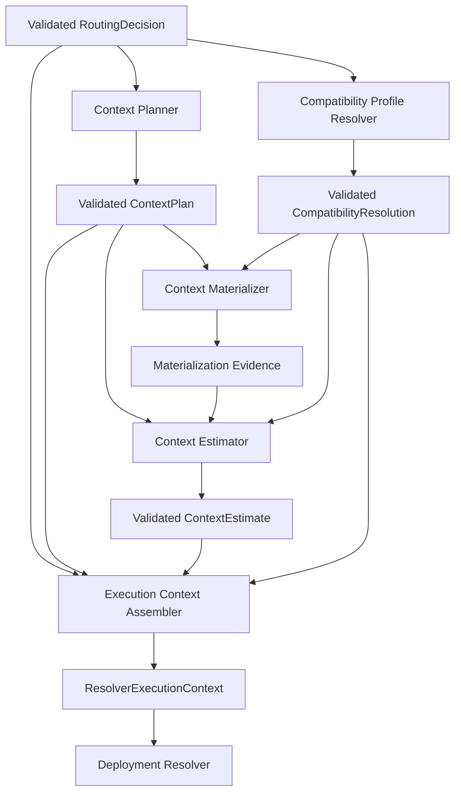

# Context Planning and Execution Context Assembly Architecture

Status: Design review candidate

Task: `ARCH-CONTEXT-ASSEMBLY-DESIGN-001`

Canonical assignment: [GitHub Issue #131](https://github.com/whatrune/sd-prompt-studio/issues/131)

Target logical architecture: `context_planning_execution_context_assembly_v1`

Implementation: not included

## 1. Purpose

This document defines the architecture between a validated Model Routing Decision and the existing Deployment Resolver `ResolverExecutionContext`.

It separates four decisions that must not be conflated:

1. which context is required, optional, or forbidden;
2. how the exact execution input capacity requirement is estimated;
3. which approved execution-environment profiles satisfy the routed requirements;
4. how those independently validated results are assembled without reinterpretation.

The result is one fail-closed creation boundary for `ResolverExecutionContext`. The design prevents Context Planning, cost optimization, compatibility mapping, or assembly from selecting a provider, model, deployment, Binding, priority, or fallback.

## 2. Normative sources and precedence

This architecture is subordinate to:

1. [AI Model Routing Policy Design](12-model-routing-policy.md)
2. [Automation Response Policy Design](13-response-policy.md)
3. [Deployment Binding Policy](14-deployment-binding-policy.md)
4. [Deployment Binding Schema Design](15-deployment-binding-schema-design.md)
5. [Binding Set Semantic Validation Policy](16-binding-set-semantic-validation-policy.md)
6. [Deployment Resolver Design](17-deployment-resolver-design.md)
7. [AI Model Routing and Response Policy Architecture](18-model-routing-response-architecture.md)
8. Model Routing contract and implementation under `src/model-routing/`
9. Deployment Resolver contract and implementation under `src/deployment-resolver/`
10. [Delegation and Result Contract](../team/11-delegation-and-result-contract.md)
11. [Repository working rules](../../AGENTS.md)

PR #126 defines the upstream architecture. PR #128 defines the frozen Model Routing types. PR #130 implements the pure Model Router. PR #122 defines the Resolver types, and PR #124 implements the Resolver core.

The implemented `RoutingDecision` and `ResolverExecutionContext` types are fixed inputs to this design. This document does not add fields to, remove fields from, or reinterpret either type.

If a conflict exists, the existing frozen contract remains authoritative and this design returns to Backend Architect review. Components must not repair a conflict by choosing the most permissive interpretation.

## 3. Scope

This design defines:

- Context Planner responsibility and logical output;
- the separate Context Materialization boundary required before estimation;
- Context Estimator responsibility and logical output;
- Compatibility Profile Resolver responsibility and logical output;
- the single Execution Context Assembler boundary;
- cross-input identity, validation, immutability, and provenance requirements;
- failure, security, cost, audit, and reproducibility behavior;
- future implementation split and acceptance-test design.

## 4. Non-goals

This design does not:

- implement a Context Planner, Context Loader, tokenizer, estimator, profile resolver, or assembler;
- change Model Router, Deployment Resolver, Execution Adapter, Dispatcher, Runner, Workflow, API, CLI, or Schema;
- load repository files, GitHub records, URLs, or Research Artifacts;
- define an execution prompt or model invocation payload;
- choose a provider, model family, model version, deployment, Binding, priority, or fallback;
- query runtime health, availability, pricing, usage, rate limits, or credentials;
- add a Result Status, persistent Artifact, Receipt, database, registry, hash, or retention contract;
- change Role, Task scope, Tier, reasoning level, security, validation, or approval authority;
- change Existing Run, Observation, Evidence, Claim, or Research Artifact data.

## 5. Architecture decisions

### 5.1 Single writer for ResolverExecutionContext

Only Execution Context Assembler creates `ResolverExecutionContext`.

The following components must not create it:

- Model Router;
- Context Planner;
- Context Materializer or Loader;
- Context Estimator;
- Compatibility Profile Resolver;
- Deployment Resolver.

This prevents multiple creation paths from applying different defaults or weakening different requirements.

### 5.2 Existing Routing Decision remains authoritative

The implemented `RoutingDecision` already contains:

- `context_policy_ref`;
- `required_context_refs`;
- `optional_context_refs`;
- `forbidden_context_categories`;
- `required_tool_profile_refs`;
- `required_structured_output_profile_refs`;
- `response_profile_ref`;
- `latency_policy_ref`;
- `cost_policy_ref`;
- `security_policy_refs`;
- `validation_policy_ref`.

Context Planner applies these values. It does not generate a replacement `context_policy_ref`, add new required context, or remove a required or forbidden entry.

### 5.3 Context requirement and context acquisition are separate

Context Planner defines a deterministic plan. It does not read the sources. A separately approved Context Materializer resolves and loads the exact permitted sources and produces trusted materialization evidence.

Context Estimator operates on an exact materialized input description, not on unresolved paths or estimated file counts. Estimation without materialization evidence is not acceptable for final assembly.

### 5.4 Compatibility does not mean Deployment selection

Compatibility Profile Resolver maps approved logical requirements to exact execution-environment profile references. It does not inspect Binding candidates or Provider availability and does not select a Deployment.

### 5.5 Assembly is validation and projection, not inference

Assembler verifies identity and cross-object consistency, then projects authoritative values into the existing `ResolverExecutionContext`. It has no defaulting, upgrade, downgrade, repair, or selection authority.

## 6. End-to-end flow

The diagram describes validated data flow. It does not grant any component authority held by another component.

## 7. Common preconditions and identity

All four design components consume already validated logical inputs. They do not repeat upstream admission or Role classification.

Every intermediate result must be traceable to:

- exact `task_id`;
- exact `assignment_revision`;
- exact `routing_contract_version`;
- one validated Routing Decision revision or immutable reference;
- component contract or implementation version;
- trusted caller-supplied evaluation timestamp where time validity applies;
- exact policy and profile references used by that component.

An intermediate result from another Task, Assignment revision, routing contract, or Routing Decision must be rejected. Equality is exact; suffix, path, timestamp, or conversation inference is forbidden.

This design does not define a new hash or persistent identity format. Future structural contracts must choose immutable references without changing existing Model Routing or Resolver fields.

## 8. Context Planner

### 8.1 Responsibility

Context Planner converts one validated `RoutingDecision` into one deterministic `ContextPlan`.

It performs:

- exact binding to the Routing Decision identity;
- exact application of `context_policy_ref`;
- preservation of all required context references;
- deterministic selection or exclusion of optional context under the referenced policy;
- preservation of every forbidden context category;
- definition of canonical context ordering and rendering-policy references;
- production of reviewable rule and provenance references.

It does not:

- load or inspect source content;
- discover additional repository files or URLs;
- calculate tokens or bytes;
- change Tier, reasoning, capability floor, response profile, tool requirements, structured-output requirements, security, or validation;
- remove required context to meet cost, latency, or capacity;
- add an unapproved source;
- select a provider, model, Deployment, Binding, or execution environment.

### 8.2 Logical ContextPlan model

`ContextPlan` is a logical design model, not a new persistent Schema.

| Field | Meaning |
| --- | --- |
| `context_plan_contract_version` | Exact supported planner contract |
| `task_id` | Exact Routing Decision Task identity |
| `assignment_revision` | Exact Routing Decision Assignment revision |
| `routing_contract_version` | Exact Routing Decision contract version |
| `routing_decision_ref` | Immutable reference to the evaluated Decision |
| `context_policy_ref` | Exact value copied from Routing Decision |
| `required_context_refs` | Exact complete required set copied from Routing Decision |
| `included_optional_context_refs` | Deterministically selected subset of routed optional references |
| `excluded_optional_context_refs` | Remaining routed optional references with applied rule evidence |
| `forbidden_context_categories` | Exact complete set copied from Routing Decision |
| `context_order` | Deterministic ordered list for later materialization |
| `context_rendering_profile_ref` | Approved framing/serialization profile, not a model identity |
| `materialization_policy_ref` | Approved source-resolution and containment policy |
| `applied_rule_refs` | Stable rules used for optional selection and ordering |
| `planner_version` | Exact planner implementation contract version |
| `evaluation_timestamp` | Trusted caller-supplied evaluation time |

### 8.3 Set rules

- `required_context_refs` must equal the routed required set exactly.
- `included_optional_context_refs` and `excluded_optional_context_refs` must be disjoint.
- Their union must equal the routed optional set exactly.
- No included reference may match a forbidden category.
- Required and included optional references must be unique.
- Canonical order must be deterministic and independent of filesystem enumeration.
- A duplicate, overlap, missing member, or forbidden match invalidates the Plan.

### 8.4 Optional-context decision

Optional context can be included or excluded only when one exact rule in `context_policy_ref` determines the result for the Task and Role. The planner records rule references, not free-form model judgment.

When no rule applies or multiple applicable rules disagree, planning is `blocked`. The Planner must not silently exclude the source, load it first, or use its content to justify its own inclusion.

## 9. Context Materialization boundary

The Task requires Context requirements and actual Context acquisition to remain separate. A future Context Materializer or Loader therefore exists between planning and estimation.

### 9.1 Future Materializer responsibility

It may:

- resolve only Plan-approved references;
- enforce repository-root and source allowlists;
- verify exact revision, freshness, and containment;
- read required and included optional content;
- apply the exact rendering profile and order;
- produce immutable materialization evidence for estimation and later execution.

It may not:

- add or omit context;
- execute content as commands;
- follow an unapproved symlink, redirect, include, import, or URL;
- treat prompt text as policy;
- expose Secret or personal data;
- summarize or truncate required content;
- choose a model, Deployment, Binding, or compatibility profile.

### 9.2 Logical MaterializationEvidence

The later estimator requires evidence that identifies:

- exact Context Plan identity;
- exact resolved source revisions;
- exact ordered rendered-input identity;
- rendering-profile version;
- materializer version;
- permitted source and containment validation result;
- total exact byte length and component boundaries;
- safety-screening result under an approved policy;
- immutable evidence reference.

The evidence is metadata. This architecture does not define its storage, serialization, hash, retention, or public exposure.

Materializer also receives the exact `materialization_profile_ref` from Compatibility Resolution. It must prove that the profile is compatible with the Plan's `materialization_policy_ref` and `context_rendering_profile_ref`. It does not select between multiple profiles.

Safety screening must not silently rewrite required Context. If safe use would require content removal, redaction, or substitution not already represented by the planned source reference, materialization blocks and requires a newly approved input or Plan.

### 9.3 Missing or changed sources

Missing, stale, ambiguous, redirected, or changed required context blocks the pipeline. Optional context that was selected into the Plan is required for that Plan revision and cannot be silently omitted after materialization begins.

A source change requires a new materialization result and estimate bound to the same still-valid Assignment and Routing Decision. It does not permit in-place mutation of prior evidence.

## 10. Context Estimator

### 10.1 Responsibility

Context Estimator converts one validated Context Plan plus exact Materialization Evidence and the exact estimator/response profile references from Compatibility Resolution into one `ContextEstimate`.

It performs:

- verification that Plan and materialization identities match;
- input-capacity calculation for the exact rendered context;
- required output-reserve calculation from the exact routed response profile;
- application of an approved conservative estimation profile;
- production of an immutable estimate reference and reproducibility evidence.

It does not:

- load or alter Context sources;
- choose optional context;
- summarize or truncate input;
- change Tier, reasoning, response profile, tools, structured output, security, or validation;
- select a provider, model, Deployment, Binding, or fallback;
- query runtime availability, pricing, or health.

### 10.2 Logical ContextEstimate model

| Field | Meaning |
| --- | --- |
| `context_estimate_contract_version` | Exact supported estimator contract |
| `task_id` | Exact Task identity |
| `assignment_revision` | Exact Assignment revision |
| `routing_contract_version` | Exact routed contract version |
| `routing_decision_ref` | Exact Decision reference |
| `context_plan_ref` | Exact Plan reference |
| `materialization_evidence_ref` | Exact materialized input evidence |
| `response_profile_ref` | Exact value copied from Routing Decision |
| `estimation_profile_ref` | Exact profile selected by Compatibility Resolution |
| `required_input_tokens` | Conservative non-negative integer input requirement |
| `required_output_reserve_tokens` | Non-negative integer reserve required by the response profile |
| `context_estimate_ref` | Immutable reference to this estimate and its inputs |
| `estimator_version` | Exact estimator implementation contract version |
| `evaluation_timestamp` | Trusted caller-supplied evaluation time |

### 10.3 Token compatibility rule

Deployment Resolver compares `required_input_tokens` and `required_output_reserve_tokens` against Binding capacities before selecting a Binding. The estimator therefore cannot rely on a tokenizer known only after Deployment selection.

The approved `estimation_profile_ref` must provide a conservative, reproducible requirement valid for every eligible Binding in the intended `resolution_scope_ref`, or provide an approved compatibility proof covering that scope. Context Estimator must use the exact profile from Compatibility Resolution, and Assembler must reject an estimate whose profile or scope differs.

This design does not choose the estimation algorithm or add a tokenizer field to existing Resolver or Binding contracts. If no cross-candidate comparable estimate can be proven under the existing contracts, implementation stops for Architect review rather than producing an unsafe number.

### 10.4 Output reserve rule

`required_output_reserve_tokens` must preserve:

- the routed response profile;
- mandatory Canonical Result Handoff meaning;
- required structured output;
- validation and failure evidence;
- unresolved and escalation information.

Cost or latency policy cannot reduce this reserve below the approved profile floor.

## 11. Compatibility Profile Resolver

### 11.1 Responsibility

Compatibility Profile Resolver maps a validated Routing Decision and one approved compatibility-policy snapshot to exact non-deployment execution requirements.

It performs deterministic resolution of:

- `resolution_scope_ref`;
- `execution_adapter_contract_version`;
- `runner_profile_ref`;
- `sandbox_profile_ref`;
- `network_policy_ref`;
- required tool profile references;
- required structured-output profile references;
- `response_profile_ref`;
- `cost_policy_ref`;
- `availability_policy_ref`;
- approved estimation and materialization profile compatibility.

It does not:

- select a provider, model, deployment, Binding, priority, or fallback;
- inspect Binding candidates;
- query availability, health, cost, capacity, or runtime state;
- widen tool, network, filesystem, or credential access;
- replace a routed policy reference;
- change Tier, reasoning, capability floor, context, security, or validation.

### 11.2 Logical CompatibilityResolution model

| Field | Meaning |
| --- | --- |
| `compatibility_resolution_contract_version` | Exact supported profile-resolution contract |
| `task_id` | Exact Task identity |
| `assignment_revision` | Exact Assignment revision |
| `routing_contract_version` | Exact Routing Decision version |
| `routing_decision_ref` | Exact Decision reference |
| `compatibility_policy_snapshot_ref` | Immutable approved mapping snapshot |
| `resolution_scope_ref` | Exact approved Resolver scope |
| `execution_adapter_contract_version` | Exact Adapter contract requirement |
| `runner_profile_ref` | Exact approved Runner profile |
| `sandbox_profile_ref` | Exact approved sandbox profile |
| `network_policy_ref` | Exact approved network policy |
| `required_tool_profile_refs` | Exact routed requirements, validated against the mapping |
| `required_structured_output_profile_refs` | Exact routed requirements, validated against the mapping |
| `response_profile_ref` | Exact routed response profile |
| `cost_policy_ref` | Exact routed cost policy |
| `availability_policy_ref` | Exact approved availability policy |
| `estimation_profile_ref` | One exact approved estimator profile for the resolution scope |
| `materialization_profile_ref` | One exact approved materialization profile for the resolution scope |
| `security_policy_refs` | Exact routed security requirements used in mapping validation |
| `applied_rule_refs` | Stable deterministic mapping rules |
| `resolver_version` | Exact compatibility resolver implementation contract version |
| `evaluation_timestamp` | Trusted caller-supplied evaluation time |

### 11.3 Deterministic mapping

The mapping source must be version-managed, approved, and independent of current Provider availability. A valid input must resolve to one exact profile combination.

The following conditions block resolution:

- no matching profile combination;
- multiple equal matches;
- a profile that does not preserve every routed security policy;
- a missing required tool or structured-output profile;
- a response or cost policy mismatch;
- a profile that widens permissions beyond the Assignment;
- an unapproved or stale policy snapshot.

Choosing a higher-permission profile to avoid ambiguity is forbidden.

Compatibility Resolution may complete in parallel with Context Planning. Materialization begins only after both results are valid. The Materializer uses the exact materialization profile, and Estimator uses the exact estimation profile and response profile, without querying a Binding candidate.

## 12. Execution Context Assembler

### 12.1 Inputs

Assembler accepts only validated instances of:

1. `RoutingDecision`;
2. `ContextPlan`;
3. `ContextEstimate`;
4. `CompatibilityResolution`.

Materialization Evidence is not copied into `ResolverExecutionContext`, but the validated `ContextEstimate` must bind to it.

### 12.2 Cross-input validation

Before projection, Assembler confirms:

- exact Task, Assignment, routing contract, and Routing Decision identity equality;
- Context Plan exactly preserves routed required and forbidden sets;
- Context Plan partitions the routed optional set without loss or overlap;
- Context Estimate binds to the exact Plan and materialization evidence;
- the estimate profile and resolution scope exactly match Compatibility Resolution;
- the Materialization Evidence was produced under the exact materialization profile from Compatibility Resolution;
- Compatibility Resolution preserves routed tool, structured-output, response, cost, and security requirements;
- no input is stale, ambiguous, structurally invalid, or from another revision;
- all required output fields have exactly one authoritative producer.

Any mismatch blocks assembly. Assembler does not choose which input is correct.

### 12.3 Exact field projection

| `ResolverExecutionContext` field | Authoritative source |
| --- | --- |
| `routing_contract_version` | Routing Decision |
| `resolution_scope_ref` | Compatibility Resolution |
| `logical_tier` | Routing Decision, unchanged |
| `capability_floor_ref` | Routing Decision, unchanged |
| `required_reasoning_level` | Routing Decision, unchanged |
| `required_input_tokens` | Context Estimate |
| `required_output_reserve_tokens` | Context Estimate |
| `context_estimate_ref` | Context Estimate |
| `execution_adapter_contract_version` | Compatibility Resolution |
| `runner_profile_ref` | Compatibility Resolution |
| `sandbox_profile_ref` | Compatibility Resolution |
| `network_policy_ref` | Compatibility Resolution |
| `required_tool_profile_refs` | Routing Decision, equality-proven by Compatibility Resolution |
| `required_structured_output_profile_refs` | Routing Decision, equality-proven by Compatibility Resolution |
| `response_profile_ref` | Routing Decision, equality-proven by Compatibility Resolution |
| `cost_policy_ref` | Routing Decision, equality-proven by Compatibility Resolution |
| `availability_policy_ref` | Compatibility Resolution |

No default value is permitted. Empty tool or structured-output arrays are valid only when the Routing Decision explicitly contains empty arrays.

### 12.4 Values not projected

The following values gate assembly or remain referenced by evidence but are not fields in the existing `ResolverExecutionContext`:

- Context Plan content and source lists;
- materialized Context content;
- `security_policy_refs`;
- `validation_policy_ref`;
- `latency_policy_ref`;
- component versions and applied rules;
- provider availability;
- Task execution payload.

Omission from `ResolverExecutionContext` does not cancel these requirements. Downstream execution must continue to enforce them through existing approved boundaries.

### 12.5 Output immutability

Assembler creates a deep immutable value. It does not retain mutable aliases to input arrays or objects. Repeated assembly from the same validated inputs produces the same field values and canonical array ordering.

## 13. Validation boundary

### 13.1 Future structural validation

Future contracts may validate each intermediate object for:

- required fields;
- exact types and enums;
- reference format;
- non-negative integer capacity values;
- UTC timestamp format;
- duplicate-free canonical arrays;
- unknown-field rejection;
- Secret-shaped field rejection;
- immutability after acceptance.

This task does not add those Schemas or validators.

### 13.2 Future semantic validation

Semantic validation covers:

- exact identity equality across all inputs;
- Context set partition and forbidden-category rules;
- source revision and materialization freshness;
- estimator compatibility with the resolution scope;
- response-reserve compatibility;
- security-to-profile mapping;
- exact routed requirement preservation;
- one authoritative source per assembled field;
- stale or conflicting policy references.

Semantic validation must complete before assembly. Assembler may enforce its cross-input preconditions, but it must not repair a failed input.

### 13.3 Resolver boundary

Deployment Resolver continues to validate its own request contract and candidate compatibility. It does not repeat Context Planning, materialization, estimation, or profile resolution and does not infer missing values.

## 14. Failure handling

Existing external Status vocabulary remains unchanged. Intermediate component results do not add public statuses.

| Condition | External disposition | Required behavior |
| --- | --- | --- |
| Missing or invalid Routing Decision | `blocked` | Return to Model Routing input owner |
| Missing or incompatible context policy | `blocked` | No Plan and no default policy |
| Required Context reference missing or forbidden | `blocked` | No silent omission or substitution |
| Optional set cannot be partitioned deterministically | `blocked` | Architect review of policy |
| Materialization failure or source revision mismatch | `blocked` | Preserve Plan; obtain corrected source/evidence |
| Estimator profile incompatible with scope | `blocked` | No approximate provider-specific fallback |
| Capacity exceeds every approved deployment capability | downstream `blocked` | Preserve estimate and let Resolver report no candidate |
| Compatibility profile missing or ambiguous | `blocked` | No broader profile selection |
| Cross-input identity or policy mismatch | `blocked` | No assembly |
| Unexpected component implementation defect | `failed` | Sanitized diagnostic and Backend Implementer review |

Failure evidence identifies the component, failed step, affected reference, retryability, decision owner, and safe next action. It must not expose source content, Secrets, personal paths, credentials, or private reasoning.

## 15. Cost and quality boundary

Allowed cost optimization:

- exclude optional context only through an approved deterministic Planner rule;
- avoid duplicate materialization of the same exact source revision within one execution;
- use a targeted rendering profile approved for the Task;
- reserve output according to the routed response profile rather than an arbitrary maximum;
- select the minimum approved compatibility profile that exactly satisfies all requirements.

Forbidden cost optimization:

- remove or summarize required Context;
- omit an optional source after it was included in the Plan;
- reduce Tier, reasoning, output reserve, validation, security, or tool requirements;
- select another Provider, model, Deployment, Binding, or tokenizer;
- weaken containment or redaction controls;
- use runtime pricing to mutate a frozen Plan, Estimate, Compatibility Resolution, or Execution Context.

Quality, security, and Contract floors take precedence over cost and latency. When no compliant result is possible, the pipeline stops.

## 16. Security boundary and threat model

### 16.1 Required properties

- Planner, Estimator, Compatibility Resolver, and Assembler cores are pure and receive normalized trusted inputs.
- Only the future Materializer performs source I/O, under its own least-privilege contract.
- Source content cannot modify policy, Role, Tier, reasoning, security, or validation requirements.
- Context references must be exact, allowlisted, revision-bound, and containment-checked before read.
- Required and forbidden context rules are enforced before materialization.
- Secret, credential, token, private endpoint, and personal-file categories are forbidden by default.
- Logs and diagnostics contain references and sanitized summaries, not raw context.
- Profile resolution cannot widen network, sandbox, tools, filesystem, or credential access.
- No component executes content, shell commands, imports, hooks, or dependency scripts as part of planning or estimation.

### 16.2 Threats and controls

| Threat | Control |
| --- | --- |
| Prompt injection in Context source | Treat source as data; policy remains external and immutable |
| Path traversal or symlink escape | Future Materializer root containment and symlink defense |
| Redirect to unapproved URL | Exact source allowlist and redirect rejection |
| Secret leakage through context or logs | Category prohibition, redaction policy, sanitized evidence |
| Policy confusion across Task revisions | Exact Task, Assignment, Decision, and policy identity checks |
| Token underestimation | Approved conservative estimator profile and scope compatibility proof |
| Permission widening by compatibility mapping | Exact security-policy preservation and ambiguity rejection |
| Mutable input after validation | Deep immutable accepted values and no retained mutable aliases |
| Provider selection hidden in a profile | Profiles contain execution requirements only; no Binding identity |

## 17. Audit, idempotency, and reproducibility

For the same validated Routing Decision, policy snapshots, materialized source revisions, rendering profile, estimator profile, and evaluation timestamp:

- Context Plan must be identical;
- Context Estimate must be identical;
- Compatibility Resolution must be identical;
- assembled `ResolverExecutionContext` must be identical.

Pure components must not read wall-clock time, environment variables, provider health, local directory order, current price, or mutable external state.

A future existing execution record may reference:

- all component versions;
- source and policy snapshot references;
- Plan, materialization, estimate, and compatibility references;
- applied rules;
- assembly validation result;
- final Resolver Execution Context reference or sanitized projection evidence.

This architecture does not define a new audit Artifact, hash, persistence mechanism, or retention period.

## 18. Future implementation split

Implementation remains outside this design PR.

1. **Context Plan Contract and types**
   - Freeze the closed structural model, identity, set rules, and compatibility versioning.
2. **Pure Context Planner core**
   - Implement deterministic Plan construction with no I/O.
3. **Context Materialization Contract**
   - Freeze source resolution, containment, rendering, evidence, redaction, and revision binding.
4. **Context Materializer implementation**
   - Implement least-privilege I/O separately from Planner and Estimator.
5. **Context Estimate Contract and estimator policy**
   - Freeze capacity semantics, estimator profiles, compatibility proof, and accuracy tests.
6. **Context Estimator implementation**
   - Implement deterministic estimation against exact materialization evidence.
7. **Compatibility Profile Contract and approved mapping configuration**
   - Freeze profile fields, policy snapshot identity, governance, and ambiguity rules.
8. **Pure Compatibility Profile Resolver**
   - Implement exact mapping without Provider or Binding access.
9. **Execution Context Assembly Contract and core**
   - Freeze cross-input validation and implement the single projection boundary.
10. **Deployment Resolver integration**
    - Supply the existing Resolver request without changing Resolver selection logic.
11. **Execution integration pilot**
    - Prove end-to-end behavior with one approved non-destructive Task class.

Each Task requires its own Canonical Assignment, branch, worktree, tests, independent review, rollback plan, and Product Owner merge decision.

## 19. Acceptance and test design

A future implementation must prove at least:

### Context Planner

- required Context is preserved exactly;
- optional Context is partitioned exactly once;
- forbidden categories cannot be included;
- source order does not change canonical Plan order;
- missing policy or ambiguous optional rule blocks planning;
- Planner performs no filesystem, network, token, Provider, or Binding operation.

### Materialization

- only planned references are read;
- missing required source, revision drift, traversal, symlink escape, or redirect blocks;
- content is never executed as instruction;
- materialization order and evidence are reproducible;
- selected optional Context cannot disappear silently.

### Estimator

- exact same materialization and profile produce the same capacities;
- negative, fractional, missing, or overflow values are rejected;
- output reserve preserves the exact response profile floor;
- incompatible estimator/scope proof blocks;
- Estimator cannot remove Context or select a Deployment.

### Compatibility Profile Resolver

- one exact mapping is required;
- zero or multiple mappings block;
- routed tools, structured output, response, cost, and security are preserved;
- broader permission is rejected;
- provider availability and Binding candidates do not affect mapping.

### Assembler

- only Assembler creates `ResolverExecutionContext`;
- every output field comes from the documented authoritative source;
- Task, Assignment, routing, policy, Plan, and Estimate mismatch blocks;
- no default, repair, Tier change, reasoning change, or array mutation occurs;
- empty requirement arrays remain explicit empty arrays;
- output is deeply immutable and reproducible;
- existing Resolver accepts a valid assembled context without contract changes.

## 20. Rollout and rollback boundary

Proposed rollout order:

1. approve this architecture;
2. Freeze and implement Context Plan types and pure Planner;
3. Freeze Materialization and Estimation contracts before any source I/O;
4. Freeze Compatibility Profile mapping and governance;
5. Freeze and implement Assembler with contract fixtures;
6. run offline cross-component integration against existing Resolver fixtures;
7. enable shadow-mode execution evidence for one safe Task class;
8. enable production dispatch only after security and Product Owner review.

Rollback disables the newest component integration and returns to the last approved execution boundary. It does not mutate prior Plans, Estimates, Routing Decisions, Resolver Results, Assignments, or Handoffs and does not select a different Provider or Binding.

## 21. Deferred decisions

The following remain separate Architect-reviewed decisions:

- structural contract and Schema format for each intermediate object;
- immutable reference and optional hash strategy;
- Context Materializer source types and rendering format;
- estimator algorithm and conservative compatibility proof;
- exact response-profile output reserve rules;
- compatibility-policy storage and approval lifecycle;
- diagnostic code catalog and severity mapping;
- persistence, audit, retention, and cleanup;
- Adapter/Runner execution-payload integration.

These items are not silently resolved by this architecture.

## 22. Explicit non-implementation confirmation

- Context Planner implemented: no
- Context Materializer or Loader implemented: no
- Context Estimator implemented: no
- Compatibility Profile Resolver implemented: no
- Execution Context Assembler implemented: no
- Model Router changed: no
- Deployment Resolver changed: no
- Execution Adapter changed: no
- Dispatcher changed: no
- Runner changed: no
- Workflow changed: no
- Schema changed: no
- Existing Contract changed: no
- Secrets or credentials configured: no
- Existing Run changed: no
- Research Artifact changed: no
- Merge performed: no
