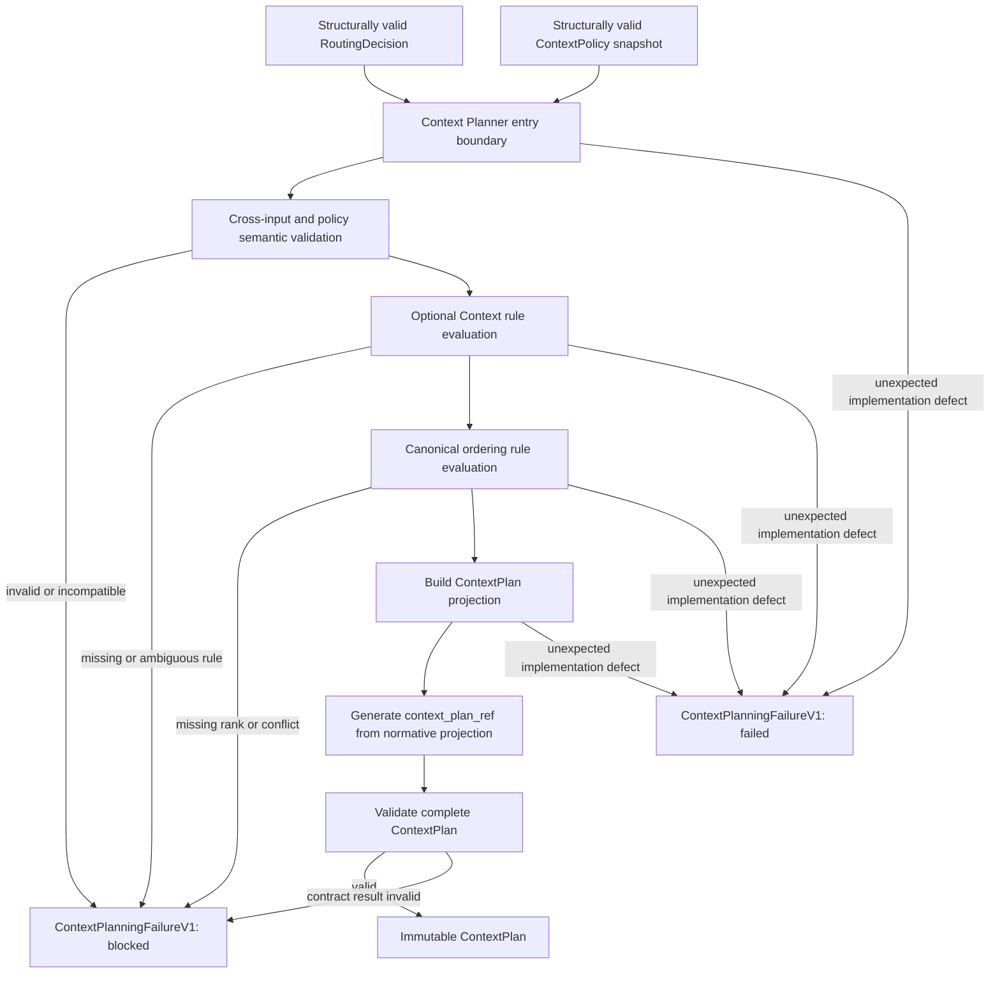

# Context Planner Supporting Contracts Design

Status: Design review candidate

Task: `ARCH-CONTEXT-PLANNER-SUPPORTING-CONTRACTS-001`

Canonical assignment: [GitHub Issue #136](https://github.com/whatrune/sd-prompt-studio/issues/136)

Target logical contracts:

- `context_planning_failure_v1`
- `context_policy_v1`
- `context_policy_rule_v1`
- `context_ordering_rule_v1`
- `context_plan_reference_v1`

Implementation: not included

## 1. Purpose

This document freezes the supporting contracts required before a pure Context Planner Core can be implemented. It closes three boundaries that the existing Context Planning architecture and Context Plan structural contract intentionally did not implement:

1. a Planner outcome failure that distinguishes expected fail-closed conditions from unexpected implementation defects;
2. a closed, deterministic Context Policy Rule model for optional-context inclusion, exclusion, and canonical ordering;
3. a deterministic, immutable `context_plan_ref` strategy that does not require persistence or source I/O.

The goal is to let a Backend Implementer implement the Planner without inventing statuses, rules, precedence, references, hash projections, or repair behavior.

## 2. Normative sources and precedence

This design is subordinate to:

1. [Context Planning and Execution Context Assembly Architecture](19-context-planning-execution-context-assembly-architecture.md)
2. the frozen Context Plan types and validators under `src/context-planning/`
3. the frozen Model Routing types and core under `src/model-routing/`
4. [AI Model Routing and Response Policy Architecture](18-model-routing-response-architecture.md)
5. [Delegation and Result Contract](../team/11-delegation-and-result-contract.md)
6. [Repository working rules](../../AGENTS.md)

PR #132 freezes the Context Planning architecture. PR #134 freezes `context_plan_v1` and its existing structural validators. PR #128 and PR #130 freeze and implement `model_routing_v1`.

This document adds no field to an existing type and changes no existing validator. If this design conflicts with an existing frozen contract, the existing contract remains authoritative and implementation returns to Architect review.

## 3. Scope

This design defines:

- the versioned Planner outcome failure model;
- exact `blocked` and `failed` semantics;
- failure codes, stages, diagnostic restrictions, and safe next actions;
- the closed Context Policy Snapshot and Rule models;
- exact-match, priority, conflict, missing-rule, and invalid-rule behavior;
- the optional-context decision and canonical-ordering algorithms;
- the `context_plan_ref` normative projection, canonicalization, digest, and format;
- structural, semantic, identity, security, and responsibility boundaries;
- future implementation prerequisites, acceptance tests, rollout, and rollback.

## 4. Non-goals

This design does not:

- implement Context Planner Core or any supporting type, validator, or hash helper;
- change `ContextPlan`, the existing PR #134 `ContextPlanningFailure`, or `ContextPlanValidationResult`;
- change Model Router, Deployment Resolver, Execution Adapter, Runner, Dispatcher, Workflow, API, CLI, or Schema;
- load a Repository file, GitHub record, URL, policy file, or Context source;
- inspect source content to decide whether optional Context is included;
- infer a Role, Task type, reference category, policy, rule, priority, or ordering rank;
- select a Provider, model, Deployment, Binding, adapter, or runner;
- add a persistent registry, Artifact, Receipt, database, or historical snapshot store;
- define an Artifact-bytes integrity hash;
- change a Result Handoff Status, Research Contract, Existing Run, or Research Artifact.

## 5. Compatibility decision for PR #134

PR #134 already exports an interface named `ContextPlanningFailure` under `context_plan_v1`. Its `status` is fixed to `blocked`, and its validator is a structural rejection boundary for Context Plan values.

That existing contract remains unchanged. It must not be widened in place to accept `failed`, and the future Planner Core task must not repurpose it as an operational outcome contract.

This design instead freezes a separate, versioned logical contract named `ContextPlanningFailureV1` with contract identity `context_planning_failure_v1`. A future implementation may expose a Planner result such as:

```text
ContextPlannerCoreResult
  = ContextPlan
  | ContextPlanningFailureV1
```

The exact TypeScript export and file layout require a separate supporting-contract implementation Task. That Task must not mutate the existing PR #134 type or validator.

The Context Planner Core implementation remains blocked until the supporting contract implementation is merged and the Core Task is explicitly authorized to consume it.

## 6. End-to-end boundary



The diagram describes pure validated data flow. Policy and source resolution occur outside Planner Core. No arrow grants I/O, repair, product judgment, or model-selection authority.

## 7. Planner entry preconditions

The formal Planner Core supports only:

- a `RoutingDecision` that passed the PR #128 structural validator;
- a Context Policy Snapshot that passed its future structural validator;
- exact immutable references for both inputs;
- one supported Planner and supporting-contract version.

Arbitrary Issue prose, unvalidated objects, source content, filesystem enumeration, and runtime discovery are not Planner inputs.

The caller resolves the exact `context_policy_ref` outside the pure core and passes the validated immutable Policy Snapshot. Planner Core does not read the reference itself.

Structural rejection of an arbitrary malformed value occurs before Planner Core. `ContextPlanningFailureV1` covers cross-input and semantic failures after trusted structural admission, plus sanitized unexpected defects inside the Planner. It does not replace the existing PR #128 or PR #134 structural validation results.

## 8. ContextPlanningFailureV1 contract

### 8.1 Logical model

`ContextPlanningFailureV1` is a closed logical design model.

| Field | Required meaning |
| --- | --- |
| `context_planning_failure_contract_version` | Constant `context_planning_failure_v1` |
| `task_id` | Exact `RoutingDecision.task_id` |
| `assignment_revision` | Exact `RoutingDecision.assignment_revision` |
| `routing_contract_version` | Exact `RoutingDecision.routing_contract_version` |
| `routing_decision_ref` | Exact immutable Decision reference supplied at entry |
| `context_policy_ref` | Exact routed policy reference copied from the Routing Decision |
| `status` | `blocked` or `failed` under the rules below |
| `failure_code` | Closed code from section 8.3 |
| `failed_stage` | Closed stage from section 8.4 |
| `path` | JSON-style logical input or output path; `$` when no narrower safe path exists |
| `message` | Sanitized deterministic catalog message, not raw exception text |
| `affected_ref` | Exact affected immutable reference when one is safely known; otherwise absent |
| `decision_owner` | Closed owner value from section 8.5 |
| `recommended_next_action` | Closed safe action from section 8.5 |
| `retry_policy` | Closed retry condition from section 8.5 |
| `planner_version` | Exact Planner implementation contract version |
| `evaluation_timestamp` | Exact trusted timestamp copied from the Routing Decision |

Unknown fields are forbidden. Optional absence must be explicit in the structural contract; placeholder paths, fake references, exception stacks, local paths, and guessed identities are forbidden.

### 8.2 Status semantics

`blocked` means the pure Planner evaluated trusted structured inputs and cannot produce a valid Plan without a corrected input, policy, reference, or Architect decision.

Examples:

- identity mismatch;
- missing or incompatible policy snapshot;
- unsupported optional reference;
- no applicable optional-context rule;
- ambiguous highest-priority rule;
- missing or conflicting ordering rank;
- forbidden Context;
- generated Plan fails its existing contract validation.

`failed` means an unexpected implementation defect prevents the pure Planner from completing an otherwise supported evaluation.

Examples:

- unreachable invariant violation inside the Planner;
- unexpected internal exception after structural and semantic preconditions pass;
- implementation result cannot be constructed because of a code defect rather than input data.

`failed` must not be used for invalid input, policy conflict, unsupported reference, missing rule, validation rejection, capacity, availability, or cost. `blocked` must not hide an internal defect.

`result_validation_failed` is used only when the rejected result is traceable to a correctable Contract input or Policy condition that was not expressible earlier in the pipeline. If all documented preconditions and invariants passed and an invalid result can only have been produced by the implementation, the outcome is `failed/internal_failure`; an implementation defect must not be mislabeled as a correctable validation block.

These statuses are Planner outcome vocabulary only. They do not add or change Team Result Handoff statuses.

### 8.3 Failure codes and status mapping

| `failure_code` | Required status | Meaning |
| --- | --- | --- |
| `inconsistent_identity` | `blocked` | Task, Assignment, routing, Decision, or policy identity mismatch |
| `missing_context_policy` | `blocked` | Exact routed Policy Snapshot was not supplied |
| `incompatible_context_policy` | `blocked` | Policy contract or revision cannot be used with the Decision |
| `unsupported_context_reference` | `blocked` | A routed reference is outside the supported immutable-reference boundary |
| `context_policy_no_match` | `blocked` | An optional candidate has no applicable exact rule |
| `context_policy_conflict` | `blocked` | More than one rule is authoritative at the highest priority |
| `forbidden_context` | `blocked` | Required or included Context violates a routed forbidden category |
| `invalid_context_order` | `blocked` | Complete-permutation or explicit-rank requirements cannot be met |
| `result_validation_failed` | `blocked` | Constructed output is rejected by the existing Context Plan validator |
| `internal_failure` | `failed` | Unexpected Planner implementation defect |

The mapping is normative. A future implementation validates the status/code pair and rejects every other combination.

### 8.4 Failure stages

Allowed `failed_stage` values are:

- `input_binding`
- `policy_validation`
- `optional_context_resolution`
- `order_generation`
- `reference_generation`
- `result_validation`
- `internal_processing`

`internal_failure` requires `internal_processing`. Every other failure code uses the narrowest stage that actually stopped evaluation. A component must not report a later stage when that stage did not begin.

### 8.5 Owner, next action, and retry

Allowed `decision_owner` values are:

- `routing_input_owner`
- `context_policy_owner`
- `backend_implementer`
- `architect_team`

Allowed `recommended_next_action` values are:

- `correct_routing_input`
- `provide_compatible_policy_snapshot`
- `correct_context_policy`
- `architect_review`
- `implementation_review`

Allowed `retry_policy` values are:

- `after_input_revision`
- `after_policy_revision`
- `after_architect_decision`
- `after_implementation_fix`
- `no_automatic_retry`

No failure authorizes automatic mutation or retry. An orchestrator may retry only after the exact declared prerequisite changes and under a separate approved execution contract.

### 8.6 Diagnostic boundary

Failure output must not contain:

- Context source content;
- prompt content or private reasoning;
- Secret, token, credential, cookie, or private key data;
- private endpoint or personal filesystem path;
- stack trace, environment dump, process arguments, or arbitrary exception text;
- guessed reference, fake identity, or mutable URL.

Messages come from a closed deterministic catalog keyed by failure code and stage. Implementation-specific detail stays in a separately governed operational log, if one is later approved. This design creates no log or diagnostic Artifact.

## 9. Context Policy Snapshot contract

### 9.1 Responsibility

The Context Policy Snapshot provides deterministic metadata rules for:

- including or excluding each routed optional Context reference;
- assigning an explicit canonical order rank to every Context reference that can be planned.

It does not determine required Context, forbidden categories, Role, Tier, reasoning, response policy, security, validation, Provider, model, Deployment, or Binding.

The Model Router already selects `context_policy_ref`. Planner Core receives the exact matching Snapshot; it does not select or discover another policy.

### 9.2 Logical root model

`ContextPolicyV1` is a closed logical design model.

| Field | Required meaning |
| --- | --- |
| `context_policy_contract_version` | Constant `context_policy_v1` |
| `context_policy_ref` | Exact immutable reference that must equal `RoutingDecision.context_policy_ref` |
| `policy_revision` | Immutable revision identifier |
| `optional_context_rules` | Closed list of `ContextPolicyRuleV1` values |
| `ordering_rule` | Exactly one `ContextOrderingRuleV1` |
| `source_ref` | Direct immutable governance source for the Snapshot |
| `approval_ref` | Direct immutable approval record |

Unknown fields are forbidden. The Snapshot contains metadata only and contains no Context source content, executable expression, script, shell command, regex, free-form prompt, Provider setting, Secret, or credential.

## 10. ContextPolicyRuleV1

### 10.1 Logical rule model

| Field | Required meaning |
| --- | --- |
| `rule_contract_version` | Constant `context_policy_rule_v1` |
| `rule_id` | Stable opaque identifier unique within the Policy Snapshot |
| `rule_revision` | Immutable rule revision |
| `rule_ref` | Immutable reference to this exact rule and revision; unique within the Snapshot |
| `policy_ref` | Exact parent `context_policy_ref` |
| `match` | Closed exact-match object from section 10.2 |
| `action` | `include` or `exclude` |
| `priority` | Integer from `0` through `1000`; higher value wins |
| `source_ref` | Direct immutable rule-definition reference |

### 10.2 Match contract

For v1, `match` contains exactly one field:

```text
optional_context_ref
```

Matching is case-sensitive exact string equality between `match.optional_context_ref` and one member of `RoutingDecision.optional_context_refs`.

The following are forbidden:

- wildcard, glob, prefix, suffix, substring, or regular-expression matching;
- path normalization or case folding;
- category inference from the reference string;
- inspection of source content or file metadata;
- matching on runtime state, availability, cost, provider, or filesystem order;
- model judgment or natural-language policy interpretation.

Policy selection already occurred upstream. Rule matching does not re-evaluate Role or Task type, because those values are not fields of the frozen `RoutingDecision` and must not be inferred.

### 10.3 Optional-context evaluation algorithm

Planner evaluates optional candidates in ascending bytewise ordinal order of the exact reference string, independent of input-array order.

For each candidate:

1. collect all structurally valid rules whose `policy_ref` equals the Snapshot reference and whose exact match equals the candidate;
2. if no rule matches, return `blocked/context_policy_no_match`;
3. find the greatest numeric `priority`;
4. if exactly one matching rule has that priority, apply its action;
5. if two or more matching rules share that greatest priority, return `blocked/context_policy_conflict`, even when their actions are the same;
6. never use `rule_id`, source order, input order, or last-write-wins as a tie breaker;
7. record the winning rule's immutable `rule_ref` in `applied_rule_refs`.

Lower-priority matches do not apply and cannot override the winner. A rule targeting a reference not present in the current Decision is not evaluated for that Decision and does not make a reusable Policy invalid.

When `RoutingDecision.optional_context_refs` is empty, no optional rule is required or evaluated. Both optional output sets are empty, and the ordering rule still determines the order of all required Context references.

### 10.4 Required and forbidden boundaries

- Required Context is never passed through optional rules and can never be excluded.
- Optional rules cannot add a reference that is absent from `RoutingDecision.optional_context_refs`.
- A winning `include` action remains subject to the routed forbidden-category boundary.
- A winning `exclude` action cannot remove a required reference.
- Rule output partitions the routed optional set exactly once into included and excluded sets.
- Planner serializes required, included, excluded, and forbidden set-valued arrays in ascending bytewise ordinal order before identity generation.

## 11. ContextOrderingRuleV1

### 11.1 Logical model

| Field | Required meaning |
| --- | --- |
| `rule_contract_version` | Constant `context_ordering_rule_v1` |
| `rule_id` | Stable opaque identifier unique within the Snapshot |
| `rule_revision` | Immutable rule revision |
| `rule_ref` | Immutable reference to this exact ordering rule and revision |
| `policy_ref` | Exact parent `context_policy_ref` |
| `strategy` | Constant `explicit_rank` |
| `rank_entries` | Closed list of exact reference/rank pairs |
| `source_ref` | Direct immutable ordering-rule reference |

Each rank entry contains exactly:

- `context_ref`: one exact immutable Context reference;
- `rank`: a non-negative integer.

References and ranks are each unique across the complete ordering rule. Input list position has no meaning.

### 11.2 Ordering algorithm

After optional decisions, Planner forms:

```text
planned_context_refs
  = required_context_refs
  union included_optional_context_refs
```

For every planned reference, exactly one rank entry must exist. Planner sorts planned references by ascending numeric rank and emits that exact order as `context_order`.

The following return `blocked/invalid_context_order` before Plan construction:

- a planned reference has no rank;
- a planned reference has more than one rank;
- two planned references have the same rank;
- an excluded, forbidden, or unplanned reference appears in the result;
- the result omits or duplicates a planned reference.

Extra rank entries for references not present in the current Routing Decision are allowed so one approved Snapshot can serve multiple Decisions. They are ignored for the current result and do not appear in `context_order`.

Planner records the ordering rule's immutable `rule_ref` in `applied_rule_refs`. `applied_rule_refs` is serialized in ascending bytewise ordinal order and contains exactly the winning optional-rule references plus the ordering-rule reference, without duplicates.

The Materializer must preserve this order and must not sort, deduplicate, complete, or repair it.

## 12. Policy semantic validation

Structural validation of a future Policy contract verifies required fields, closed objects, types, formats, enums, ranges, and unknown-field rejection.

Before any candidate evaluation, semantic validation verifies:

- Snapshot `context_policy_ref` exactly equals the routed reference;
- all child `policy_ref` values equal the parent reference;
- contract versions are supported together;
- policy revision, source, and approval references are immutable and present;
- `rule_id` is unique across optional and ordering rules;
- the pair `rule_id` and `rule_revision` is not duplicated;
- every `rule_ref` is unique and binds one exact rule revision;
- multiple rules may share a `source_ref` when they are defined by the same governance source;
- ordering rank references are unique;
- ordering ranks are unique;
- no rule contains forbidden executable or content-bearing data.

An invalid Policy blocks before any optional candidate is evaluated. Planner does not partially apply valid-looking rules from an invalid Snapshot.

## 13. Context Plan reference strategy

### 13.1 Meaning

`context_plan_ref` identifies the exact Context Plan Normative Projection. It is:

- immutable;
- deterministic;
- content-addressed;
- independent of JSON property order and insignificant serialization formatting;
- generated only by Context Planner after the complete logical Plan is assembled;
- verifiable without reading Context source content.

It is not:

- a file location or retrieval guarantee;
- an Artifact-bytes integrity hash;
- a historical snapshot store;
- a source-content hash;
- a semantic-equality judgment;
- a Provider, model, Deployment, or Binding identity.

### 13.2 Normative projection

The `context_plan_reference_v1` projection contains every `ContextPlan` field except `context_plan_ref`, using the final canonical array values:

- `context_plan_contract_version`
- `task_id`
- `assignment_revision`
- `routing_contract_version`
- `routing_decision_ref`
- `context_policy_ref`
- `required_context_refs`
- `included_optional_context_refs`
- `excluded_optional_context_refs`
- `forbidden_context_categories`
- `context_order`
- `context_rendering_profile_ref`
- `materialization_policy_ref`
- `applied_rule_refs`
- `planner_version`
- `evaluation_timestamp`

`evaluation_timestamp` must be copied exactly from the validated Routing Decision. Planner must not read wall-clock time. Therefore repeated planning against the same Decision, Policy Snapshot, and Planner version produces the same projection.

No unknown, derived diagnostic, file byte, comment, whitespace, or serialization-only value enters the projection.

### 13.3 Canonicalization and digest

The exact algorithm is:

1. build the closed normative projection above;
2. serialize it with JSON Canonicalization Scheme semantics defined by RFC 8785;
3. encode the canonical JSON as UTF-8;
4. calculate SHA-256 over those bytes;
5. encode the digest as 64 lowercase hexadecimal characters;
6. form the reference:

```text
evidence/context-plans/sha256-<64-lowercase-hex>
```

This path-shaped value is chosen because it satisfies the existing PR #134 immutable-reference format. It is a logical content reference and does not assert that a Repository file exists at that path.

### 13.4 Identity behavior

- Identical normative projections produce identical references.
- A change to any projected field produces a different reference.
- JSON property order and insignificant formatting do not change the reference.
- `context_plan_ref` is excluded to avoid self-reference.
- Artifact file name, comments, storage bytes, and external metadata do not change the reference.
- The reference can be recalculated from a complete Plan without Repository, network, source-content, or Evidence Store access.

The existing PR #134 validator checks reference format and Plan structure only. It does not recalculate this identity. A future supporting-contract implementation must add a separate helper and semantic check without changing the existing validator's contract.

### 13.5 Reference handling rules

All routed Context, policy, rule, Decision, rendering-profile, and materialization-policy references are exact case-sensitive immutable values. Planner:

- does not normalize, dereference, probe, or rewrite them;
- does not infer immutability from a file timestamp or current branch;
- does not convert a mutable branch URL into an immutable reference;
- does not infer a category from a path-like string;
- does not use an unversioned or unsupported reference as a fallback.

Reference accessibility, authorization, source revision, containment, and content validation belong to upstream admission or the later Materializer boundary, not Planner Core.

## 14. Determinism and immutability

For the same validated:

- Routing Decision and its reference;
- Context Policy Snapshot and revision;
- optional and ordering rule revisions;
- Planner implementation contract version;
- `context_plan_reference_v1` algorithm;

Planner must produce the same immutable Context Plan or the same sanitized failure classification.

Determinism must not depend on:

- input-array order for set-valued fields;
- Policy list order;
- filesystem or Repository enumeration;
- process environment, locale, current directory, or wall clock;
- network, provider availability, cost, or runtime health;
- random value, model judgment, or previous conversation.

Accepted inputs and results are deep-cloned and deeply immutable. Planner retains no mutable caller alias.

## 15. Failure handling matrix

| Condition | Outcome | Safe action |
| --- | --- | --- |
| Routing and Planner identity mismatch | `blocked/inconsistent_identity` | Correct input binding |
| Exact Policy Snapshot absent | `blocked/missing_context_policy` | Supply approved Snapshot |
| Policy contract or revision incompatible | `blocked/incompatible_context_policy` | Context Policy owner review |
| Optional reference unsupported | `blocked/unsupported_context_reference` | Correct routed input or approved Policy |
| No exact optional rule | `blocked/context_policy_no_match` | Add and approve an explicit rule |
| Equal highest-priority matches | `blocked/context_policy_conflict` | Resolve Policy conflict; no tie break |
| Required or included Context forbidden | `blocked/forbidden_context` | Correct upstream routing or policy |
| Rank missing, duplicate, or result incomplete | `blocked/invalid_context_order` | Correct approved ordering rule |
| Constructed Plan rejected | `blocked/result_validation_failed` | Correct inputs/policy or return to Architect review |
| Unexpected code defect | `failed/internal_failure` | Backend Implementer investigation; no automatic retry |

No failure path emits a partial Context Plan. No failure path defaults an action, rank, policy, reference, or status.

## 16. Security boundary and threat model

### 16.1 Required controls

- Caller supplies validated immutable metadata; Planner performs no I/O.
- Policy and Rule objects are closed and reject unknown fields.
- Rule matching uses exact references only.
- Rule data cannot contain executable expressions, shell commands, regex, or free-form prompts.
- Source content never participates in inclusion, exclusion, priority, ordering, failure, or identity decisions.
- Context reference values are treated as inert identifiers, never commands or paths to open.
- Failure messages use sanitized catalog text.
- Plan identity hashes the closed metadata projection, not Context source bytes or Secrets.
- Planner has no credential, token, network, filesystem, Provider, Adapter, or Runner access.

### 16.2 Threats and controls

| Threat | Control |
| --- | --- |
| Prompt injection in Context source | Planner never loads source content |
| Shell or expression injection in Policy | Closed metadata model; executable syntax has no evaluation path |
| Rule-order manipulation | Explicit priority and fail-closed highest-priority tie handling |
| Input-array manipulation | Canonical set serialization and explicit ordering ranks |
| Mutable policy substitution | Exact immutable Policy and revision binding |
| Reference confusion | Exact case-sensitive equality; no normalization or suffix inference |
| Hash self-reference or formatting drift | Closed projection excluding `context_plan_ref`; JCS and SHA-256 |
| Secret leakage through diagnostics | Closed failure fields and catalog messages |
| Internal defect disguised as input error | Normative `failed/internal_failure` mapping |
| Invalid Policy partially applied | Whole-Snapshot semantic validation before evaluation |

## 17. Validation boundaries

### 17.1 Existing validation retained

PR #128 continues to validate `RoutingDecision`. PR #134 continues to validate `ContextPlan` and its existing blocked-only structural failure. Neither is modified by this design.

### 17.2 Future supporting structural validation

A separate implementation Task must validate:

- closed failure, Policy, optional-rule, ordering-rule, and rank-entry objects;
- required fields, enum values, integer ranges, reference formats, and unknown fields;
- status/code/stage cross-field branches where structurally expressible;
- forbidden Secret-shaped or executable fields.

### 17.3 Future Planner semantic validation

Planner entry validation must verify:

- exact Decision, Policy, Task, Assignment, and version binding;
- whole-Policy semantic validity before rule evaluation;
- exact optional-set partition;
- unique authoritative rule per candidate;
- explicit rank completeness and uniqueness;
- forbidden-category protection;
- exact `applied_rule_refs` provenance;
- normative-projection reference recalculation;
- final acceptance by the existing Context Plan validator.

Planner must not repair an invalid input or output.

## 18. Acceptance and test design

A future implementation must prove at least:

### Failure contract

- every expected input or policy condition maps to `blocked`;
- only `internal_failure` maps to `failed`;
- invalid status/code/stage combinations are rejected;
- raw exception, Context content, Secret, private endpoint, and personal path are never exposed;
- catalog messages and safe actions are deterministic;
- no partial Plan accompanies a failure.

### Policy structure and binding

- exact parent/child policy references are accepted;
- mismatched Policy reference is blocked;
- duplicate rule ID, duplicate rule revision pair, duplicate source reference, or duplicate rank is blocked before evaluation;
- unknown field and executable-content field are rejected;
- unapproved, absent, or incompatible Policy Snapshot is blocked;
- Planner performs no policy-location I/O.

### Optional-context decisions

- one exact match includes a candidate;
- one exact match excludes a candidate;
- no match is blocked;
- one unique highest priority wins;
- equal highest priority is blocked even when actions are equal;
- lower-priority rules cannot override the winner;
- Policy array order does not affect the result;
- required Context cannot be excluded;
- unplanned Context cannot be added;
- every routed optional reference appears exactly once in included or excluded output;
- source content and runtime state cannot affect the decision.

### Ordering

- one unique rank per planned reference produces the canonical order;
- missing rank is blocked;
- duplicate rank is blocked;
- excluded, forbidden, duplicate, or unplanned output reference is blocked;
- input-set and Policy-array order variations produce the same `context_order`;
- Materializer receives the unchanged order and has no repair behavior.

### Context Plan reference

- the same normative projection produces the same reference;
- every projected-field change changes the reference;
- JSON property order and insignificant formatting do not change the reference;
- `context_plan_ref` is not hashed into itself;
- the exact format is accepted by the existing PR #134 reference validator;
- a stored wrong digest is detected by the future semantic identity check;
- identity calculation performs no Repository, network, source, or Evidence Store access.

### Boundary

- Model Router, Deployment Resolver, Adapter, Runner, Dispatcher, and Workflow are untouched;
- Planner cannot access filesystem, network, Provider, model, Deployment, Binding, Secret, or credential state;
- existing PR #134 validation behavior remains unchanged.

## 19. Future implementation split

Implementation must remain split from this design PR.

1. **Context Planner supporting contract types and structural validators**
   - Add separate versioned `ContextPlanningFailureV1`, `ContextPolicyV1`, `ContextPolicyRuleV1`, and `ContextOrderingRuleV1` contracts.
   - Do not modify the existing PR #134 failure or validator.
2. **Context Plan reference helper and semantic verifier**
   - Implement the closed projection, JCS serialization, SHA-256 calculation, format construction, and mismatch tests.
   - Do not add persistence or an Artifact-bytes hash.
3. **Pure Context Planner Core**
   - Consume only validated Routing Decision and Policy values.
   - Implement whole-Policy validation, optional selection, canonical ordering, Plan creation, and the versioned Planner outcome.
4. **Context Planner integration boundary**
   - Resolve approved Policy Snapshots outside the core, pass immutable inputs, and correlate the result without adding source I/O to Planner.
5. **Context Materialization Contract and implementation**
   - Resolve and load only the approved Plan under the separate PR #132 boundary.

Each Task requires a Canonical Assignment, dedicated branch and worktree, independent review, validation, rollback plan, and Product Owner merge decision.

The existing Issue #135 Planner Core Task must not proceed by guessing these contracts. It should resume only after items 1 and 2 are implemented and its allowed inputs and file scope are confirmed.

## 20. Rollout and rollback boundary

Proposed rollout:

1. approve this design;
2. implement and review supporting contracts without changing PR #134;
3. implement and review the reference helper;
4. update or confirm the Planner Core Assignment against those merged prerequisites;
5. implement the pure Planner behind offline contract tests;
6. integrate Policy Snapshot resolution only after a separate security review;
7. proceed to Materialization only after Planner output is pinned and validated.

Rollback disables the newest supporting component and restores the last approved boundary. It does not reinterpret an existing Context Plan, reuse a mismatched reference, mutate a Policy Snapshot, downgrade `failed` to `blocked`, or modify prior Routing Decisions, Assignments, Result Handoffs, Existing Runs, or Research Artifacts.

## 21. Deferred decisions

The following remain separate Architect-reviewed decisions:

- exact TypeScript module and export names for the supporting contracts;
- Policy Snapshot storage, retrieval, approval lifecycle, and retention;
- operational-log contract for sanitized internal defects;
- historical Plan snapshot storage or lookup;
- Artifact-bytes integrity hashing;
- Context source reference catalog and category metadata;
- Context Materializer source types and containment rules;
- Planner integration with Dispatcher, Adapter, Runner, or Workflow.

None of these is silently resolved by this design.

## 22. Explicit non-implementation confirmation

- Context Planner Core implemented: no
- Supporting contract types or validators implemented: no
- Context Plan reference helper implemented: no
- Policy Snapshot resolver implemented: no
- Context Materializer implemented: no
- Context Estimator implemented: no
- Execution Context Assembler implemented: no
- Existing Context Plan contract changed: no
- Existing ContextPlanningFailure changed: no
- Model Router changed: no
- Deployment Resolver changed: no
- Execution Adapter changed: no
- Runner changed: no
- Dispatcher changed: no
- Workflow changed: no
- Schema changed: no
- Secret or credential configured: no
- Existing Run changed: no
- Research Artifact changed: no
- Merge performed: no
