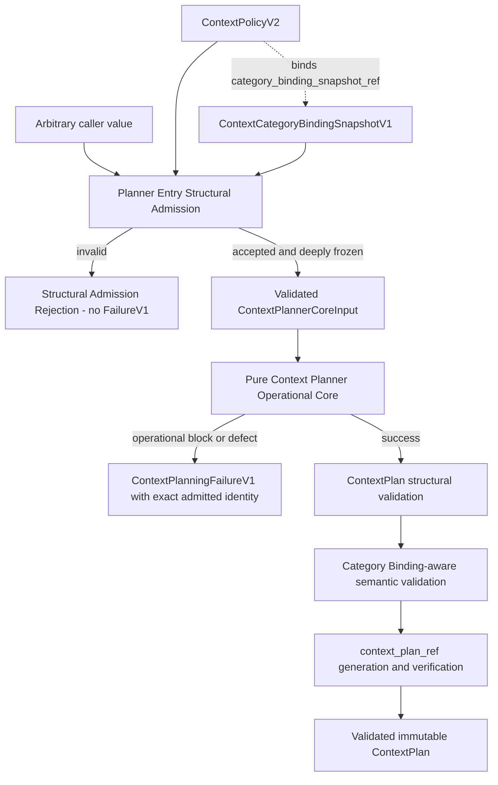

# Context Planner Entry Admission and Category Binding Design

Status: Design review candidate

Task: `ARCH-CONTEXT-PLANNER-ENTRY-ADMISSION-001`

Canonical assignment: [GitHub Issue #141](https://github.com/whatrune/sd-prompt-studio/issues/141)

Dispatch record: [Backend Architect Dispatch](https://github.com/whatrune/sd-prompt-studio/issues/141#issuecomment-5018560965)

Selected category boundary: **Option A — approved Context Category Binding Snapshot supplied at Planner Entry and identity-bound through a successor Context Policy contract**

Implementation: not included

## 1. Purpose

This document freezes the admission, category, identity, failure, validation, and rank boundaries required to correct Draft PR #140 without allowing Backend Implementer inference.

It closes seven review gaps:

1. exact approved binding between Context references and forbidden categories;
2. immutable identity and provenance for that binding;
3. separation of arbitrary-value structural admission from the pure operational core;
4. prevention of fake or placeholder identity in `ContextPlanningFailureV1`;
5. removal of path-based category inference from the new Planner validation path without changing the existing validator's behavior;
6. fail-closed rank invariants after ordering validation;
7. an exact implementation and merge sequence before Draft PR #140 can resume.

The result is a pure Planner boundary in which every value affecting planning is either projected directly into `ContextPlan` identity or bound indirectly through an immutable projected reference.

## 2. Normative sources and precedence

This design is subordinate to:

1. [Context Planning and Execution Context Assembly Architecture](19-context-planning-execution-context-assembly-architecture.md)
2. [Context Planner Supporting Contracts Design](20-context-planner-supporting-contracts-design.md)
3. merged PR #139 supporting contracts under `src/context-planning/`
4. the frozen Context Plan contract and validator introduced by PR #134
5. the frozen Model Routing contract and implementation introduced by PR #128 and PR #130
6. Issue #135 and its cumulative Task Assignment amendments
7. Draft PR #140 at review anchor `49afb5fb6e01a812c68322e886ba734ae89946c7`
8. [Delegation and Result Contract](../team/11-delegation-and-result-contract.md)
9. [Repository working rules](../../AGENTS.md)

Existing merged contracts remain authoritative. This design does not modify their code or silently widen their meaning. A successor contract is used where the current closed shape cannot represent the new identity relationship.

## 3. Scope

This design defines:

- the selected Category Boundary architecture;
- `ContextCategoryBindingSnapshotV1` and its content identity;
- successor `ContextPolicyV2` and its Category Snapshot binding;
- Planner Entry Structural Input and Structural Admission Result;
- validated immutable `ContextPlannerCoreInput`;
- exact structural-versus-operational failure behavior;
- Context Plan identity propagation;
- category and forbidden-context semantics;
- existing validator alignment without in-place contract change;
- post-validation rank invariants;
- algorithms, test design, ownership, implementation split, merge order, rollout, and rollback.

## 4. Non-goals

This design does not:

- change `src/**`, `scripts/**`, `package.json`, `.github/**`, Schema, or Workflow;
- modify Draft PR #140 or the Issue #135 implementation branch;
- implement Entry Admission, Category Binding, Policy v2, a validator, Planner Core, or integration wiring;
- change `RoutingDecision`, `ContextPlan`, `ContextPolicyV1`, or `ContextPlanningFailureV1`;
- read a file, Repository, URL, network response, source body, or file metadata;
- infer a category from a reference, path, filename, prefix, suffix, substring, regular expression, glob, or case-folded value;
- generate fake, guessed, fallback, or placeholder identity;
- select a Provider, model, Deployment, Binding, Adapter, or Runner;
- implement Context Materialization, Estimation, Assembly, Secret handling, or Credential handling;
- add a persistent registry, Receipt, audit Artifact, or historical store;
- change Existing Run or Research Artifact data;
- approve, mark ready, or merge any PR.

## 5. Verified gap baseline

At the review anchor, Draft PR #140:

- accepts `unknown` inside the operational `planContext` function;
- constructs fallback identity such as `unknown-task` and `1970-01-01T00:00:00Z`;
- uses `Date.parse` rather than the frozen strict timestamp validator;
- infers categories from normalized reference text;
- uses `ranks.get(reference) ?? 0` after ordering validation;
- calls the existing `validateContextPlan`, which contains the same path-based category inference;
- passes only six Core fields and has no approved Category Binding input.

These are Contract gaps, not implementation style findings. PR #140 must remain blocked until the prerequisite contracts and validators defined here are merged.

## 6. Category Boundary option comparison

| Option | Model | Advantages | Blocking problems | Decision |
| --- | --- | --- | --- | --- |
| A | Supply an approved Category Binding Snapshot at Planner Entry | Keeps exact category metadata with the decision boundary; allows pure exact-set checks; does not require source I/O | Requires an explicit identity chain because `ContextPlan` has no Category Binding field | **Selected**, with `ContextPolicyV2` binding the Snapshot identity |
| B | Upstream Admission screens categories and wraps `RoutingDecision` | Keeps screening before Planner | Either changes the meaning of `routing_decision_ref` or creates Admission Evidence not projected into Plan identity; risks changing Model Routing authority | Rejected |
| C | Separate semantic admission component screens categories | Strong component separation | Still needs an Evidence reference carried into Plan identity; creates another failure and correlation boundary and can overlap Planner or Materializer | Rejected for v1 |

### 6.1 Normative selection

Option A is normative.

Planner Entry receives one validated `ContextCategoryBindingSnapshotV1` in addition to the six values previously authorized by Issue #135 Amendment 2. A successor `ContextPolicyV2` contains the exact `category_binding_snapshot_ref`. The validated `RoutingDecision.context_policy_ref`, `ContextPolicyV2.context_policy_ref`, and output `ContextPlan.context_policy_ref` must be equal.

`ContextPolicyV2.context_policy_ref` is the immutable identity of the complete Policy v2 projection, including `category_binding_snapshot_ref`. Therefore:

```text
Category Binding content change
        |
        v
new category_binding_snapshot_ref
        |
        v
new ContextPolicyV2 projection and context_policy_ref
        |
        v
new ContextPlan.context_policy_ref
        |
        v
new context_plan_ref
```

No new field is added to `RoutingDecision` or `ContextPlan`. No semantic input is hidden from Plan identity.

## 7. Architecture and component boundary



### 7.1 Single responsibility rules

- Entry Structural Admission is the only public boundary that accepts arbitrary caller values.
- Operational Core accepts only `DeepReadonly<ContextPlannerCoreInput>` produced by successful Admission.
- Entry Admission does not plan, include, exclude, order, or generate a Plan reference.
- Operational Core does not perform arbitrary-object admission or create placeholder identity.
- Category metadata is supplied as approved inert metadata; no component derives it from a reference string or source content.
- Existing `validateContextPlan` remains unchanged and is not the final authority for the new admitted Planner path.

## 8. Planner Entry Structural Input contract

The public Entry value is a closed object. Unknown fields are rejected.

| Field | Type | Req. | Immutable identity meaning | Producer | Validator | Consumer | Treatment | Failure behavior |
| --- | --- | --- | --- | --- | --- | --- | --- | --- |
| `entry_admission_contract_version` | constant `context_planner_entry_admission_v1` | yes | Selects the closed admission shape only | approved caller | Entry validator | Entry Admission | validated, not passed to Core | Structural Rejection |
| `routing_decision` | `RoutingDecision` | yes | Exact routed requirements and timestamp | Model Routing boundary | existing strict Routing Decision validator | Operational Core | deep-cloned and referenced | Structural Rejection |
| `routing_decision_ref` | immutable reference | yes | Identity of the exact Decision | approved caller | Entry reference validator | Operational Core | copied | Structural Rejection |
| `context_policy` | `ContextPolicyV2` | yes | Exact Policy v2 Snapshot, including Category Snapshot identity | Context Policy owner | Policy v2 validator and identity verifier | Operational Core | deep-cloned and referenced | Structural Rejection |
| `context_category_binding` | `ContextCategoryBindingSnapshotV1` | yes | Exact approved Context-to-category Snapshot | Context Policy owner | Category Snapshot validator and identity verifier | Operational Core | deep-cloned and referenced through Policy v2 | Structural Rejection |
| `context_rendering_profile_ref` | immutable reference | yes | Exact caller-approved rendering profile | approved caller | Entry reference validator | Operational Core | copied unchanged | Structural Rejection |
| `materialization_policy_ref` | immutable reference | yes | Exact caller-approved Materialization policy | approved caller | Entry reference validator | Operational Core | copied unchanged | Structural Rejection |
| `planner_version` | opaque supported version | yes | Exact Planner implementation contract version | execution configuration owner | Entry version validator | Operational Core | copied unchanged | Structural Rejection |

The Entry validator reuses the existing strict `validateRoutingDecision` timestamp and reference validation. It does not use `Date.parse`, wall clock, locale parsing, or a default timestamp.

## 9. Structural Admission Result contract

### 9.1 Result union

```text
ContextPlannerEntryAdmissionResult
  = AdmissionAccepted
  | PlannerEntryStructuralRejection
```

```text
AdmissionAccepted {
  accepted: true
  core_input: DeepReadonly<ContextPlannerCoreInput>
  errors: []
}

PlannerEntryStructuralRejection {
  accepted: false
  errors: NonEmptyReadonlyArray<PlannerEntryStructuralError>
}
```

| Field | Type | Req. | Immutable identity meaning | Producer | Validator | Consumer | Treatment | Failure behavior |
| --- | --- | --- | --- | --- | --- | --- | --- | --- |
| `accepted` | boolean discriminator | yes | Identifies result branch only | Entry Admission | result constructor | caller | derived | Never defaulted |
| `core_input` | `DeepReadonly<ContextPlannerCoreInput>` | accepted only | Exact admitted Core value | Entry Admission | admission composition | Operational Core | deep immutable value | Absent on rejection |
| `errors` | closed error array | yes | No Task identity; structural diagnostics only | Entry Admission | closed error validator | caller | sanitized | Empty on acceptance |

`PlannerEntryStructuralRejection` is not `ContextPlanningFailureV1` and has no Planner status, Task ID, Assignment revision, Decision reference, Policy reference, Planner version, or evaluation timestamp.

### 9.2 Structural error vocabulary

Allowed codes are:

- `invalid_type`
- `missing_field`
- `unknown_field`
- `invalid_value`
- `invalid_reference`
- `invalid_timestamp`
- `unsupported_contract`
- `duplicate_binding`
- `invalid_category`
- `reference_mismatch`
- `admission_internal_failure`

Each error contains only `code`, JSON-style `path`, and a deterministic sanitized `message`. It contains no source content, local path, Secret, stack trace, raw exception, or guessed identity.

Malformed timestamp, malformed reference, and nested validator rejection return this Result synchronously or as a resolved promise under the chosen API. They must not escape as an unhandled promise rejection.

## 10. Validated ContextPlannerCoreInput contract

Admission produces exactly seven Core fields.

| Field | Type | Req. | Immutable identity meaning | Producer | Validator | Consumer | Treatment | Failure behavior after admission |
| --- | --- | --- | --- | --- | --- | --- | --- | --- |
| `routing_decision` | deep-readonly `RoutingDecision` | yes | Exact admitted Decision | Entry Admission | existing Routing Decision validator | Operational Core | referenced and projected through its fields/ref | Identity mismatch is FailureV1 |
| `routing_decision_ref` | immutable reference | yes | Exact Decision identity | Entry Admission | Entry reference validator | Operational Core | copied to Plan | Identity mismatch is FailureV1 |
| `context_policy` | deep-readonly `ContextPolicyV2` | yes | Exact Policy v2 identity | Entry Admission | Policy v2 validator/verifier | Operational Core | its ref is copied to Plan | Policy mismatch is FailureV1 |
| `context_category_binding` | deep-readonly `ContextCategoryBindingSnapshotV1` | yes | Exact Category Snapshot identity | Entry Admission | Category validator/verifier | Operational Core | indirectly bound through Policy ref | Coverage/conflict is FailureV1 |
| `context_rendering_profile_ref` | immutable reference | yes | Rendering profile identity | Entry Admission | Entry reference validator | Operational Core | copied to Plan | No default; impossible absence is internal failure |
| `materialization_policy_ref` | immutable reference | yes | Materialization policy identity | Entry Admission | Entry reference validator | Operational Core | copied to Plan | No default; impossible absence is internal failure |
| `planner_version` | opaque supported version | yes | Planner implementation identity | Entry Admission | Entry version validator | Operational Core | copied to Plan | Impossible invalidity is internal failure |

Core Input has no optional field and no unknown field. Entry Admission deep-clones and deep-freezes every nested array and object; caller mutation after admission cannot affect Core behavior.

## 11. ContextCategoryBindingSnapshotV1 contract

### 11.1 Snapshot fields

| Field | Type | Req. | Immutable identity meaning | Producer | Validator | Consumer | Treatment | Failure behavior |
| --- | --- | --- | --- | --- | --- | --- | --- | --- |
| `category_binding_contract_version` | constant `context_category_binding_v1` | yes | Selects Snapshot contract | Context Policy owner | Category validator | Entry/Core | projected | Structural Rejection |
| `category_binding_snapshot_ref` | content reference | yes | Identity of exact Snapshot projection | Context Policy owner | identity verifier | Entry/Core/Policy v2 | referenced | Structural Rejection on mismatch |
| `category_catalog_ref` | immutable reference | yes | Approved category vocabulary source | Context Policy owner | reference validator | Entry | projected | Structural Rejection |
| `approved_category_values` | unique canonical category array | yes | Exact allowed category vocabulary for this Snapshot | Context Policy owner | category validator | Entry/Core | projected; bytewise sorted | Structural Rejection |
| `bindings` | unique binding array | yes | Exact reference-to-category facts | Context Policy owner | binding validator | Core | projected; canonicalized | Structural Rejection or operational coverage block |
| `source_ref` | immutable reference | yes | Governance source | Context Policy owner | reference validator | audit boundary | projected | Structural Rejection |
| `approval_ref` | immutable reference | yes | Approval record | approval owner | reference validator | Entry | projected | Structural Rejection |

### 11.2 Binding entry fields

| Field | Type | Req. | Immutable identity meaning | Producer | Validator | Consumer | Treatment | Failure behavior |
| --- | --- | --- | --- | --- | --- | --- | --- | --- |
| `context_ref` | immutable Context reference | yes | Exact case-sensitive Context identity | Context Policy owner | binding validator | Operational Core | exact-map key | Duplicate is Structural Rejection |
| `categories` | non-empty unique category array | yes | Approved exact category membership | Context Policy owner | membership validator | Operational Core | exact-set value; bytewise sorted | Unknown/unapproved category is Structural Rejection |

No binding contains content, path metadata, filename metadata, a match expression, or a derived category.

### 11.3 Snapshot identity

The Snapshot reference format is:

```text
evidence/context-category-bindings/sha256-<64-lowercase-hex>
```

Its `context_category_binding_reference_v1` Normative Projection contains every Snapshot field except `category_binding_snapshot_ref`. Arrays are canonicalized as follows before RFC 8785 JCS and SHA-256:

- `approved_category_values`: ascending UTF-8 bytewise order;
- `bindings`: ascending UTF-8 bytewise `context_ref` order;
- each `categories`: ascending UTF-8 bytewise order.

The identity is a Normative Projection content identity, not an Artifact-bytes hash or storage location.

### 11.4 Coverage and extra bindings

For one admitted Routing Decision:

- every member of `required_context_refs union optional_context_refs` must have exactly one Binding;
- duplicate Binding references are rejected during Admission;
- a missing exact Binding is `blocked/unsupported_context_reference` in the Operational Core;
- reference comparison is case-sensitive exact equality;
- extra bindings are allowed for reusable approved Snapshots, are ignored for the current Decision, and remain part of Snapshot identity;
- an extra binding cannot add Context to the Plan;
- every used category must be present in `approved_category_values` exactly.

Changing an unused extra Binding changes the Snapshot reference and therefore changes the bound Policy and Plan references. This conservative identity behavior preserves reproducibility.

## 12. ContextPolicyV2 identity binding

`ContextPolicyV1` remains unchanged. `ContextPolicyV2` is a successor contract with the same optional and ordering Rule v1 values plus one required Category Snapshot reference.

| Field | Relationship |
| --- | --- |
| `context_policy_contract_version` | constant `context_policy_v2` |
| `context_policy_ref` | content identity of the Policy v2 Normative Projection |
| `policy_revision` | immutable revision |
| `category_binding_snapshot_ref` | exact `ContextCategoryBindingSnapshotV1.category_binding_snapshot_ref` |
| `optional_context_rules` | existing closed `ContextPolicyRuleV1[]` |
| `ordering_rule` | existing closed `ContextOrderingRuleV1` |
| `source_ref` | immutable governance source |
| `approval_ref` | immutable approval record |

The Policy reference format is:

```text
policies/context/sha256-<64-lowercase-hex>
```

Its `context_policy_reference_v2` projection excludes every occurrence of the parent Policy reference to avoid self-reference:

- root `context_policy_ref` is excluded;
- each optional Rule's `policy_ref` is excluded;
- the ordering Rule's `policy_ref` is excluded.

All other Policy and Rule fields, including `category_binding_snapshot_ref`, are projected. Rule arrays are canonicalized by immutable `rule_ref`. RFC 8785 JCS and SHA-256 produce the parent Policy reference. After generation, the same generated value is stored in the root and every child `policy_ref`; verification requires exact equality at all locations.

Implementations must not attempt to hash a projection that already embeds the parent digest in child fields. Such a recursive identity has no stable construction rule and is invalid.

Entry Admission verifies both content references. Operational Core verifies:

```text
routing_decision.context_policy_ref
  == context_policy.context_policy_ref

context_policy.category_binding_snapshot_ref
  == context_category_binding.category_binding_snapshot_ref
```

Any mismatch returns the existing closed `blocked/incompatible_context_policy` branch. No v1 Policy is silently upgraded or defaulted.

## 13. Operational ContextPlanningFailureV1 usage

`ContextPlanningFailureV1` is created only after successful Entry Admission.

| Failure condition | Required admitted source fields | Closed mapping | Producer | Validator | Partial Plan |
| --- | --- | --- | --- | --- | --- |
| Cross-input identity mismatch | all seven Core fields | `blocked/inconsistent_identity` | Operational Core | PR #139 validator | forbidden |
| Missing/incompatible Policy v2 or Category Snapshot binding | exact admitted Policy/Snapshot refs | `blocked/incompatible_context_policy` | Operational Core | PR #139 validator | forbidden |
| Routed reference has no exact Binding | admitted Decision and Snapshot | `blocked/unsupported_context_reference` | Operational Core | PR #139 validator | forbidden |
| Optional rule missing | admitted Policy v2 | `blocked/context_policy_no_match` | Operational Core | PR #139 validator | forbidden |
| Highest-priority tie | admitted Policy v2 | `blocked/context_policy_conflict` | Operational Core | PR #139 validator | forbidden |
| Required Context category intersects forbidden set | exact Binding | `blocked/forbidden_context/input_binding` | Operational Core | PR #139 validator | forbidden |
| Included optional category intersects forbidden set | exact Binding | `blocked/forbidden_context/optional_context_resolution` | Operational Core | PR #139 validator | forbidden |
| Missing/conflicting rank before accepted ordering | admitted ordering Rule | `blocked/invalid_context_order` | Operational Core | PR #139 validator | forbidden |
| Constructed Plan rejected by the new admitted validation path | admitted exact identity | `blocked/result_validation_failed` | Operational Core | PR #139 validator | forbidden |
| Unexpected operational defect | admitted exact identity | `failed/internal_failure` | Operational Core | PR #139 validator | forbidden |

Failure identity is copied only from `ContextPlannerCoreInput`. No fallback extraction exists. An operational exception handler is installed only after the exact immutable Failure Context has been constructed from admitted inputs.

## 14. ContextPlan identity binding table

| Semantic input | Direct Plan projection field | Indirect binding | Change behavior |
| --- | --- | --- | --- |
| Routing Decision | `task_id`, `assignment_revision`, `routing_contract_version`, routed sets, forbidden categories, `evaluation_timestamp` | `routing_decision_ref` | Any Decision identity change changes Plan reference |
| Decision reference | `routing_decision_ref` | none | Changes Plan reference |
| Policy v2 | `context_policy_ref`, `applied_rule_refs` | Policy ref binds full Policy projection | Any Policy change requires new ref and changes Plan reference |
| Category Binding Snapshot | none added | `ContextPolicyV2.category_binding_snapshot_ref` is inside projected `context_policy_ref` identity | Any Snapshot change requires new Policy ref and changes Plan reference |
| Rendering profile | `context_rendering_profile_ref` | none | Changes Plan reference |
| Materialization policy | `materialization_policy_ref` | none | Changes Plan reference |
| Planner version | `planner_version` | none | Changes Plan reference |
| Evaluation timestamp | `evaluation_timestamp` | copied exactly from Decision | Changes Plan reference |
| Entry Admission result | none | no semantic Evidence Artifact exists in Option A | Does not affect Plan; if future evidence affects semantics, a new projected/bound Contract is mandatory |

### 14.1 Same input and same identity

“Same Core input” means field-for-field equal canonical immutable values for all seven Core fields; serialization property order and insignificant formatting are irrelevant. “Same Plan identity” means the same `context_plan_reference_v1` Normative Projection and therefore the same `context_plan_ref`.

Entry validator implementation version is not a semantic Core input. A validator implementation change that preserves `context_planner_entry_admission_v1` acceptance semantics does not change Plan identity. A change to Admission semantics requires a new Admission contract version and, if it can affect planning, a new Policy or Plan contract identity path; it must not silently alter output under the old version.

## 15. Rank invariant table

| Boundary | Required invariant | Failure when violated | Default/tie behavior |
| --- | --- | --- | --- |
| Ordering Rule structural admission | ranks and Context refs are unique and non-negative | Structural Rejection | no default, no tie break |
| Ordering semantic validation | every planned ref has exactly one explicit rank | `blocked/invalid_context_order` | no default, no tie break |
| Post-acceptance lookup | every lookup must return its admitted rank | impossible absence is `failed/internal_failure` | `?? 0` and equivalent fallback forbidden |
| Sort | ascending numeric rank only | invariant defect is `failed/internal_failure` | input order and lexical tie break forbidden |
| Emitted `context_order` | exact duplicate-free complete permutation | `blocked/invalid_context_order` before Plan success | silent repair forbidden |

An accepted ordering result is a proof boundary. Code after that boundary must use a total lookup that either returns the rank or reports an internal invariant defect.

## 16. Component ownership table

| Component | Owns | Must not own |
| --- | --- | --- |
| Policy/Category governance | Policy v2, Category Snapshot, approval, immutable refs | Planner decisions or source I/O |
| Policy/Snapshot resolver outside Core | Retrieve exact approved immutable values | Include/exclude/order decisions |
| Planner Entry Structural Admission | Arbitrary-value shape, nested structural validation, strict timestamp/reference checks, deep clone/freeze | Planning, category inference, FailureV1 |
| Operational Core | Cross-input binding, optional rules, exact Category intersection, rank order, Plan/reference creation | Arbitrary-value admission, I/O, defaults, placeholders |
| Context Plan structural validator | Closed Plan shape, types, sets, order completeness | Category inference |
| Category-aware semantic validator | Exact Binding coverage and forbidden intersection | Path/source inspection |
| Reference helper | Normative projection, JCS, SHA-256, verification | Policy resolution or category inference |
| Entry façade/integration | Admission-to-Core composition and Result union | Repair, product judgment, Provider/Binding selection |
| Materializer | Later approved Context acquisition | Planner policy or category classification |

## 17. Normative algorithms

### 17.1 Structural Admission

```text
admit(value):
  if value is not a closed object:
    return StructuralRejection
  validate exact root fields
  validate RoutingDecision with frozen strict validator
  validate routing_decision_ref and supplied profile/policy refs
  validate supported planner_version
  validate and verify ContextPolicyV2 identity
  validate and verify Category Binding Snapshot identity
  validate Binding uniqueness and approved category membership
  if any error:
    return StructuralRejection without Task identity or FailureV1
  deep-clone and deep-freeze the seven Core fields
  return AdmissionAccepted(core_input)
```

Unexpected Admission exceptions return sanitized `admission_internal_failure`; they do not fabricate Planner identity.

### 17.2 Category Binding Admission

```text
validate_snapshot(snapshot):
  validate closed fields and contract version
  validate unique approved_category_values
  for each binding:
    require exact immutable context_ref
    require unique context_ref
    require non-empty unique categories
    require each category in approved_category_values by exact equality
  canonicalize projection
  require calculated snapshot_ref == stored snapshot_ref
```

### 17.3 Forbidden Category Check

```text
binding_by_ref = exact Map(snapshot.bindings)
for ref in required_context_refs:
  binding = binding_by_ref.get(ref)
  if absent: blocked / unsupported_context_reference
  if intersection(binding.categories, forbidden_context_categories) is non-empty:
    blocked / forbidden_context / input_binding

for ref in included_optional_context_refs:
  binding = binding_by_ref.get(ref)
  if absent: blocked / unsupported_context_reference
  if intersection(binding.categories, forbidden_context_categories) is non-empty:
    blocked / forbidden_context / optional_context_resolution
```

Intersection uses exact case-sensitive values only. The reference text is never examined for category meaning.

### 17.4 Optional Context Resolution

```text
for candidate in UTF-8-bytewise-sorted optional_context_refs:
  matches = exact policy rules for candidate
  if none: blocked / context_policy_no_match
  highest = maximum priority
  winners = matches where priority == highest
  if winners.count != 1: blocked / context_policy_conflict
  apply include or exclude
  record exact winner.rule_ref
```

### 17.5 Ordering

```text
planned = required union included_optional
ordering = validateContextOrderingSemantics(rule, planned)
if rejected: blocked / invalid_context_order

for ref in planned:
  rank = totalRankLookup(ordering, ref)
  if rank absent after acceptance: failed / internal_failure

sort by explicit rank ascending
do not use a fallback rank
do not use input order or a tie breaker
```

### 17.6 Failure construction

```text
after AdmissionAccepted:
  failure_context = exact immutable identity from core_input
  mapping = exact PR #139 closed mapping for code and stage
  construct candidate from failure_context + mapping + safe path/ref
  validate ContextPlanningFailureV1
  return failure only; never a partial Plan
```

Before Admission acceptance, only Structural Rejection is legal.

### 17.7 ContextPlan construction

```text
validate cross-input policy and Category Snapshot refs
resolve optional rules
verify exact Binding coverage and forbidden intersections
validate explicit ordering
copy exact routed and supplied values
build ContextPlan without context_plan_ref
run new structural-only Plan validation
run Category Binding-aware semantic validation
generate context_plan_ref
verify context_plan_ref
repeat admitted validation on final Plan
return deeply immutable Plan
```

### 17.8 context_plan_ref generation

The existing `context_plan_reference_v1` projection remains unchanged. It directly includes `context_policy_ref`; Policy v2 identity binds Category Snapshot identity.

```text
verify Category Snapshot ref
verify Policy v2 ref contains exact Category Snapshot ref
copy Policy v2 ref into ContextPlan.context_policy_ref
canonicalize existing Context Plan projection with JCS
SHA-256 -> evidence/context-plans/sha256-<digest>
```

No hidden Category or Admission Evidence argument enters the hash helper.

### 17.9 Unexpected exception handling

```text
if exception occurs before AdmissionAccepted:
  return StructuralRejection(admission_internal_failure)

if exception occurs after AdmissionAccepted:
  return valid failed/internal_failure using exact admitted identity

if the closed Failure constructor itself cannot produce a valid Failure:
  do not fabricate or substitute identity
  propagate a platform-level failed execution to the caller
  do not report Task completion or a partial Plan
```

Raw exception text is never emitted in either result.

## 18. Existing validateContextPlan alignment

The existing `validateContextPlan` remains behaviorally unchanged for backward compatibility. Its path-based forbidden-category inference is not used as semantic authority in the new admitted Planner path.

The required alignment is:

1. add a new `validateContextPlanStructure` that performs the existing closed-object, type, reference, set, and complete-order checks but performs no category inference;
2. add a new `validateContextPlanCategorySemantics(plan, categorySnapshot, policyV2)` that checks exact identity, coverage, and category intersection;
3. add a composed `validateAdmittedContextPlan` that requires structure, Category semantics, and reference verification;
4. update the reference projection helper to use structural-only validation rather than legacy path inference;
5. keep existing `validateContextPlan` and its tests unchanged until a separately approved versioned deprecation/migration Task;
6. update PR #140 to call only the new admitted path after the alignment implementation is merged.

This approach avoids an in-place PR #134 behavior change while preventing legacy heuristic false positives or false negatives from deciding new Planner results.

The legacy validator's placeholder failure construction is never used by the new Entry or Core outcome path. New structural validators return structural errors without fake Planner identity.

## 19. Failure boundary summary

### 19.1 Structural Admission Rejection

Used for:

- non-object input;
- missing or unknown field;
- malformed Routing Decision, strict timestamp, immutable reference, Policy v2, or Category Snapshot;
- duplicate Binding;
- category outside the Snapshot's approved vocabulary;
- Policy or Category content-reference mismatch;
- unsupported admission contract or Planner version.

It never emits `ContextPlanningFailureV1`.

### 19.2 Operational ContextPlanningFailureV1

Used only after exact identity admission for:

- cross-input identity or Policy binding mismatch;
- missing exact Context Binding coverage;
- optional rule no-match or highest-priority conflict;
- exact Category/forbidden intersection;
- missing/conflicting rank;
- admitted Plan rejection;
- unexpected operational defect.

No code path converts one result class into the other, and no error is emitted twice.

## 20. Purity, determinism, and security

Forbidden dependencies in Admission and Core:

- filesystem, Repository, URL, network, source content, or file metadata;
- wall clock, random value, locale, environment variable, or process state;
- Provider, model, Deployment, Binding, Adapter, Runner, or cost state;
- previous conversation, path inference, content inference, or model judgment;
- default reference, timestamp, rank, category, Policy, or identity.

For identical accepted seven-field Core inputs, Operational Core returns the same immutable Plan or the same sanitized failure classification.

Logs and Result Handoffs must not contain source content, Secret, Credential, personal path, private endpoint, raw exception, or internal reasoning.

## 21. Required test design

### 21.1 Structural Admission

- non-object rejected without FailureV1;
- missing Routing Decision rejected without FailureV1;
- malformed strict timestamp rejected without FailureV1 or promise rejection;
- malformed reference rejected without FailureV1;
- unknown root or nested field rejected;
- unsupported contract version rejected;
- accepted value deeply frozen;
- caller alias mutation cannot affect admitted input;
- Admission internal exception returns sanitized structural rejection.

### 21.2 Category Binding

- exact reference Binding accepted;
- missing used Binding becomes operational `unsupported_context_reference`;
- duplicate Binding rejected at Admission;
- category absent from `approved_category_values` rejected;
- extra Binding accepted, ignored for planning, and retained in Snapshot identity;
- reference case mismatch does not match and is blocked;
- path containing a forbidden word does not imply a category;
- metadata without forbidden intersection is accepted;
- metadata with forbidden intersection is blocked on the correct required/optional branch;
- Category Snapshot content change changes its ref;
- source content is never inspected.

### 21.3 Identity

- Category Snapshot reference change requires Policy v2 reference change;
- Category Snapshot change with unchanged Policy ref is rejected;
- Policy v2 reference change changes `context_plan_ref`;
- Planner version change changes `context_plan_ref`;
- evaluation timestamp change changes `context_plan_ref`;
- rendering or Materialization ref change changes `context_plan_ref`;
- no unprojected semantic input affects Plan identity;
- Admission implementation change under identical contract semantics does not change Plan identity.

### 21.4 Failure

- Structural Rejection never contains fake FailureV1 identity;
- operational failure uses exact admitted Task, Assignment, Decision, Policy, Planner, and timestamp values;
- no placeholder such as `unknown-task` or epoch timestamp exists;
- unexpected operational defect returns valid `failed/internal_failure`;
- failure-constructor fatal defect does not fabricate a result;
- raw exception text and partial Plan are absent.

### 21.5 Ordering

- missing rank before accepted semantic validation is `blocked/invalid_context_order`;
- duplicate rank is rejected;
- accepted ordering followed by impossible missing lookup is `failed/internal_failure`;
- no `?? 0` or equivalent rank default;
- no input-order, lexical, or insertion-order tie break;
- exact complete permutation remains required.

### 21.6 Existing validator alignment

- legacy `validateContextPlan` behavior and fixtures remain unchanged;
- new structural validator accepts a safe path whose text contains a forbidden-category word;
- category-aware validator decides from exact metadata only;
- reference projection helper no longer invokes path category inference;
- composed admitted validator rejects missing/mismatched Snapshot or Policy identity.

### 21.7 Boundary

- no File, Repository, URL, network, wall-clock, random, or environment access;
- no Provider, model, Deployment, or Binding selection;
- no Context Materialization;
- no change to Model Router or Deployment Resolver;
- no Secret or Credential access.

## 22. Required implementation tasks and merge order

This Architecture PR is merge step 0. No implementation starts before Product Owner merge decision.

### Step 1 — Category Binding and ContextPolicyV2 contracts

- proposed task ID: `IMPLEMENT-CONTEXT-CATEGORY-BINDING-CONTRACT-001`
- role: Backend Implementer
- dependencies: merged Architecture PR from Issue #141 and merged PR #139
- allowed files: new Category/Policy-v2 contract module under `src/context-planning/`, required `index.ts` exports, one focused test script, and `package.json` test registration
- forbidden files: Model Router, Resolver, Adapter, Runner, Dispatcher, Workflow, Existing Run, Research Artifact
- completion: closed types/validators, JCS/SHA-256 identity helpers, approved-category and duplicate tests, no v1 mutation
- merge gate: Backend Architect review and Product Owner decision

### Step 2 — Planner Entry Admission Contract and validator

- proposed task ID: `IMPLEMENT-CONTEXT-PLANNER-ENTRY-ADMISSION-001`
- role: Backend Implementer
- dependencies: Step 1 merged
- allowed files: new Entry Admission module, `src/context-planning/index.ts`, focused admission test script, and `package.json` test registration
- forbidden files: PR #140 Core files except shared exports, all other subsystems
- completion: arbitrary-value admission, strict validator reuse, Structural Rejection union, seven-field deep-frozen Core Input, no fake identity
- merge gate: Backend Architect review and Product Owner decision

### Step 3 — Existing ContextPlan validator alignment

- proposed task ID: `ALIGN-CONTEXT-PLAN-VALIDATION-001`
- role: Backend Implementer
- dependencies: Steps 1 and 2 merged
- allowed files: `src/context-planning/validation.ts`, `reference.ts`, `index.ts`, Context Plan contract test script, one focused semantic test script, and `package.json` registration
- forbidden files: existing type meaning, legacy fixture behavior, PR #140 Core, other subsystems
- completion: new structural-only and Category-aware validators, legacy validator unchanged, reference helper uses structural-only validation
- merge gate: Backend Architect review and Product Owner decision

### Step 4 — Correct existing Draft PR #140

- task: amend and resume existing `IMPLEMENT-CONTEXT-PLANNER-CORE-001`
- role: Backend Implementer
- dependencies: Steps 1–3 merged and Issue #135 explicitly amended/reassigned
- branch/worktree/PR: reuse `codex/implement-context-planner-core`, `.worktrees/context-planner-core`, and Draft PR #140; create no replacement
- allowed files: the exact Issue #135 Core scope (`core.ts`, `index.ts`, Core test script, `package.json`)
- forbidden files: all newly merged supporting/admission/validation contract files, other subsystems, Ready transition, Merge
- completion: typed seven-field Core, exact Category semantics, no path inference, no fake identity, strict rank lookup, new admitted Plan validation, all cumulative tests
- merge gate: fresh Backend Architect review and Product Owner decision

### Step 5 — Entry façade and integration wiring

- proposed task ID: `INTEGRATE-CONTEXT-PLANNER-ENTRY-001`
- role: Backend Implementer
- dependencies: corrected PR #140 merged
- allowed files: new Context Planner Entry façade module, `index.ts`, focused integration tests, and test registration
- forbidden files: Dispatcher/Runner integration unless separately assigned, source I/O, Policy retrieval, other contracts
- completion: public unknown-value Entry composes Admission then typed Core; Structural Rejection and Operational Result remain distinct
- merge gate: Backend Architect review and Product Owner decision

### Step 6 — Regression expansion and offline integration proof

- proposed task ID: `TEST-CONTEXT-PLANNER-ADMISSION-REGRESSION-001`
- role: Backend Implementer or Worker for matrix preparation, Backend Implementer for executable tests
- dependencies: Step 5 merged
- allowed files: Context Planning test scripts, approved fixtures, and test registration only
- forbidden files: production behavior, external I/O, Provider/Deployment integration
- completion: all section 21 scenarios, cumulative Issue #135 tests, purity guards, legacy compatibility, deterministic references
- merge gate: Backend Architect review and Product Owner decision

The merge order is strict: Architecture → Step 1 → Step 2 → Step 3 → PR #140 correction → Step 5 → Step 6. Parallel merge of Steps 1–3 is forbidden because later contracts depend on earlier frozen identities.

PR #140 cannot be corrected safely within its current cumulative Assignment until Steps 1–3 are merged and Issue #135 is explicitly amended. After that amendment, its existing branch and PR must be reused.

## 23. Rollout and rollback boundary

Rollout is offline and fail-closed:

1. merge Architecture after review;
2. implement and merge the three prerequisites in strict order;
3. amend Issue #135;
4. correct PR #140 without rebasing away its review history;
5. validate the new Entry façade offline;
6. run regression proof before any execution integration.

Rollback removes or disables the newest unmerged integration layer and returns to the last approved boundary. It never restores path inference, fake identity, default rank, or an older mutable Policy value. Existing v1 contracts and prior valid Plans remain unchanged.

## 24. Acceptance criteria

The Architecture is implementation-ready only when reviewers can confirm:

- Option A is the sole normative Category Boundary;
- every planning-relevant input is directly projected or indirectly identity-bound;
- existing `RoutingDecision` and `ContextPlan` shapes remain unchanged;
- Category decisions use exact approved metadata only;
- arbitrary caller values cannot reach Operational Core;
- Structural Rejection cannot contain FailureV1 or fake identity;
- FailureV1 is constructed only from admitted exact identity;
- strict timestamp validation is reused;
- legacy validator behavior is preserved but excluded from new semantic authority;
- rank default and tie break are impossible;
- PR #140 remains blocked until prerequisite merge and reassignment;
- the implementation and merge sequence is unambiguous.

## 25. Deferred decisions

- concrete filenames for future Category/Policy-v2 and Admission modules;
- storage, retrieval, approval enforcement, retention, and revocation for Policy and Category Snapshots;
- operational platform-failure reporting when the closed Failure constructor itself is defective;
- eventual deprecation or versioned replacement of legacy `validateContextPlan`;
- integration beyond the Context Planner Entry façade.

These decisions do not authorize implementation in this Task.

## 26. Explicit non-implementation confirmation

- Architecture document created: yes
- Category Boundary selected: Option A
- Source code changed: no
- Script changed: no
- Package changed: no
- Schema changed: no
- Workflow changed: no
- Draft PR #140 changed: no
- Issue #135 implementation branch changed: no
- Existing Contract implementation changed: no
- Model Router changed: no
- Deployment Resolver changed: no
- Context Materializer implemented: no
- Secret or Credential changed: no
- Existing Run changed: no
- Research Artifact changed: no
- Merge performed: no
- Approve performed: no
- Ready-for-review transition performed: no
