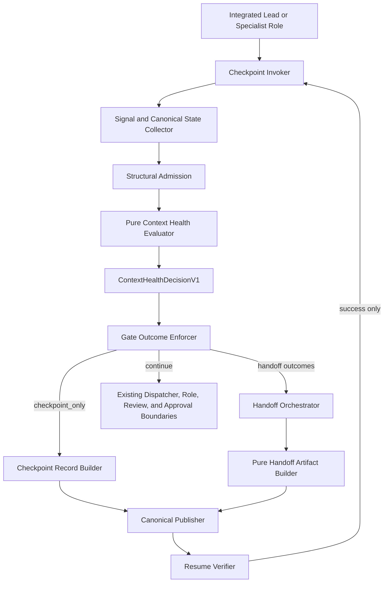
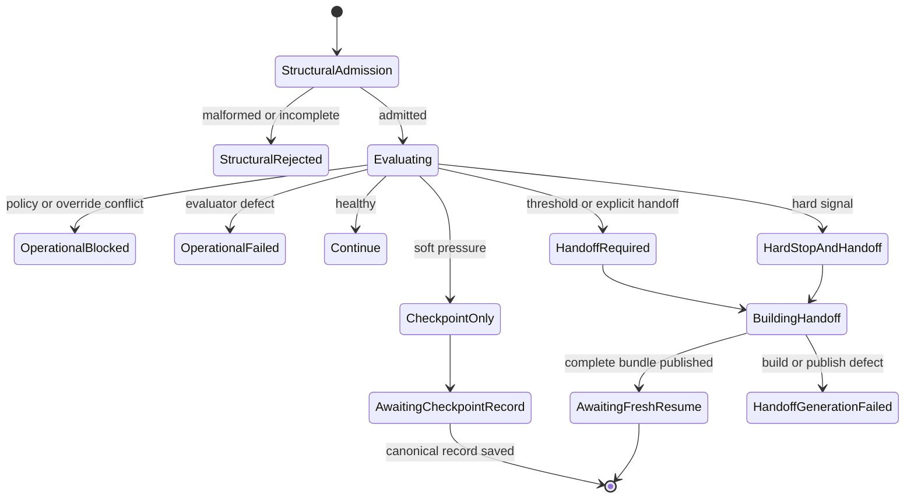
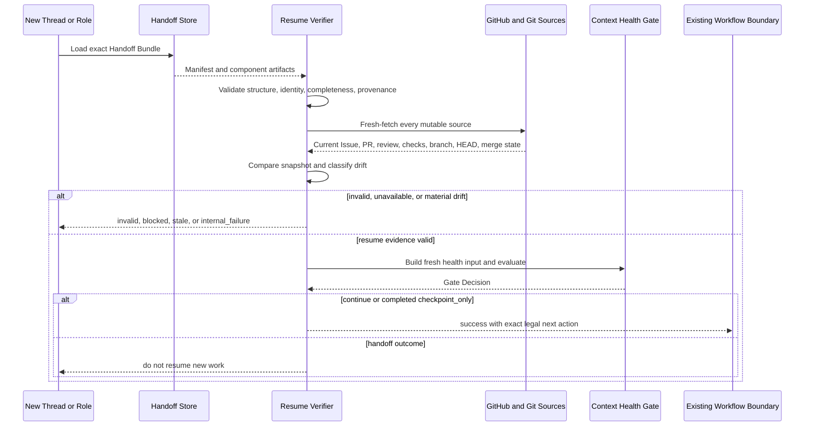

# Context Health and Automatic Handoff Gate Architecture

## Status

- Architecture version: `0.1.0`
- Status: Freeze candidate
- Task ID: `ARCH-CONTEXT-HEALTH-HANDOFF-GATE-001`
- Canonical Task Assignment: <https://github.com/whatrune/sd-prompt-studio/issues/154>
- Dispatch Record: <https://github.com/whatrune/sd-prompt-studio/issues/154#issuecomment-5020331802>
- Roadmap Record: <https://github.com/whatrune/sd-prompt-studio/issues/143>
- Implementation status: not implemented

## 1. Problem statement

Long-running Integrated Lead and Specialist Role workflows accumulate decisions, amendments, mutable GitHub state, validation evidence, and forbidden-operation constraints. Continuing after those dependencies can no longer be reconstructed exactly risks contradictory decisions, lost constraints, fabricated identity, or an untrustworthy completion claim.

Exact remaining-token telemetry is neither portable nor required. This architecture instead evaluates closed, observable, provenance-bound signals at mandatory checkpoints. It determines whether work may continue, must record a checkpoint, or must stop and create a handoff before new judgment is attempted.

The Gate is a restriction boundary. It never grants an action that an existing Role, Task Assignment, Approval Gate, or Product Owner decision forbids.

## 2. Normative sources

This design supplements without changing:

1. [`00-automation-overview.md`](00-automation-overview.md)
2. [`01-dispatch-contract.md`](01-dispatch-contract.md)
3. [`02-role-runner-mapping.md`](02-role-runner-mapping.md)
4. [`03-approval-gate.md`](03-approval-gate.md)
5. [`04-security-boundary.md`](04-security-boundary.md)
6. [`05-automation-handoff-contract.md`](05-automation-handoff-contract.md)
7. [`../team/08-integrated-lead-charter.md`](../team/08-integrated-lead-charter.md)
8. [`../team/11-delegation-and-result-contract.md`](../team/11-delegation-and-result-contract.md)
9. [`../team/12-integrated-completion-report-template.md`](../team/12-integrated-completion-report-template.md)
10. [`19-context-planning-execution-context-assembly-architecture.md`](19-context-planning-execution-context-assembly-architecture.md)
11. [`21-context-planner-entry-admission-and-category-binding-design.md`](21-context-planner-entry-admission-and-category-binding-design.md)
12. merged PR #153 at commit `f4befaaff2d1b6d6cea30bb81729b428cb4e6101`

On conflict, the existing Team Contract, Task Assignment, domain Freeze Contract, and Product Owner decision remain authoritative. The Gate fails closed and does not resolve the conflict.

## 3. Scope

This document freezes:

- the logical Context Health input and policy boundary;
- authoritative, advisory, derived, and forbidden signals;
- mandatory checkpoints;
- the four closed Gate outcomes;
- deterministic precedence, scoring, unknown handling, and override rules;
- Handoff Artifact ownership, identity, completeness, and provenance;
- the future schema and template boundary;
- the Resume Protocol contract;
- Dispatcher and Role invocation points;
- failure, security, privacy, audit, and test boundaries;
- successor Tasks and strict merge order.

## 4. Non-goals

This Task does not:

- implement production source code;
- add JSON Schema, TypeScript contracts, validators, templates, or fixtures;
- implement signal collection, an evaluator, an artifact generator, Dispatcher integration, or Resume Protocol;
- require or approximate exact remaining-token telemetry;
- change Dispatcher state, Result Handoff status, Role responsibility, Approval Gates, or Product Owner authority;
- change Context Planner, Model Router, Deployment Resolver, Execution Adapter, Runner, Workflow, Existing Run, or Research Artifact behavior;
- automatically Merge, Approve, mark ready for review, Revert, dispatch a next Role, or resume work;
- create a full conversation transcript as a canonical artifact;
- infer health from prose style, personality, verbosity, or response length alone.

## 5. Terminology

| Term | Meaning |
| --- | --- |
| Context Health | Whether the current Role can continue the assigned work while preserving exact identity, constraints, decisions, and verification quality |
| Checkpoint | A Contract-defined point where the Gate must be evaluated before a protected next action |
| Signal Observation | A provenance-bound observation supplied to the pure evaluator |
| Hard signal | A signal whose presence determines an outcome before soft scoring |
| Soft signal | An advisory signal with a frozen weight in the approved policy |
| Gate Decision | One of the four closed outcomes plus its reproducibility evidence |
| Checkpoint Record | A compact canonical record of a non-handoff Gate evaluation |
| Handoff Bundle | The complete machine-readable and human-readable artifact set required to resume in fresh context |
| Material fact | A workflow fact whose omission or change could alter the legal next action, scope, identity, or completion claim |
| Fresh verification | Direct retrieval of mutable canonical state at a supplied timestamp by a component authorized to perform I/O |
| Resume drift | A difference between a Handoff snapshot and freshly retrieved mutable state |

Gate outcomes are not Team Result Handoff statuses and are not Dispatcher states.

## 6. Frozen architecture decisions

1. The Gate uses a hybrid policy: hard rules first, then a versioned deterministic soft score.
2. Exact remaining-token telemetry is forbidden as a required signal and has no hidden default.
3. The evaluator is pure and performs no Repository, GitHub, filesystem, network, clock, environment, or conversation I/O.
4. Signal collection and fresh verification occur outside the evaluator.
5. All required checkpoints are blocking boundaries; optional periodic observation is advisory.
6. The only Gate outcomes are `continue`, `checkpoint_only`, `handoff_required`, and `hard_stop_and_handoff`.
7. `handoff_required` and `hard_stop_and_handoff` prohibit new architecture or implementation work until a complete Handoff Bundle is canonically saved and Resume Protocol later succeeds.
8. Operator action may make an outcome more restrictive but never less restrictive.
9. Gate input, policy, decision, and Handoff manifest use content-addressed normative identities.
10. Handoff generation copies verified state and preserves unresolved state; it never creates new Architecture, Product, Research, or implementation judgment.
11. Resume always fresh-fetches mutable state and never trusts a Handoff snapshot as current merely because its identity is valid.
12. Existing Approval Gates remain necessary. A Gate decision can deny or pause an action but cannot authorize it.

## 7. Component architecture



### 7.1 Ownership

| Component | Owns | Must not do |
| --- | --- | --- |
| Checkpoint Invoker | Invoke the Gate at the frozen boundary | Skip a mandatory checkpoint or reinterpret a decision |
| Signal and Canonical State Collector | Authorized I/O, counters, fresh GitHub/Git evidence, provenance | Decide the outcome or fabricate unavailable state |
| Structural Admission | Closed shape, type, format, reference, timestamp, and deep immutability validation | Create workflow identity or a Gate outcome |
| Context Health Evaluator | Hard-rule evaluation, soft score, precedence, decision construction | I/O, artifact generation, Role or Product judgment |
| Gate Outcome Enforcer | Restrict legal next actions according to the decision | Grant Approval, Merge, or Role authority |
| Checkpoint Record Builder | Build the compact non-handoff record from admitted evidence | Add new decisions or omit triggered signals |
| Handoff Orchestrator | Freeze inputs, call the builder, request canonical publication | Interpret unresolved issues or change scope |
| Handoff Artifact Builder | Deterministically build the Bundle from admitted verified facts | Fetch state, infer facts, or resolve decisions |
| Canonical Publisher | Save exact artifacts to an allowed Canonical Location | Mark incomplete publication as complete |
| Resume Verifier | Validate artifacts, fresh-fetch mutable state, classify drift | Repair stale artifacts or begin work |

## 8. Evaluator entry contract

The future pure evaluator accepts exactly two separately validated, deeply immutable values:

```text
evaluateContextHealth(
  input: ContextHealthEvaluationInputV1,
  policy: ContextHealthPolicyV1
)
```

`input.policy_ref` must equal `policy.context_health_policy_ref`. Neither value is optional and neither may be defaulted or derived inside the evaluator.

### 8.1 ContextHealthEvaluationInputV1

| Field | Required meaning |
| --- | --- |
| `context_health_input_contract_version` | Constant `context_health_input_v1` |
| `context_health_input_ref` | Content identity of this admitted input projection |
| `policy_ref` | Exact approved `ContextHealthPolicyV1` reference |
| `workflow_identity` | Exact Task, Role, canonical record, and applicable Git/GitHub identity |
| `workflow_phase` | Closed phase value supplied by the invoking workflow |
| `checkpoint` | Exact checkpoint type, blocking class, and checkpoint instance identity |
| `constraint_snapshot` | Exact forbidden operations and source references applicable now |
| `counters` | Explicit measured counters; no token count |
| `signal_observations` | Closed signal-code observations with state and provenance |
| `canonical_record_coverage` | Required mutable records and their fresh-verification states |
| `validation_state` | Exact validation/CI state and evidence references |
| `handoff_artifact_state` | Explicit current availability and validity of checkpoint/handoff artifacts |
| `prior_checkpoint_state` | Exact prior Decision refs and consecutive checkpoint-only count, or proven first-checkpoint state |
| `operator_override` | Optional restrictive override bound to this Task and Assignment revision |
| `evaluation_timestamp` | Strict supplied timestamp; the evaluator does not read a clock |

Unknown root or nested fields are rejected. Accepted values are deep-cloned and deeply immutable. `null`, empty placeholder strings, guessed URLs, fake commits, and implicit defaults are forbidden.

### 8.2 WorkflowIdentityV1

| Field | Rule |
| --- | --- |
| `repository` | Exact approved owner/name identity |
| `task_id` | Exact Canonical Assignment Task ID |
| `assignment_revision` | Exact immutable revision identity defined by the dispatch contract |
| `role` | Exact version-managed Role value; no free-text fallback |
| `canonical_task_record` | Exact GitHub URL or Repository-relative canonical path |
| `issue_binding` | Closed `bound`, `not_applicable`, or `unavailable` binding |
| `pr_binding` | Closed `bound`, `not_created`, `not_applicable`, or `unavailable` binding |
| `branch_binding` | Exact branch or explicit Contract-backed non-applicability |
| `worktree_binding` | Repository-relative logical worktree reference; no personal absolute path |
| `head_binding` | Exact 40-character lowercase commit SHA or explicit Contract-backed non-applicability |
| `execution_id` | Exact Automation execution identity when applicable |

A `bound` value requires the exact value and provenance. `unavailable` requires a closed reason and source attempt; it never accepts a fabricated fallback. `not_applicable` is legal only when the Task Contract proves the resource is not expected at this checkpoint.

### 8.3 CounterSnapshotV1

The input records explicit non-negative integer counters:

- interaction turns in the current execution context;
- tool or operation count;
- source document count;
- unresolved decision count;
- active blocker count;
- amendment or correction count;
- repeated fetch count per exact source reference;
- repeated explanation count per exact settled-fact reference.

Counts must identify their observation window and collector provenance. Missing counters are not silently zero. Exact token count, estimated remaining tokens, prose length, and personality scoring are not fields in v1.

### 8.4 SignalObservationV1

| Field | Rule |
| --- | --- |
| `signal_code` | Closed code defined by the approved policy |
| `state` | `present`, `absent`, or `unknown` |
| `authority` | `authoritative` or `advisory` as fixed for that code |
| `evidence_refs` | Non-empty exact sources when `present`; required attempt evidence when `unknown` |
| `observed_at` | Strict supplied timestamp |
| `observation_window_ref` | Exact window or checkpoint scope |

The caller may supply only policy-declared atomic observation codes, such as an exact operator request or a provenance-bound compression event. It must not supply threshold-derived, coverage-derived, contradiction-derived, or escalation-derived health signal codes. Those are calculated from the admitted counters and snapshots by the evaluator.

The caller cannot supply derived signal presence, score, outcome, precedence, or escalation values. Those are evaluator-owned. A derived code in `signal_observations` is a structural or semantic rejection rather than a hint.

### 8.5 Other required snapshots

`constraint_snapshot` contains exact forbidden-operation values and their Contract or Assignment references. Missing constraints cannot be reconstructed from memory.

`canonical_record_coverage` enumerates every mutable record required at the checkpoint and records `verified`, `contradicted`, or `unavailable` plus exact URL, revision/ETag when available, and supplied fetch timestamp.

`validation_state` uses a closed state such as `not_started`, `running`, `passed`, `failed`, `not_applicable`, or `unavailable` and references the exact command/profile and result record. It does not change existing validation semantics.

`handoff_artifact_state` uses `none`, `draft`, `complete`, `invalid`, or `unavailable` with exact refs when present.

`prior_checkpoint_state` uses `none`, `available`, or `unavailable`. `none` is valid only when provenance proves this is the first checkpoint for the Task revision. `available` carries exact prior Decision refs and the verified consecutive `checkpoint_only` count.

## 9. Signal authority boundary

### 9.1 Authoritative signals

Authoritative observations are derived by the Collector from:

- directly fetched GitHub Issue, Comment, PR, Review, Check, and merge state;
- exact local Git repository, branch, worktree, and HEAD evidence;
- version-managed Contract and Task Assignment values;
- exact Validation Result records;
- explicit Product Owner or authorized operator records in a Canonical Location;
- structurally and semantically validated prior Gate Decisions and Handoff manifests.

### 9.2 Advisory signals

Advisory observations may come from deterministic orchestration counters or an explicit Role/operator declaration with provenance:

- interaction, operation, and source-volume counters;
- repeated fetch or repeated explanation counters;
- unresolved, blocker, and amendment deltas;
- an explicit runtime compression event;
- an explicit Role statement that exact historical reconstruction is becoming unreliable.

An advisory signal alone never creates a hard stop.

### 9.3 Derived values

Only the evaluator derives:

- threshold-, coverage-, contradiction-, and checkpoint-derived health signal presence;
- hard-rule matches;
- soft-signal score;
- checkpoint streak escalation;
- effective outcome after restrictive operator override;
- legal-action class and required artifact class;
- Decision identity.

Derived values are output, never caller input.

### 9.4 Forbidden signals

The following must not affect a decision:

- exact or guessed remaining-token count;
- prose style, personality, politeness, verbosity, or response length alone;
- hidden model confidence or hidden reasoning;
- an unrecorded previous conversation;
- locale, wall clock, current directory, environment variable, or random value;
- source-content inference where canonical metadata exists;
- a guessed Issue, PR, branch, worktree, commit, status, or approval;
- filesystem enumeration order or API response order.

## 10. Closed health signal semantics

The codes in this section are evaluator-owned health signals. The evaluator derives them from admitted raw snapshots, counters, and permitted atomic observations; the caller does not pre-classify them.

### 10.1 Hard-stop signals

Presence of any signal below produces `hard_stop_and_handoff` before soft scoring.

| Signal code | Deterministic present condition |
| --- | --- |
| `required_identity_unavailable` | An identity required by the Task at this checkpoint cannot be verified exactly |
| `canonical_state_contradiction` | Fresh canonical state contradicts the current claimed Issue, PR, branch, worktree, HEAD, Assignment revision, or approval state |
| `forbidden_constraints_unavailable` | Applicable forbidden operations or their source references are missing or contradictory |
| `required_fresh_state_unavailable` | A mutable canonical source required at a blocking checkpoint could not be freshly fetched |
| `security_boundary_uncertain` | Secret exposure, untrusted origin, containment, approval, or Role-boundary safety cannot be established |
| `operator_hard_stop_requested` | A correctly bound authorized canonical record explicitly requires immediate stop |
| `resume_artifact_stale_or_invalid` | Resume preflight proves the Handoff invalid or materially stale |

The canonical source wins over chat or cached state. The Gate does not choose between contradictory versions.

### 10.2 Forced-handoff signals

Presence of either signal establishes at least `handoff_required`:

| Signal code | Deterministic present condition |
| --- | --- |
| `operator_handoff_requested` | A correctly bound authorized canonical record requests handoff but not immediate emergency stop |
| `user_declared_context_limit` | The operator explicitly states that the current context must be replaced after safe preservation |

### 10.3 Soft signals and weights

The v1 policy freezes these baseline weights and thresholds. A future policy revision may change them only through Architect review and Product Owner approval.

| Signal code | Present condition within the declared observation window | Weight |
| --- | --- | ---: |
| `interaction_volume_high` | interaction count is at least 40 | 1 |
| `operation_volume_high` | operation count is at least 25 | 1 |
| `unresolved_state_growth` | unresolved decision count increased by at least 3 since the last verified checkpoint | 2 |
| `active_blocker_growth` | active blocker count increased by at least 2 since the last verified checkpoint | 2 |
| `amendment_churn` | at least 3 amendments or corrections occurred since the last completed handoff | 2 |
| `settled_fact_recorrected` | the same exact settled-fact reference required correction at least twice | 3 |
| `record_refetched_repeatedly` | the same canonical source was re-fetched at least 3 times without a Contract-defined phase reason | 2 |
| `settled_fact_reexplained` | the same exact settled-fact reference was re-requested or re-explained at least twice | 2 |
| `compression_pressure_observed` | an explicit runtime compression event or provenance-bound Role/operator warning exists | 3 |
| `high_dependency_phase_transition` | a phase-transition checkpoint depends on at least 10 material source references | 3 |
| `nonmandatory_retrieval_failure` | an advisory, non-required source fetch failed | 2 |

Cumulative input/output text size and generic self-assessed confidence are not scored in v1. They are too runtime-dependent without a stable observation contract. An explicit inability to reconstruct exact state is represented by a provenance-bound signal, not an inferred confidence score.

### 10.4 Unknown handling and minimum evidence

- Missing required fields are Structural Rejection, not `unknown`.
- `unknown` is legal only with an exact attempted source and closed unavailability reason.
- Unknown authoritative identity, canonical state, constraints, or required fresh verification at a blocking checkpoint triggers the corresponding hard-stop signal.
- Unknown advisory signals add no score and are listed in the Decision.
- `continue` requires exact Task/Role identity, complete applicable constraints, fresh required canonical state, known validation state or Contract-backed `not_applicable`, and valid prior-checkpoint provenance.
- Absence of optional telemetry does not disable the Gate and does not fabricate a zero counter.

### 10.5 False-positive and false-negative posture

Soft evidence first produces `checkpoint_only`, allowing preservation without forcing a full handoff. Mandatory checkpoints, hard identity rules, repeated-checkpoint escalation, and fail-closed fresh verification limit false negatives. No optimization may weaken identity, security, constraints, or freshness requirements.

## 11. Mandatory checkpoints

All checkpoints below are blocking: the protected next action cannot begin until a valid Decision and any required artifact are canonically recorded. `periodic_observation` is the only advisory checkpoint type.

| Checkpoint type | Invocation point | Protected next action |
| --- | --- | --- |
| `architecture_draft_pr_creation` | Immediately before creating the Architecture Draft PR | Draft PR creation |
| `pre_review` | Before specialist or Architect review begins | Review judgment |
| `first_review_decision` | After the first Review Decision is recorded | Revision, approval recommendation, or closure |
| `subsequent_review_decision` | After any later Review Decision | Further revision or closure |
| `review_amendment_creation` | After a Canonical Amendment is created | Amendment implementation |
| `pre_revision` | Immediately before modifying the reviewed branch | Revision work |
| `revision_completion` | Before revision completion is claimed or Handoff is updated | Completion publication |
| `post_result_handoff` | After a Result Handoff is received | Acceptance, next Role, or integrated report |
| `pre_merge_recommendation` | Before recommending Merge | Merge recommendation only; never Merge itself |
| `merge_confirmation` | After fresh verification of a Product Owner merge | Post-merge action |
| `phase_transition` | Before moving from design, implementation, review, rollout, or research phase | New phase work |
| `specialist_reassignment` | Before a different Role receives the Task | New Role execution |
| `production_defect_discovery` | Immediately after a production defect is established | Any new remediation judgment |
| `large_dependency_task_start` | Before a Task with at least 10 material source references begins | Task execution |
| `major_architecture_stream_close` | Before declaring a major architecture stream complete | Closure report or next stream |
| `operator_requested` | When an authorized operator requests evaluation | Any further protected action |
| `periodic_observation` | Optional policy-defined interval | Advisory only; does not replace mandatory checkpoints |

## 12. Closed Gate outcomes

Severity order is:

```text
continue < checkpoint_only < handoff_required < hard_stop_and_handoff
```

| Outcome | New design or implementation | Current validation | GitHub writes | Dispatch | Required artifact |
| --- | --- | --- | --- | --- | --- |
| `continue` | Allowed only within existing Assignment and Role authority | May complete | Only existing Approval Gates and scope permit | Existing Gate 3 rules apply | Content-addressed Decision record |
| `checkpoint_only` | Paused until the Checkpoint Record is saved; then the same phase may continue | Current safe validation may complete | Checkpoint publication and already-authorized current-task writes only | Paused until record is canonical | Decision plus Checkpoint Record |
| `handoff_required` | Forbidden until complete handoff and later Resume success | Current bounded, non-mutating validation may finish; no new validation scope | Only state-preservation, already-authorized safe commit/push, and handoff publication | Normal/next-phase dispatch forbidden; resume assignment requires human/Integrated Lead action | Complete Handoff Bundle |
| `hard_stop_and_handoff` | Immediately forbidden | Stop new or mutating validation; only read-only safety verification may continue | Only safe stop/cancel record and handoff publication after canonical target is verified | All normal dispatch forbidden | Complete Handoff Bundle or explicit generation-failure record |

No Gate outcome authorizes Merge, Approve, Ready-for-review, Revert, Scope expansion, Role change, Research judgment, or Product decision.

Handoff completion does not itself resume work. It ends the current context safely. Resume requires a new execution context and successful Resume Protocol.

## 13. Decision policy and precedence

### 13.1 ContextHealthPolicyV1

The evaluator receives one approved, deeply immutable policy containing:

- Contract version and content identity;
- checkpoint definitions and blocking class;
- hard and forced-handoff signal codes;
- soft signal definitions, thresholds, and weights;
- score thresholds;
- unknown handling;
- repeated-checkpoint escalation;
- override authority requirements;
- required canonical-coverage classes;
- evaluator compatibility version.

No default policy exists. Missing, mismatched, unapproved, or incompatible policy input is rejected before evaluation.

### 13.2 Soft score thresholds

When no hard or forced-handoff signal is present:

| Score | Base outcome |
| ---: | --- |
| 0 through 2 | `continue` |
| 3 through 5 | `checkpoint_only` |
| 6 or greater | `handoff_required` |

Two consecutive verified `checkpoint_only` Decisions for the same Task and Assignment revision, without an intervening `continue` or completed Handoff Bundle, escalate the next outcome to at least `handoff_required`.

### 13.3 Operator override

An override is an optional canonical record bound to repository, Task ID, Assignment revision, Role, checkpoint instance, actor, authority, requested minimum outcome, reason, and strict timestamp.

- It may raise the minimum outcome to `checkpoint_only`, `handoff_required`, or `hard_stop_and_handoff`.
- It may not request `continue` or reduce the computed severity.
- It cannot grant Approval, Merge, Ready, Revert, Scope, Role, or Contract authority.
- Identity, actor, authority, or revision mismatch produces operational `blocked/operator_override_conflict`.
- A valid less-restrictive minimum is harmless because the computed more-restrictive outcome wins.

### 13.4 Normative algorithm

```text
evaluate(admitted_input, admitted_policy):
  require input.policy_ref == policy.context_health_policy_ref
  require exact workflow identity, constraints, and checkpoint binding
  require minimum evidence for the checkpoint

  hard_matches = present hard-stop signals
  if hard_matches not empty:
    base = hard_stop_and_handoff
  else if a forced-handoff signal is present:
    base = handoff_required
  else:
    score = sum each present soft signal's frozen weight exactly once
    base = threshold(score)

  if verified consecutive_checkpoint_only >= 2:
    base = max(base, handoff_required)

  if checkpoint is operator_requested and no stronger result exists:
    base = max(base, checkpoint_only)

  effective = max(base, valid operator_override.minimum_outcome)
  construct immutable Decision with triggered rules, score, unknowns, and evidence refs
  calculate and verify Decision reference
  return Decision
```

Set iteration is canonical UTF-8 bytewise order. Each signal code contributes at most once. Input list order, API response order, locale, and insertion order do not affect the result.

## 14. Decision identity and reproducibility

Logical reference formats are frozen for successor schema implementation:

```text
Context Health Policy:
policies/context-health/sha256-<64 lowercase hexadecimal>

Evaluation Input:
evidence/context-health-inputs/sha256-<64 lowercase hexadecimal>

Gate Decision:
evidence/context-health-decisions/sha256-<64 lowercase hexadecimal>

Handoff Manifest:
evidence/context-handoffs/sha256-<64 lowercase hexadecimal>
```

Each identity uses RFC 8785 JCS over its versioned normative projection followed by SHA-256. Its own reference field is excluded from that projection. Stored reference and calculated reference must match.

`ContextHealthDecisionV1` records at least:

- Contract version and Decision reference;
- exact input and policy refs;
- Task, Assignment revision, Role, workflow phase, and checkpoint identity;
- outcome;
- hard-rule and forced-handoff matches;
- soft score and exact contributing rule refs;
- unknown advisory signals;
- prior-checkpoint refs and escalation evidence;
- operator override ref when present;
- legal-action class and required-artifact class;
- exact supplied evaluation timestamp;
- evaluator Contract version.

Content identity verifies normative content. It does not guarantee historical retrieval. Canonical storage and retention remain separate operational responsibilities.

## 15. Evaluation state model



`StructuralRejected`, `OperationalBlocked`, `OperationalFailed`, and `HandoffGenerationFailed` are failure classes, not Gate outcomes.

## 16. Handoff Artifact architecture

### 16.1 Required bundle

One complete Handoff Bundle contains:

| Artifact | Form | Normative role |
| --- | --- | --- |
| Context Handoff Manifest | Machine-readable | Root identity, component refs, source coverage, validation, completeness |
| Compressed Context Handoff | Human-readable and machine-linkable | Verified current state, completed work, frozen decisions, unresolved items, blockers, constraints, validation, exact next action |
| New-thread Bootstrap Prompt | Human-readable | Instructs the next context to load the manifest, fresh-fetch mutable state, and stop on drift |
| Canonical Record Manifest | Machine-readable section of the root manifest | Exact URLs or revision-pinned Repository-relative sources for every material fact |
| Repository State Snapshot | Machine-readable section | Repository, sanitized worktree ref, branch, HEAD, dirty state, PR/Issue binding |
| Validation Snapshot | Machine-readable section | Commands/profiles, result, warnings, unverified items, evidence refs |

The human-readable files are not independent authority. They are projections linked by the machine-readable root manifest.

### 16.2 Required content

The Bundle must preserve:

- exact Task, Issue, PR, branch, sanitized worktree, and HEAD identity;
- completed work without completion inflation;
- frozen decisions with their authoritative source refs;
- unresolved decisions explicitly remaining unresolved;
- blockers, risks, and required decision owners;
- forbidden operations and Role boundaries;
- validation and CI state, including warnings and not-run reasons;
- exact legal next action and its preconditions;
- `generated_at` and source-specific `fetched_at` evidence supplied to the builder;
- provenance for every material fact;
- the Gate Decision and policy/input refs that required the handoff.

Placeholder URLs, fake commits, guessed statuses, invented completion, and implied resolution are invalid.

### 16.3 HandoffFactV1 provenance

Every material fact is represented logically by:

- stable `fact_id` within the Bundle;
- closed fact kind;
- exact value or explicit `unverified`/`stale` state;
- one or more exact source refs;
- source revision, commit, comment ID, ETag, or Check identity when available;
- supplied verification timestamp;
- owner Role;
- resolution state: `resolved`, `unresolved`, `blocked`, or `not_applicable` where Contract-valid.

An unavailable fact is not omitted when required. It remains explicitly unverified and prevents a success claim when material.

### 16.4 Generation ownership

The evaluator produces only a Decision. The Handoff Orchestrator freezes admitted facts and calls the pure builder. The builder:

- copies and compresses verified information without changing meaning;
- keeps tentative, unresolved, rejected, and approved states distinct;
- never performs I/O or new Architecture, Product, Research, Review, or implementation judgment;
- never repairs contradictory sources;
- returns an invalid/incomplete result if a required fact lacks safe provenance.

The Publisher saves the complete Bundle to an existing allowed Canonical Location. Publication failure leaves the workflow incomplete.

### 16.5 Canonical location

Handoff artifacts use only the locations already allowed by the Delegation and Result Contract:

1. GitHub Issue or Pull Request Body;
2. GitHub Issue or Pull Request top-level Comment;
3. Task branch Repository-relative Git-managed Markdown or machine-readable file.

Local-only files, conversation memory, logs, or an unlinked artifact are not canonical. A Result Handoff may reference the Bundle but the Bundle does not replace the existing Result Handoff Contract.

## 17. Successor schema and template boundary

### 17.1 ContextHandoffManifestV1 logical root

The future root manifest is closed and requires:

| Field | Required meaning |
| --- | --- |
| `context_handoff_manifest_contract_version` | Constant `context_handoff_manifest_v1` |
| `context_handoff_manifest_ref` | Verified content identity of the normative manifest projection |
| `task_id` | Exact Canonical Assignment Task ID |
| `assignment_revision` | Exact Assignment revision at handoff |
| `role` | Exact handing-off Role |
| `gate_decision_ref` | Exact Decision that required this Bundle |
| `workflow_phase` | Exact phase stopped at the Gate |
| `canonical_task_record` | Exact Task Assignment URL or Repository-relative path |
| `workflow_identity_snapshot` | Exact Issue, PR, branch, worktree, HEAD, and execution bindings with explicit applicability |
| `completed_work` | Verified completed scope only |
| `frozen_decisions` | Exact frozen decision facts and provenance |
| `unresolved_items` | Unresolved facts preserved without interpretation |
| `blockers_and_risks` | Exact blockers, risks, decision owners, and source refs |
| `forbidden_operations` | Applicable prohibitions and their source refs |
| `validation_snapshot` | Commands/profiles, results, warnings, not-run reasons, and evidence refs |
| `exact_next_action` | One Contract-legal next action, owner, and preconditions; not an automatic command |
| `component_artifacts` | Exact refs and byte-integrity digests for the human and machine components |
| `material_facts` | Complete `HandoffFactV1` collection |
| `freshness` | Exact supplied `generated_at` and per-source `fetched_at` evidence |
| `redaction_summary` | Closed redaction codes and affected fact IDs; never replacement secrets |
| `generator_contract_version` | Exact pure builder Contract version |

Optionality is represented only by closed conditional binding objects. For example, a Task without a PR records `pr_binding.state: not_created`; it does not omit the binding, use `null`, or write a placeholder URL. Unknown fields are forbidden.

### 17.2 Validation result boundary

Structural validation returns either the deeply immutable accepted value or a closed rejection with safe `path`, `code`, and catalog `message`. Semantic validation verifies identity, component completeness, provenance coverage, conditional applicability, and cross-reference consistency. It returns `valid` or `invalid`; it does not repair the Bundle, resolve an item, fetch a source, or create a Team status.

### 17.3 Required successor contracts

The successor Contract implementation must define versioned closed schemas for:

- `ContextHealthEvaluationInputV1`;
- `ContextHealthPolicyV1`;
- `ContextHealthDecisionV1`;
- `ContextHealthStructuralRejectionV1`;
- `ContextHealthOperationalFailureV1`;
- `ContextHandoffManifestV1` and component records;
- `ContextResumeValidationResultV1`.

It must freeze and test:

- required and optional fields with conditional presence rules;
- deep immutability and caller mutation isolation;
- unknown-field rejection at every object boundary;
- strict RFC 3339 timestamp syntax and semantic validity without permissive date parsing;
- exact GitHub URL, Repository-relative path, Git SHA, and content-reference formats;
- provenance and material-fact representation;
- resolved, unresolved, blocked, stale, unverified, and not-applicable distinctions;
- secret, credential, personal path, raw transcript, and raw exception exclusion;
- structural versus semantic validation results;
- normative projection, JCS, SHA-256, self-reference exclusion, and mismatch handling;
- backward-compatible version handling and fail-closed unsupported-version behavior.

This Architecture creates no schema or template file.

## 18. Resume Protocol design

### 18.1 Required sequence



### 18.2 Fresh-fetch requirements

Resume fresh-fetches every applicable mutable source, including:

- Canonical Task Assignment and amendment comments;
- Issue state and labels;
- PR state, Draft/Ready state, reviews, review threads, checks, and merge state;
- branch existence and remote HEAD;
- current base revision and relevant merged Contract revisions;
- exact local branch, worktree ownership, HEAD, and dirty state when local execution is planned.

No cached Handoff value is promoted to current without comparison.

### 18.3 Drift classification

| Drift class | Meaning | Resume effect |
| --- | --- | --- |
| `none` | All material mutable bindings match | Eligible for health re-evaluation |
| `non_material` | Append-only evidence changed without changing Assignment, scope, approvals, review decision, HEAD, constraints, or next action | Eligible only if exact differences are recorded |
| `review_required` | A material source changed but is not directly contradictory | `stale`; human/Integrated Lead review required |
| `blocking` | Assignment, Role, scope, approval, review decision, branch, HEAD, merge, constraints, or next action contradicts the Bundle | `stale`; no work |

The verifier does not repair drift or select a preferred source.

### 18.4 Closed Resume results

| Result | Meaning |
| --- | --- |
| `success` | Bundle valid, fresh fetch complete, drift acceptable, health re-evaluated, exact legal next action established |
| `blocked` | Required fresh state or human decision unavailable |
| `stale` | Material drift requires a new or amended handoff |
| `invalid` | Bundle structure, identity, completeness, provenance, or reference validation failed |
| `internal_failure` | Resume implementation defect after valid admission |

Unresolved items remain unresolved under every result. Resume cannot convert them into decisions.

## 19. Dispatcher and Role integration points

Future integration invokes the Gate without changing existing Role, Dispatch State, Result Handoff status, or Approval Gate semantics.

| Integration point | Checkpoint mapping | Enforcement |
| --- | --- | --- |
| Pre-dispatch | `large_dependency_task_start` or `specialist_reassignment` | Do not queue until Gate permits and existing Gate 1 passes |
| Post-result handoff | `post_result_handoff` | Verify context before accepting or routing next action |
| Pre-review | `pre_review` | Do not begin review judgment without current canonical state |
| Post-review | first or subsequent review decision | Do not revise, recommend, or close until evaluated |
| Pre-revision | `review_amendment_creation` then `pre_revision` | Bind exact amendment and reviewed HEAD |
| Post-revision | `revision_completion` | Require Decision before completion Handoff |
| Pre-merge recommendation | `pre_merge_recommendation` | Gate may restrict recommendation; never Merge |
| Post-merge phase transition | `merge_confirmation` then `phase_transition` | Fresh-fetch merge commit before next phase |
| Specialist escalation | `specialist_reassignment` | Preserve unresolved items and exact owner |
| Production defect | `production_defect_discovery` | Immediate hard checkpoint before remediation judgment |
| Long autonomous sequence | mandatory phase checkpoints plus policy-defined periodic observation | Never use periodic checks to skip a mandatory checkpoint |

The Gate never adds a Role Label, changes an Assignment, changes dispatch approval, starts a Runner, publishes a PR, or creates the next Task by itself.

## 20. Failure taxonomy

### 20.1 Structural rejection

`ContextHealthStructuralRejectionV1` is returned before trusted workflow identity exists for:

- non-object, missing, unknown, or wrong-type fields;
- malformed URL, path, commit, timestamp, reference, or enum;
- duplicate signal or evidence identity;
- invalid conditional presence;
- malformed policy or input content reference.

It contains a safe path, closed code, and catalog message only. It contains no Task status, Gate outcome, fake Task ID, fake URL, fake commit, or fallback timestamp.

### 20.2 Operational blocked and failed results

After exact admission, operational failures use admitted identity only.

| Condition | Result | Safe behavior |
| --- | --- | --- |
| Policy/input reference mismatch | `blocked/policy_mismatch` | Stop and supply the exact approved pair |
| Operator override identity or authority conflict | `blocked/operator_override_conflict` | Stop and obtain a corrected canonical record |
| Required canonical fetch explicitly unavailable | Gate Decision `hard_stop_and_handoff` | Stop new work; record unverified state without guessing |
| Canonical contradiction | Gate Decision `hard_stop_and_handoff` | Stop; canonical owner review |
| Invalid or incomplete Handoff artifact | Resume `invalid` | Do not resume; rebuild from verified sources |
| Resume material drift | Resume `stale` | Do not resume; create amended handoff after review |
| Evaluator invariant or unexpected defect | `failed/evaluator_internal_failure` | No Decision fabrication; implementation review |
| Artifact construction defect | `failed/artifact_generation_failure` | Keep handoff obligation active; publish failure record if safe |
| Canonical publication failure | `blocked/handoff_publication_failed` | Do not claim handoff completion or Task completion |
| Resume implementation defect | Resume `internal_failure` | No work; implementation review |

Raw exceptions, stacks, source content, Secrets, credentials, personal absolute paths, and hidden reasoning never appear in results.

## 21. Security and privacy boundary

- Canonical GitHub and Git metadata are Control Inputs only after exact verification.
- Free-form Issue, Comment, prompt, or source content cannot add signal codes, weights, Role authority, or executable commands.
- The Collector follows Repository, actor, approval, path, and network allowlists.
- The evaluator, Decision builder, and Handoff builder are pure and require no Secret or credential.
- Handoff artifacts exclude Tokens, credentials, private endpoints, environment variables, personal absolute paths, complete transcripts, raw prompts, raw source content, and internal reasoning.
- Worktree identity is stored as a sanitized Repository-relative logical reference.
- Redaction never fabricates a replacement. A required unsafe value becomes an explicit redacted/unavailable fact and may prevent completion.
- Artifact publication uses existing Approval and write boundaries; the Gate itself has no implicit GitHub write authority.
- Untrusted fork, external actor, unknown Contract revision, or suspected prompt injection produces safe stop under existing Security Contract.
- Content-addressed identity does not make untrusted content trustworthy; provenance and authorization remain mandatory.

## 22. Determinism and purity

Equivalent admitted input and policy values produce the same immutable Decision and Decision reference.

Pure components must not depend on:

- wall clock or current date;
- random or UUID generation;
- locale or platform sort;
- filesystem, Repository, GitHub, network, or environment;
- process state or previous conversation;
- model, Provider, Deployment, cost, availability, or hidden telemetry;
- mutable caller aliases.

Timestamps, IDs, counters, observations, source ordering, and policy are explicit inputs. Sets use canonical UTF-8 bytewise ordering. Unknown and unavailable states are explicit rather than defaulted.

## 23. Audit boundary

The future audit trail records only safe, necessary metadata:

- Task, Assignment revision, Role, execution, phase, and checkpoint identities;
- input, policy, Decision, Checkpoint Record, and Handoff manifest refs;
- outcome, hard-rule refs, soft score, contributing rule refs, and unknown signals;
- override record ref and authority result;
- source verification refs and supplied timestamps;
- publication location and validation result;
- Resume drift class and result.

It does not store the full conversation or use logs as the sole Canonical Record. Retention duration and physical storage are deferred to the successor operational Contract.

## 24. Required successor test strategy

### 24.1 Structural and identity tests

- closed valid input and policy accepted;
- missing/unknown fields rejected;
- invalid URL, path, timestamp, SHA, or content ref rejected;
- no placeholder or fake identity accepted;
- duplicate signal and evidence refs rejected;
- caller-supplied derived health signal code rejected;
- counter-derived signal boundary values are recalculated by the evaluator rather than trusted from the caller;
- caller mutation cannot affect admitted values or outputs;
- every accepted object and result is deeply frozen;
- content change changes the corresponding reference;
- stored/calculated reference mismatch rejected.

### 24.2 Outcome and precedence tests

- healthy complete evidence produces `continue`;
- score 3 through 5 produces `checkpoint_only`;
- score 6 or more produces `handoff_required`;
- each hard signal produces `hard_stop_and_handoff` regardless of score;
- forced handoff dominates a lower score;
- two consecutive checkpoint-only results escalate to handoff;
- each signal contributes once and input order does not affect score;
- unknown authoritative required evidence hard-stops;
- unknown advisory evidence is reported and not silently scored;
- restrictive operator override promotes outcome;
- an attempted downgrade is impossible;
- override identity or authority conflict blocks evaluation.

### 24.3 Signal semantics tests

- unresolved growth threshold exact boundaries;
- repeated settled-fact correction uses an exact fact ref;
- repeated fetch/explanation counters use exact source/fact refs;
- prose style, personality, verbosity, and response length do not affect results;
- no exact token telemetry is required;
- context compression pressure requires explicit provenance;
- canonical state wins over contradictory cached/chat state.

### 24.4 Artifact tests

- complete Bundle accepted;
- missing required component rejected;
- every material fact has provenance;
- unresolved decisions remain unresolved;
- frozen and proposed decisions remain distinct;
- fake URL, commit, status, completion, or validation rejected;
- unverified material state prevents completion;
- bootstrap prompt requires fresh fetch and contains no automatic-resume claim;
- Secret, credential, personal path, transcript, and raw exception excluded;
- deterministic equivalent inputs produce identical normative artifacts;
- Handoff generation never invokes Architecture or Research judgment.

### 24.5 Resume tests

- exact fresh state and healthy Decision produce `success`;
- unavailable fresh fetch produces `blocked`;
- structural or identity defect produces `invalid`;
- assignment, review, HEAD, approval, or merge drift produces `stale`;
- non-material append-only drift is explicitly recorded;
- unresolved items remain unresolved;
- stale data is never silently repaired;
- health is re-evaluated before legal next action is returned;
- internal defect produces `internal_failure` without fabricated state.

### 24.6 Integration and security tests

- every mandatory integration point invokes the Gate;
- `handoff_required` and `hard_stop_and_handoff` prevent new work;
- existing Task start, publish, next-role, and Merge Approval Gates remain required;
- Gate never Merge, Approve, Ready, Revert, change Role, or change Product decisions;
- unauthorized GitHub writes are impossible;
- Dispatcher state and Result Handoff status vocabularies remain unchanged;
- no I/O, clock, random, locale, environment, or previous-conversation dependency exists in pure evaluator/builder tests;
- scope, actor, repository, and canonical-record failures stop safely.

## 25. Successor implementation sequence

The sequence expands the Issue #154 baseline by separating artifact generation from artifact schema. This prevents the schema implementation, pure evaluator, and I/O orchestration responsibilities from being combined.

### Step 1 — Architecture and Contract Design

- Task: `ARCH-CONTEXT-HEALTH-HANDOFF-GATE-001`
- Owner: Backend Architect
- Output: this document only
- Merge gate: Backend Architect review and Product Owner decision

### Step 2 — Context Health and Handoff Artifact Contracts

- proposed Task: `IMPLEMENT-CONTEXT-HEALTH-HANDOFF-CONTRACTS-001`
- Owner: Backend Implementer under frozen Architect Contract
- Inputs: merged Step 1 and exact logical models in sections 8, 14, 16, and 17
- Outputs: versioned types/schemas, structural and semantic validators, strict reference/timestamp validation, templates, identity helpers, focused tests
- Forbidden: evaluator logic, I/O, artifact generation, Dispatcher/Role integration, Resume I/O, Workflow, Merge automation
- Merge gate: Backend Architect review and Product Owner decision

### Step 3 — Pure Context Health Evaluator

- proposed Task: `IMPLEMENT-CONTEXT-HEALTH-EVALUATOR-001`
- Owner: Backend Implementer
- Inputs: merged Step 2 contracts and approved Policy fixture
- Outputs: pure admission-to-Decision evaluator and focused truth-table/determinism tests
- Forbidden: signal collection, GitHub/Git/filesystem I/O, artifact generation, dispatch, resume, Product/Role judgment
- Merge gate: Backend Architect review and Product Owner decision

### Step 4 — Pure Handoff Artifact Generator

- proposed Task: `IMPLEMENT-CONTEXT-HANDOFF-ARTIFACT-GENERATOR-001`
- Owner: Backend Implementer
- Inputs: merged Steps 2 and 3
- Outputs: pure Checkpoint Record and Handoff Bundle builders with completeness, provenance, identity, redaction, and mutation-isolation tests
- Forbidden: fresh fetch, publication, architecture judgment, unresolved-item resolution, dispatch, resume
- Merge gate: Backend Architect review and Product Owner decision

### Step 5 — Dispatcher and Role Gate Integration

- proposed Task: `INTEGRATE-CONTEXT-HEALTH-HANDOFF-GATE-001`
- Owner: Backend Implementer; Integrated Lead and Security review required
- Inputs: merged Steps 2 through 4 and existing Dispatch/Approval contracts
- Outputs: Collector/Invoker/Enforcer/Publisher integration at section 19 checkpoints, without changing existing state vocabularies or authority
- Forbidden: auto-Merge, auto-Approve, Ready, Revert, Role/Scope/Product decision, Resume success logic
- Merge gate: Backend Architect, Security, Integrated Lead review, then Product Owner decision

### Step 6 — Resume Protocol

- proposed Task: `IMPLEMENT-CONTEXT-HANDOFF-RESUME-PROTOCOL-001`
- Owner: Backend Implementer
- Inputs: merged Steps 2 through 5
- Outputs: Handoff loading, fresh-fetch boundary, drift classification, health re-evaluation, and closed Resume results
- Forbidden: stale repair, unresolved decision resolution, automatic work start, merge, approval, Role reassignment
- Merge gate: Backend Architect and Security review, then Product Owner decision

### Step 7 — Regression and Operational Validation

- proposed Task: `VALIDATE-CONTEXT-HEALTH-HANDOFF-OPERATIONS-001`
- Owner: Backend Implementer; Worker may prepare a non-normative matrix only under a separate Assignment
- Inputs: merged Steps 2 through 6
- Outputs: full section 24 regression, failure injection, shadow-run evidence, operational runbook, rollback proof
- Forbidden: Contract meaning change, threshold tuning without policy revision, production auto-Merge or auto-Approve
- Merge gate: Backend Architect, Integrated Lead, Security, and Product Owner decision

Strict merge order is Step 1 → Step 2 → Step 3 → Step 4 → Step 5 → Step 6 → Step 7. Parallel implementation may prepare read-only analysis, but no later Step may merge before every predecessor.

## 26. Rollout and rollback boundary

Future rollout requires:

1. offline contract and evaluator fixtures;
2. artifact builder validation with synthetic non-secret inputs;
3. shadow observation that records proposed outcomes but cannot enforce or write;
4. review of false-positive/false-negative evidence and an approved Policy revision if needed;
5. enforcement at selected mandatory checkpoints without Resume automation;
6. Resume Protocol pilot on a non-destructive Task;
7. broader Role coverage only after Product Owner approval.

Rollback disables the newest integration layer and returns to the existing manual Task Assignment and Result Handoff process. It preserves already published Decision and Handoff evidence, never rewrites history, never restores fabricated/default identity, and never weakens existing Approval, Security, or Merge gates.

## 27. Acceptance criteria

This Architecture is review-ready when reviewers can confirm:

- exact remaining-token telemetry is not required or guessed;
- inputs, policy, signal authority, unknowns, and forbidden signals are closed;
- all required checkpoints and their blocking behavior are explicit;
- all four outcomes have exact action, write, dispatch, validation, and artifact boundaries;
- hard rules dominate soft scores;
- soft thresholds and repeated-checkpoint escalation are deterministic;
- operator override cannot reduce severity or grant authority;
- minimum evidence for `continue` is fail-closed;
- Decisions and Handoff manifests are reproducibly identity-bound;
- Handoff generation cannot make new decisions;
- artifacts contain exact provenance and no placeholders or fabricated completion;
- Resume always fresh-fetches mutable state, classifies drift, and re-evaluates health;
- structural rejection, operational failure, Gate outcome, artifact failure, and Resume result are distinct;
- existing Dispatcher, Role, Result Handoff, Approval, and Merge authority remain unchanged;
- successor Tasks have non-overlapping owners, outputs, forbidden work, dependencies, and merge gates;
- no production implementation is included.

## 28. Explicitly frozen decisions

- Hybrid hard-rule-first and versioned soft-score policy
- v1 signal codes, weights, and score thresholds
- exact four-outcome vocabulary and severity order
- mandatory checkpoint vocabulary and blocking classification
- two-consecutive-checkpoint escalation
- restrictive-only operator override
- pure evaluator and pure artifact builder
- content-addressed input, policy, Decision, and Handoff manifest identities
- canonical source and material-fact provenance requirements
- machine-readable manifest plus human-readable handoff and bootstrap artifacts
- full stop before new work for both handoff outcomes
- fresh-fetch Resume and closed Resume result vocabulary
- seven-step successor sequence and merge order

## 29. Explicitly deferred decisions

- physical storage, retention duration, deletion, and historical retrieval service;
- exact TypeScript and JSON Schema filenames;
- GitHub Action, Service, CLI, SDK, or Runner implementation choice;
- repository-specific label, Environment, Bot, Token, and Secret configuration;
- operational scheduling frequency for advisory periodic observations;
- Policy revision after measured shadow-run evidence;
- initial production Role allowlist and staged rollout cohort;
- UI or dashboard presentation;
- cross-repository federation.

Deferred items do not authorize implementation or hidden defaults.

## 30. Non-implementation confirmation

- Design document created: yes
- Production source changed: no
- Existing Contract changed: no
- Schema created or changed: no
- Evaluator implemented: no
- Artifact generator implemented: no
- Dispatcher or Role integration implemented: no
- Resume Protocol implemented: no
- Workflow changed: no
- Context Planner changed: no
- Model Router or Deployment Resolver changed: no
- Adapter or Runner changed: no
- Existing Run or Research Artifact changed: no
- Secret or credential changed: no
- Merge performed: no
- Approve performed: no
- Ready-for-review transition performed: no
