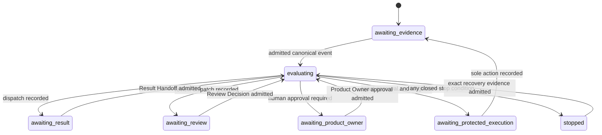

# Automatic Gate Progression Contract

**Version:** v0.1.0 (design freeze candidate)
**Task:** `ARCH-AUTOMATIC-GATE-PROGRESSION-CONTRACT-001`
**Canonical task assignment:** <https://github.com/whatrune/sd-prompt-studio/issues/175>

## 1. Purpose

This contract defines a future fail-closed control plane for progressing one existing task from canonical Result Handoffs, Review Decisions, Product Owner approvals, and fresh GitHub state. It removes ordinary manual prompt forwarding without granting an automation a new decision right.

The controller may admit canonical evidence, create a deterministic transition record, request an already-authorized metadata update or dispatch, and stop. It does not perform specialist work, decide Product policy, close a finding by inference, or make a protected GitHub action safe merely because an event was observed.

## 2. Scope and non-goals

In scope are the logical event-admission boundary, progression state machine, closed stop matrix, Gate Status projection rules, same-task dispatch rules, protected-action preconditions, audit trail, and implementation acceptance criteria.

This is documentation only. It does not implement a scheduler, webhook, GitHub API client, dispatcher, evaluator, resume protocol, PR-body writer, workflow, credential store, or protected-action executor. It does not change Result Handoff status, Context Health outcome, Dispatch state, role taxonomy, Task Assignment shape, Review vocabulary, or the existing Gate Status fields.

The controller MUST NOT automatically approve, merge, rebase, squash, revert, change a Contract, select a Product direction, alter an Existing Run, or override a human stop decision.

## 3. Normative ownership and precedence

This contract consumes, and does not replace, the following owners:

| Subject | Normative owner | This contract's use |
| --- | --- | --- |
| Task Assignment and Result Handoff shape/status | [Delegation and Result Contract](../team/11-delegation-and-result-contract.md) | Canonical input admission |
| Role execution, stop reasons, same-task correction, protected actions, and PR Body Gate Status | [Shared Role Execution Contract](../team/13-shared-role-execution-contract.md) | Preconditions and projections |
| Review evidence and finding closure | [Review Execution Contract](../team/14-review-execution-contract.md) | Review Decision admission |
| Integrated Lead routing and Resume Dispatch record | [Integrated Lead Charter](../team/08-integrated-lead-charter.md) | Dispatch authoring boundary |
| Context Health and automatic handoff gate | [Context Health and Automatic Handoff Gate Design](22-context-health-and-automatic-handoff-gate-design.md) | Context-health prerequisite only |

Canonical Issue/PR records are authoritative for mutable decisions. A PR Body Gate Status is a projection and never supersedes a direct canonical Result Handoff, Review Decision, Product Owner approval, or fresh PR snapshot. Chat, local memory, a branch name, a commit SHA alone, an inline review thread alone, or an uncited PR description are never progression authority.

When admitted evidence conflicts, the controller stops with `canonical_conflict`; it does not select a preferred record. A direct current canonical record can make a stale PR Body entry historical, but no stale entry can make a direct record current.

### 3.1 Closed canonical precedence and conflict matrix

Precedence is authority-domain-specific rather than a general recency order. A
source is usable only for the authority stated in this table. Every automatic
transition MUST cite the required direct canonical URL(s), plus the current PR
snapshot where the row requires one. A conflict, missing required citation, or
failed freshness check stops progression; no row can be repaired by inference.

| Source | Authority use and classification | Exact freshness / citation requirement | Conflict or absence outcome | Recovery owner | Downstream auto-progression |
| --- | --- | --- | --- | --- | --- |
| Task Assignment and direct Issue decision | canonical scope, assigned Role, allowed action, and escalation authority | direct Task Assignment / decision URL; exact task, repository, and active revision | `canonical_conflict` for inconsistent authority; `external_blocker` when unreadable | Integrated Lead or named decision owner | only after a valid matching assignment is admitted |
| Direct Result Handoff | canonical statement of completed work, terminal status, stop reason, validation, and recommended next action | direct Result Handoff URL; matching task/Role and exact execution HEAD where applicable | stop if missing, stale for the required HEAD, or contradicted by a same-authority record | Result-Handoff authoring Role | only the explicitly named next action may be evaluated |
| Direct Review Decision / Amendment | canonical review decision, blocking findings, and finding-specific closure | direct top-level Issue/PR record URL; full reviewed HEAD; current closure flags | any open/reopened blocker stops; contradictory decisions stop as `canonical_conflict` | assigned reviewer or Architect Team | no progression past a blocker; closed findings still require all other gates |
| Product Owner approval | canonical, action-scoped approval only | direct approval URL; exact task, PR, action, full HEAD, base/state snapshot, and expiry/one-use condition | cannot override a conflict, blocker, missing canonical record, HEAD drift, or failed check; otherwise stale/missing approval waits for Product Owner | Product Owner | only to the matching protected-action precondition check |
| Fresh PR metadata | current mutable evidence: PR/branch/base/head, open/closed, Draft/Ready, and non-outdated review state | fresh PR retrieval at `evaluated_at`; full current head/base and PR URL cited in the decision | mismatch with a canonical record stops as `canonical_conflict`; unavailable state is `external_blocker` | Integrated Lead for retrieval; named authority for substantive conflict | never alone; validates rather than creates authority |
| Review thread or inline comment | evidence pointer only; it is not a Review Decision or finding-closure authority | direct thread URL and fresh non-outdated state when cited | thread alone cannot close, reopen, or authorize; an unresolved blocking thread requires its canonical Review Decision to be obtained | assigned reviewer | none until canonical Review Decision is admitted |
| Check / CI result | exact-HEAD validation evidence only | check URL/name/conclusion and checked full HEAD; current retrieval | green CI alone creates no gate, approval, or completion; missing, failed, pending, cancelled, or wrong-HEAD check stops as `external_blocker` | validation/check owner | only as a satisfied prerequisite to an otherwise authorized action |
| PR Body Gate Status | projection of already-admitted current evidence, never authority | fresh PR Body snapshot; direct URLs for every cited gate and current full HEAD | stale, malformed, uncited, or conflicting projection stops before downstream reliance; direct canonical evidence prevails | Task-Assignment-authorized metadata Role | none until the projection is verified against admitted evidence |

The controller evaluates the rows in this order: Task Assignment scope; direct
Result Handoff and Review Decision authority; fresh PR/check state; Product
Owner action scope; then Gate Status projection consistency. Review threads can
only supply evidence pointers during the direct Review Decision check. A Product
Owner approval is evaluated after, and never overrides, an earlier stop. If two
direct records within the same authority domain conflict, neither wins: record
`canonical_conflict`, cite both records, and return to the recovery owner.

## 4. Canonical progression inputs

Every evaluated transition MUST have one immutable `ProgressionInputSnapshot` created from fresh retrieval at `evaluated_at`. It is a logical design model, not a new persisted schema.

| Input | Required identity and admission facts |
| --- | --- |
| Task Assignment | direct GitHub `canonical_record`, `task_id`, repository, assigned role, scope, allowed/forbidden actions, completion and escalation conditions |
| Result Handoff | direct GitHub `canonical_record`, matching `task_id`, authoring role, status, `execution_stop_reason`, branch/worktree/PR identity where applicable, exact execution HEAD, validation evidence, recommended next action |
| Review Decision | direct GitHub `canonical_record`, reviewed PR, full `reviewed_head`, decision, blocking-finding count and per-finding closure facts, validation/check evidence at that HEAD |
| Product Owner Approval | direct GitHub `canonical_record`, author identity, task and PR identity, approved action, full approved HEAD, base/head state, approval scope, issue/PR state snapshot, and explicit expiry or one-use condition |
| Fresh PR snapshot | PR URL/number, full current head and base SHA, open/closed state, Draft/Ready state, current non-outdated blocking findings, reviews, checks and their bound HEAD |
| Gate Status projection | current PR Body, exact body revision/snapshot, all cited record URLs, current full HEAD, current gate rows and next gate |
| Context Health / handoff gate | only the current canonical outcome required by the Task Assignment or Resume Dispatch; a missing or non-admitted outcome is not inferred |

All identity comparisons are exact: repository, task ID, PR, branch, worktree when assigned, full 40-character HEAD, and record URL. A short SHA, suffix, array position, source-image-like name, or text similarity is not a match.

### 4.1 Event admission sequence

The future controller MUST perform these checks in order. The first failing row wins; it records no later automatic action.

1. Retrieve the Task Assignment and verify its direct canonical identity.
2. Fresh-fetch mutable Issue/PR state and every direct record cited by the candidate transition.
3. Verify task, repository, role, branch/worktree, PR, and exact-HEAD binding.
4. Verify record authoring authority under its owning contract.
5. Verify Context Health / handoff eligibility if the Assignment requires it.
6. Verify no open or reopened blocking finding, Architecture gap, external blocker, canonical conflict, or protected-action prohibition exists.
7. Verify all action-specific prerequisites in section 8.
8. Create one idempotency key and deterministic transition decision.
9. Update the PR Body Gate Status projection, if an authorized publisher is available; otherwise stop before dispatch or protected action.
10. Dispatch the exact next same-task role or request the separately authorized protected action.

An invalid, missing, unreadable, stale, inconsistent, or unverifiable input is not a negative business decision. It is a fail-closed stop.

## 5. Automatic progression state machine

The following are controller-local logical states. They are not Result Handoff statuses, Dispatcher states, Context Health outcomes, or a new GitHub label catalog.

| State | Entry condition | Only permitted automatic action | Exit condition | Human decision owner |
| --- | --- | --- | --- | --- |
| `awaiting_evidence` | no admissible triggering record | fresh-read canonical sources | valid event admitted | record authoring Role |
| `evaluating` | complete input snapshot | decide one transition or stop | deterministic decision recorded | none for mechanical validation |
| `awaiting_result` | a same-task specialist dispatch was recorded | wait; do not dispatch a duplicate | matching terminal Result Handoff admitted | assigned specialist Role |
| `awaiting_review` | review dispatch was recorded | wait; do not infer review result | matching Review Decision admitted | assigned reviewer |
| `awaiting_product_owner` | a protected action or policy decision is next | report exact decision required | explicit matching approval admitted | Product Owner |
| `awaiting_protected_execution` | exact approval and all gate prerequisites are current | request exactly one approved sole action | direct sole-action completion record admitted | authorized protected-action executor |
| `stopped` | a row in section 7 matched | publish the stop projection only | exact recovery evidence passes fresh admission | owner named by that row |

`awaiting_protected_execution` is not permission to execute. It is the only state in which a future protected-action executor may be asked to evaluate the separate authority chain in section 8.

## 6. Deterministic next-role and same-task dispatch

The controller may create a Resume Dispatch only when the Task Assignment or a direct canonical Review Decision explicitly identifies the next role and action. It MUST use the Integrated Lead's existing Resume Dispatch record shape and authoring authority. It cannot infer a role from a file, label, PR reviewer, or previous chat.

| Admitted predecessor | Required next-action declaration | Automatic result |
| --- | --- | --- |
| `completed` Result Handoff needing review | explicit review role and same PR/HEAD scope | one review dispatch |
| `needs_followup` Review Decision | finding-specific correction role and exact correction scope | one same-task correction dispatch |
| closed Architecture gap plus required closure review | valid same-task Resume Dispatch authority and explicit implementer role | one resume dispatch |
| `blocked` Result Handoff | direct recovery owner and explicit resume authority | no dispatch until recovery record is admitted |
| review with zero blockers | explicit Product Owner decision requirement | `awaiting_product_owner`; no protected action |
| Product Owner approval for an allowed protected action | one matching action grant | `awaiting_protected_execution` only |

Every same-task dispatch MUST preserve `task_id`, canonical Task Assignment, repository, branch, worktree, PR identity, and cumulative scope. It may not create a replacement task, branch, worktree, or PR. A role change requires a direct canonical decision that names the new role and why it owns the next action. Otherwise the stop reason is `ambiguous_role_ownership`.

The dispatch idempotency key is the ordered tuple of task ID, predecessor canonical-record URL, target role, exact target HEAD, action kind, and Assignment revision. A duplicate key returns the existing transition record; it MUST NOT create a second dispatch.

## 7. Closed stop and recovery matrix

The table is exhaustive for automatic progression. A matching condition blocks all later rows and all automatic dispatch/protected actions until its recovery condition has been admitted fresh.

The values after `stopped:` are closed controller-condition identifiers only. They are not new Result Handoff statuses, `execution_stop_reason` values, Context Health outcomes, or GitHub labels. Any later Result Handoff retains the existing vocabulary and is authored by its existing owning Role with this condition and its canonical evidence recorded as supporting facts.

| Priority | Condition | Controller result | Gate Status projection | Recovery owner and required evidence |
| ---: | --- | --- | --- | --- |
| 1 | canonical record missing, unreadable, malformed, or authoring authority unverifiable | `stopped: external_blocker` | `blocked`; cite retrieval failure without fabricating content | record owner; direct readable canonical record |
| 2 | task/repository/role/PR/branch/worktree/exact-HEAD records conflict | `stopped: canonical_conflict` | `blocked`; cite all conflicting records | Product Owner or Architect Team, according to conflict subject |
| 3 | Architecture gap or unresolved Contract conflict is current | `stopped: architecture_gap` | `blocked`; cite gap record | Architect Team Freeze and required review closure |
| 4 | current Review Decision has any open/reopened blocking finding | `stopped: blocking_finding` | `blocked`; cite decision and finding IDs | assigned correction Role, then reviewer finding closure at new exact HEAD |
| 5 | Result Handoff reports `blocked` or a terminal external blocker | `stopped: external_blocker` | `blocked`; cite handoff | named external-condition owner |
| 6 | required Product Owner approval is absent, stale, mismatched, expired, or already consumed | `awaiting_product_owner` | `pending` or `blocked` exactly as canonical evidence states | Product Owner gives a new exact approval |
| 7 | current HEAD differs from any approving/reviewed/validated/protected-action HEAD | `stopped: authority_drift` | prior evidence becomes `historical_at_prior_head`; current next gate is blocked/pending | fresh validation, fresh review, and fresh approval as applicable |
| 8 | PR state, Draft/Ready state, base, required check result, or non-outdated finding set differs from approval snapshot | `stopped: authority_drift` | `blocked`; cite fresh PR snapshot | new current evidence and new approval where protected |
| 9 | required CI/check lacks exact-HEAD binding, is pending/failed/cancelled, or cannot be fetched | `stopped: external_blocker` | `blocked`; cite check and checked HEAD | validation/check owner produces current evidence |
| 10 | worktree is dirty, missing, or bound to a different task/branch | `stopped: external_blocker` | `blocked`; cite workspace identity only | assigned specialist / workspace owner resolves safely |
| 11 | next role/action is absent, unsupported, or multiply owned | `stopped: ambiguous_role_ownership` | `blocked`; cite assignment/decision gap | Integrated Lead with Architect Team or Product Owner decision |
| 12 | Gate Status publisher update/verification fails | `stopped: external_blocker` | no fabricated update; report intended transition via canonical record | authorized metadata publisher restores and verifies projection |
| 13 | duplicate, concurrent, cancelled, or stale transition lock | retain existing transition or `stopped: external_blocker` | do not write a competing row | controller operator resolves lock with canonical audit record |
| 14 | any condition not represented above | `stopped: external_blocker` | `blocked`; state only observable facts | Product Owner / Architect Team routes the condition |

Priority 1–4 take precedence over every approval. Product Owner approval cannot override authority conflicts, blockers, Architecture gaps, missing exact-HEAD validation, dirty worktrees, or an ambiguous role owner.

## 8. Protected actions and approval invalidation

Ready for Review, Approve, and Merge retain the existing protected-action meaning. This contract adds no authority to perform them. A future executor may execute only one sole action when all rows below hold simultaneously.

| Action | Required direct authority chain | Additional exact-HEAD prerequisites | Forbidden automation |
| --- | --- | --- | --- |
| Draft return | current PR was Ready when HEAD changed; a direct Product Owner grant names `draft_return`; existing Draft-return completion requirements are met | prior/current HEAD, Ready-to-Draft transition, current open PR, no conflict | returning a Draft PR without the grant; treating a prior Ready as current |
| Ready for Review | direct Product Owner grant names `ready_for_review`; current review and required gates are complete | current Draft PR, current full HEAD, current Final Regression and Operational Validation, no blockers, Gate Status verified | self-approval, Ready on stale evidence, bypassing required review |
| Approve | direct approval authority under the existing review contract; Product Owner approval does not substitute for reviewer authority | current Ready PR, fresh review at current full HEAD, zero blockers | automatic reviewer approval or self-approval |
| Normal merge commit | direct Product Owner grant names `normal_merge_commit`; current authorized review approval remains valid | current open Ready PR, current full HEAD/base/check/finding snapshot, merge policy and required checks | auto-merge, rebase, squash, merge queue enrollment, revert, force push |

A Product Owner approval is valid only for its exact task, repository, PR, approved action, full HEAD, base/head state, and scope. It becomes `historical_at_prior_head` and cannot be reused when any of these changes:

- the PR HEAD or base changes;
- the PR changes Draft/Ready/open/closed state unexpectedly;
- a blocking finding opens or reopens;
- a required check changes, disappears, or no longer binds to the approved exact HEAD;
- Gate Status is missing, conflicting, or cannot be verified;
- the authority record expires, is superseded, or has already been consumed.

After invalidation, the controller records the historical evidence and returns to the required fresh gate. It does not silently continue because the Product Owner approved an earlier HEAD. A later explicit Product Owner approval begins a new action-specific authority chain.

## 9. PR Body Gate Status projection

The PR Body remains a current-state projection, not the source of authority.
The Role authorized by the Task Assignment remains the sole owner of the PR
Body metadata mutation, as required by the Shared Role Execution Contract. A
future Gate Status publisher is only that Role's transport: it carries out the
Role's already-authorized, already-admitted projection mutation and has no
independent Role, decision, metadata, or protected-action authority.

The transport may run only when the Task Assignment authorizes the metadata
mutation, the authorized Role's canonical decision is admitted, all cited
evidence binds to the current exact HEAD, and the invocation is limited to the
resulting projection patch. It MUST NOT infer a gate result, generate approval,
reassign a Role, execute a protected action, alter canonical evidence, or write
when those conditions cannot be verified. Update or verification failure is the
priority-12 fail-closed stop; it never transfers ownership to the transport.

The publisher MUST:

1. fresh-fetch the PR Body and current PR state;
2. bind every current gate row to the current full HEAD or mark prior evidence `historical_at_prior_head`;
3. preserve the existing independent Ready, Approve, and Merge rows;
4. cite direct canonical result, review, approval, and action-completion URLs;
5. include current blocker and next gate without inferring an absent result;
6. write an idempotent patch keyed by the transition decision ID;
7. re-fetch and verify that the projection matches the admitted decision.

If a concurrent edit, missing citation, malformed body, failed update, or post-write mismatch occurs, the publisher MUST stop under priority 12. It MUST not overwrite unrelated PR Body content, synthesize a passing gate, or dispatch a next role before verification succeeds.

## 10. Audit and observability

Each attempted transition creates one canonical `GateProgressionDecisionV1` logical record. It is an implementation target, not a new schema in this PR. Its minimum fields are `decision_id`, `task_id`, `assignment_revision`, `evaluated_at`, input snapshot references, exact PR/head/base identity, predecessor record URL, selected state/action or stop row, target role when applicable, idempotency key, Gate Status projection outcome, and recovery owner. It must not contain secrets, credentials, raw prompt payloads, or private local paths.

The Product Owner report is a compact projection of that record: current task, current exact HEAD, current gate, last canonical evidence, blocker if any, whether a dispatch/protected action was performed, and the named next owner. Duplicate delivery returns the prior decision ID. A dispatch or action is never repeated merely because a webhook/comment/label was delivered twice.

## 11. Context Health and Resume compatibility

Context Health remains a prerequisite owned by document 22. This controller does not evaluate health, manufacture a handoff bundle, or resume from memory. If a Task Assignment requires a Context Health outcome or Resume Protocol record, it admits the exact record and applies its fail-closed result before section 6. A healthy outcome alone never authorizes dispatch, review closure, Ready, Approve, or Merge.

The existing same-task Resume Dispatch remains the only resume authority. Automatic progression can prepare or publish one only after its existing requirements and the relevant stop-row recovery evidence are current. It never turns an Architecture Amendment, a green CI check, or a Gate Status row into a Resume Dispatch.

## 12. Opt-in, rollback, and compatibility

Automatic progression is opt-in per new Task Assignment after this Contract is approved and implemented. Existing tasks retain manual Integrated Lead routing; they are not retrofitted. The opt-in must identify the contract version, allowed transition classes, and whether metadata-only Gate Status publication is authorized.

Disabling the controller stops new transitions and preserves the last canonical decision. It never deletes records, cancels an already-running specialist task, changes PR state, or revokes a human decision. Rollback is therefore a return to manual routing with the same canonical evidence, not a rewrite of history.

## 13. Future implementation split and acceptance criteria

| PR | Owner | Scope | Merge gate |
| --- | --- | --- | --- |
| A | Architect Team | This contract and review closure | Product Owner approval |
| B | Backend Implementer | pure input admission and deterministic controller; no GitHub writes | contract tests and Architecture review |
| C | Backend Implementer | GitHub read transport and canonical-record fetcher | security review and fail-closed transport tests |
| D | Backend Implementer | idempotent Gate Status publisher and audit record writer | exact-HEAD/retry/concurrency tests |
| E | Backend Implementer | same-task dispatcher integration | duplicate-dispatch and workspace-identity tests |
| F | separate protected-action owner | hardened Draft/Ready/merge executor, if separately approved | Product Owner approval and security review |

The pure controller acceptance matrix is normative:

| ID | Scenario | Required result |
| --- | --- | --- |
| `AGP-01` | matching completed handoff names one review role | exactly one same-task review dispatch after Gate Status projection verification |
| `AGP-02` | duplicate delivery of the same handoff | same decision ID; no second dispatch or PR Body duplication |
| `AGP-03` | HEAD changes after review/approval | all affected evidence becomes historical; no Ready/Approve/Merge/resume |
| `AGP-04` | new or reopened blocking finding | stop before any next action; correction owner is named |
| `AGP-05` | stale Gate Status conflicts with a direct record | stop or correct projection; never trust the stale row |
| `AGP-06` | missing exact-HEAD CI evidence | fail closed as external blocker |
| `AGP-07` | approved normal merge commit with all current gates | request one normal merge only; never approve/rebase/squash/auto-merge |
| `AGP-08` | approval snapshot changes after grant | invalidate grant and await a new explicit approval |
| `AGP-09` | publisher write fails | no next dispatch/action and no fabricated gate update |
| `AGP-10` | dirty/mismatched worktree or ambiguous next role | fail closed with named recovery owner |
| `AGP-11` | Context Health or Resume record is missing where required | no resume; preserve existing stop boundary |
| `AGP-12` | controller is disabled for a legacy task | no automatic action; manual routing remains available |

## 14. Deferred scope

The following need separate design and Product Owner approval: event transport, polling/webhooks, GitHub credentials, token/secret handling, permission model, GitHub API mutation, scheduler/queue, locking storage, protected action execution, handling of public forks, and any cross-repository operation.

Until those contracts and their implementations are approved, this document is a freeze candidate for deterministic behavior, not authorization to perform an automated action.
