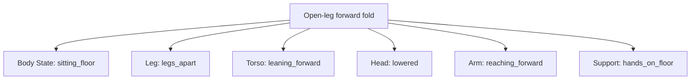

# Concept Dictionary

## Purpose

The Concept Dictionary is the canonical ledger between human intent, observed model behavior, compiler concepts, and rendered phrases. It must not collapse a human translation, a model observation, and a compiler rule into one undocumented label.

## Production Dictionary requirements

The production dictionary contract and the TypeScript intermediate-representation contract intentionally differ:

- **Production Dictionary**: every concept has a small common identity contract plus conditional requirements determined by its Concept Type, role, and declared behavior.
- **Draft / Migration Schema**: the corresponding fields in `PromptNode.ts` may be optional so unresearched concepts and partially migrated legacy records can be represented.
- **Meaning of `undefined`**: an omitted optional value means **unknown / not yet investigated**, never `false`, unsupported, empty, or inapplicable.

Promotion from draft/migration data into the production dictionary requires the common fields and every applicable conditional field. It does not require meaningless empty arrays or dummy values for conditions that do not apply.

### Common required fields

| Field | Purpose |
|---|---|
| `id` | Stable canonical identifier used by references, provenance, and migration. |
| `phrase` | Canonical English phrase passed to or considered by the renderer. |
| `displayName` | UI label; may describe observed behavior rather than translate literally. |
| `domain` | Subject area owned by the concept, separate from its compiler role. |
| `role` | How the concept acts in the compiler. |
| `conceptType` | Atomic, modifier, native/expandable composite, relation, effect, or exception. |
| `supportStatus` | Supported, unverified, unreliable, unsupported, or exception. |

Descriptive and research fields such as `humanMeaning`, `observedModelBehavior`, `primaryAxis`, and `observations` are populated when applicable or investigated. A production storage policy may require an explicit unknown marker for these fields, but it must not substitute false, an empty string, or fabricated evidence for unknown information.

### Conditional required fields

| Condition | Required information |
|---|---|
| `conceptType: "expandable_composite"` | A non-empty `components` array, at least one component with `role: "required"`, and an `expansionStrategy`. |
| `conceptType: "relation"` | Directionality or an explicit source/target contract. A resolved relation instance uses `RelationNode.sourceEntityId` and `targetEntityId`. |
| State-dependent pose or object concept | `stateDependency` and/or `stateAffinity`, with compatible, preferred, or incompatible states when the evidence supports them. |
| Concept with a visibility or observability requirement | Applicable region metadata such as `requiresVisibleRegions` or `evidenceRegions`, plus observability/visibility strength when known. |
| Model-dependent concept | `modelDependent: true` and evidence information such as `observations` or `evidenceSources`. |
| Concept with known conflicts or cross-axis effects | Applicable `conflicts`, `secondaryEffects`, cooperation, suppression, or fallback metadata. |

Atomic, relation, effect, and other concepts are not required to carry `components`, state metadata, or visibility arrays when those concepts do not use those behaviors.

The full schema also supports aliases, secondary axes, role-classified components, state affinity, support/orientation/object/scene requirements, target/evidence/visibility regions, upper-body observability, visibility strength, viewer-relation requirements/support, framing and spatial budget, resolution priority, cooperation/suppression, variance, context/model dependency, confidence, and evidence-source IDs. See [PromptNode.ts](../schemas/PromptNode.ts).

## Concept types

| Type | Definition | Example |
|---|---|---|
| `atomic` | A concept resolved without component assembly. | `legs apart`, `crossed ankles` |
| `modifier` | Changes a state, region, direction, or intensity without defining a full scene. | `leaning forward` |
| `native_composite` | A learned phrase/cluster that must remain intact because decomposition loses behavior. | `legs crossed`, `twin braids` |
| `expandable_composite` | A user-level concept that can be rendered from verified components. | open-leg forward fold |
| `relation` | Edge between entity nodes. | `holding`, `sitting_on`, `looking_at` |
| `effect` | Global or cross-domain influence with available degrees of freedom. | `dynamic composition`, `masterpiece` |
| `exception` | Known multi-axis or misleading phrase that cannot safely enter a pure canonical axis. | `worm eye view`, `bust shot` |

## Phrase management

1. Treat phrases, not tokens, as the minimum unit.
2. Keep canonical IDs distinct from aliases and display names.
3. Do not infer `contains` automatically. Store only validated relationships.
4. Preserve native composites even when their words resemble atomic components.
5. A UI label may reflect model behavior. For example:
   - `legs crossed`: 「脚組み（座位）」;
   - `crossed legs`: 「脚交差（汎用）」;
   - `floating`: 「浮遊 / 無支持状態」;
   - `tiptoes`: 「つま先支持 / 忍び足姿勢」;
   - `worm eye view`: 「極端な煽り（顔・目変化あり）」.
6. Keep the internal concept name independent from the UI label.

## State affinity

State affinity records observed bias rather than a hard truth. For example:

```ts
{
  phrase: "legs crossed",
  conceptType: "native_composite",
  primaryAxis: "pose.legs.configuration",
  preferredStates: ["sitting"],
  stateAffinity: { sitting: "high", standing: "low" },
  stateDependency: "optional"
}
```

By contrast, `crossed legs` is a general configuration with low-to-medium state dependency and can retain standing. The dictionary must never merge the two records as synonyms.

## Visibility, observability, and evidence

The Visibility Resolver keeps three judgments separate:

1. **Semantic validity**: whether a concept is valid after semantic and structural resolution.
2. **Visual observability**: whether the current framing exposes the regions needed to observe it.
3. **Evidence strength**: whether the visible information is sufficient to verify the concept or state.

Related dictionary fields have distinct meanings:

- `requiresVisibleRegions`, `prefersVisibleRegions`, and `forbidsVisibleRegions` describe region constraints.
- `evidenceRegions` lists the regions that can prove the concept or state.
- `upperBodyObservability` estimates how reliably the concept can be inferred when only the upper body is visible.
- `visibilityStrength` describes how strongly the concept pressures resolution toward visibility of its required or target regions; it is not the same as evidence strength.
- `requiresViewerRelation` means the concept cannot resolve as intended without a relation to the viewer.
- `supportsViewerRelation` means a viewer relation can participate in or strengthen the concept but is not required.
- `priority` is a resolver tie-break input. It is not confidence, prompt weight, or evidence strength.

Example: `standing + upper body` is semantically valid, but `upperBodyObservability` is low because the legs and feet that provide evidence of standing are outside the frame. Low observability must not be treated as a semantic conflict, nor may it be reported as strong visual proof.

## Component expansion

Expansion preserves the parent concept and provenance. It is not a silent replacement. `ConceptNode.components` is the only component collection, and every `ConceptComponent` has exactly one `ComponentRole`:

| `ComponentRole` | Meaning |
|---|---|
| `required` | Must participate in resolution of the expandable parent concept. |
| `optional` | May strengthen or refine the parent but is not necessary for its resolution. |
| `evidence` | Helps verify the parent concept in the generated image; it is not necessarily emitted into the prompt. |
| `render_candidate` | May be selected by the Renderer for a model/context strategy; it is not an instruction to emit the phrase in every prompt. |

Requiredness and usage are determined only by `ConceptComponent.role`; separate required/optional arrays and boolean flags are not used. The component's containment in its parent `ConceptNode` preserves dictionary provenance, while `ResolvedConceptNode.parentConceptIds` preserves provenance after expansion.

The verified design example is the open-leg forward fold:



The weak completed phrase `seated straddle forward fold` produced bent knees, side-sitting, insufficient leg spread, and only forward lean. The component form `sitting on floor, legs apart, leaning forward, head lowered, reaching forward, hands on floor` produced six of six open-leg, forward-torso, lowered-head, hand-supported results and approached the intended pose substantially more closely.

Expansion rules therefore include their failure rationale, evidence, and renderer strategy. The renderer may bundle object properties into a natural phrase (for example `holding a folded transparent umbrella at her side`) while the graph retains object type, appearance, state, relation, and position separately.

## Relationships and conflicts

- `components` describes a compiler construction.
- `contains` describes verified internal features and does not automatically emit them.
- `cooperativeWith` records combination-only activation such as `negative space` with a spatial budget from `wide shot`.
- `suppresses` records observed reduction, such as strict upper-body/simple-background constraints suppressing `dynamic composition`.
- `conflicts` records incompatible states or visual requirements.
- `secondaryEffects` records leakage rather than hiding it in a primary category.

## Support and evidence

`supportStatus` must remain separate from `confidence` and `stability`:

- `supported`: useful behavior observed in scope;
- `unverified`: insufficient evidence;
- `unreliable`: activates inconsistently or in the wrong band;
- `unsupported`: tested behavior did not provide the intended control;
- `exception`: behavior exists but is multi-axis or misleading.

Each promotion should retain model/checkpoint, seed or seed range, sampler, steps, CFG, resolution, sample count, date, reviewer, prompts, counterexamples, and source IDs when available. The supplied source often records six-image batches but does not provide all generation settings; that absence must be retained as unknown.

## Canonical storage

JSON, YAML, or SQLite is preferred as the canonical source. Spreadsheets may be generated for viewing but should not become the authoritative ledger. Model-independent semantic rules and model-specific evidence/strategy must be stored separately.
