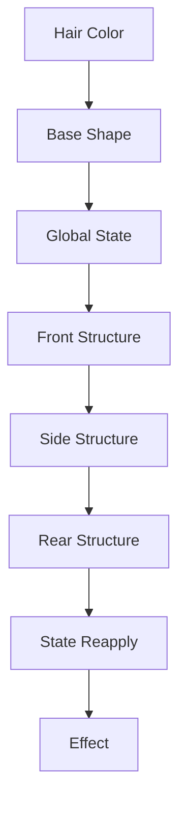

# Hair Engine

## Responsibility

Hair is organized by affected region and semantic role, not by a flat hairstyle category.

```text
Hair
├ Color / Appearance
├ Global Shape
├ Global State
├ Front Structure
├ Side Structure
├ Rear Structure
├ State Reapply
└ Effect
```

## Resolver order



Example rendered order:

```text
platinum blonde hair,
long bob cut,
messy hair,
hime cut,
side braid,
messy hair
```

State reapplication is permitted because placement and repetition may change the strength of global states such as `messy hair`. This remains a hypothesis requiring evidence-aware model strategy rather than an unconditional duplication rule.

## Confirmed design decisions

- `bob cut` is a global silhouette constraint, not merely short hair.
- Global shape can coexist with front, side, and rear structures.
- Camera can move a rear structure sideways or over the shoulder; this is a cross-domain effect, not proof that the requested structure disappeared.
- Native composites such as `twin braids` must not be decomposed automatically.
- `contains` relationships are dictionary evidence, not automatic inference or automatic output.
- A core phrase remains present when support components are added. Expansion supplements rather than replaces it.

## Relationship to prior research

Hair provided the component-decomposition model later generalized to pose, objects, relations, and scenes. The generalization does not mean every hair phrase is expandable. Learned composite phrases can be stronger than their apparent parts, so each concept carries its own `conceptType`, support status, and evidence.

## Open work

Hair motion phrases such as `flowing hair` and `windblown hair`, model-specific expansion strategy, and systematic camera/rear-structure interaction remain research targets.
