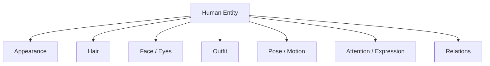

# Human Engine

## Responsibility

The Human Engine owns human entities and their per-entity attribute bundles. It provides stable identity and ownership boundaries for appearance, hair, face/eyes, outfit, pose, action, attention, and visibility evidence. Hair, Pose, Object, and Relation engines resolve their own structures but attach results to a Human entity.

## Entity bundle

Each human has a stable ID and owns its concepts. Attributes must not be stored only at scene level when more than one human exists. The recorded two-girl experiments improved hair and outfit separation when phrases were expressed as `girl with silver hair and bob cut` and `girl with black long hair` rather than a shared tag list.

The engine keeps these orientations separate:

- head orientation;
- gaze direction;
- body orientation;
- camera direction.

`looking at viewer` redirects gaze and does not guarantee a front-facing head. It can coexist with `side view`. `pov` is a weak, context-dependent viewer-relation modifier. `reaching toward viewer` is a stronger interaction composite that requires visible arm/hand regions and affects perspective and camera distance.

## State observability

Semantic state and visible proof are separate outputs.

| State | Evidence regions | Upper-body observability | Current interpretation |
|---|---|---:|---|
| `standing` | hips, legs, feet | low | Strong state when evidence is visible; upper-body framing commonly hides proof. |
| `sitting` | hips, thighs, knees | medium | Strong state with typical knee/lean/arm configurations. |
| `kneeling` | knees, thighs, lower legs | high | Knee support, lower waist, and floor relation can enter upper-body framing. |

The engine must not claim a state was visually confirmed when its evidence regions were cropped.

## Visibility contract

Human concepts contribute required, preferred, forbidden, and evidence regions to the Visibility Resolver. Outfit and equipment may add requirements: boots require feet and lower legs. Pose may prohibit a fallback: standing is incompatible with sitting, kneeling, and crouching. Camera then finds a framing that can show the solution or emits an unresolved/suppressed warning.

Observed failure to retain: `upper body + standing + black boots` preserved upper-body framing and standing semantics, omitted boots, and transferred black to waist/skirt/pants. `full body + standing + black boots` displayed all requested elements.

## Multi-subject behavior

The Human Engine supplies entity-bound inputs to the Relation Engine. It does not promise precise expression or gaze assignment. Recorded strength was:

- hair identity separation: good;
- outfit separation: good to medium;
- one-sided physical arm action such as waving: often successful;
- distinct subtle expressions: weak but possible at adequate face resolution;
- precise gaze/attention target: difficult.

Camera and face resolution are therefore dependencies for subtle per-entity face and attention concepts.

## Current boundaries

Species, body proportions, adult-specific relations, and complete face/expression resolution remain outside the confirmed scope of the supplied Part6 experiments. They should be added through the same concept/evidence model rather than inferred as settled behavior.
