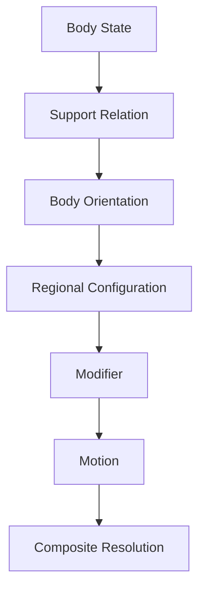
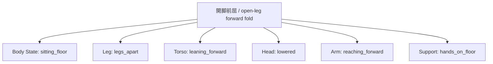

# Pose Engine

## Purpose

The Pose Engine resolves a pose as structured state, support, orientation, regional configuration, modifiers, motion, and composites. It does not treat pose phrases as a flat mutually exclusive tag list.

## Resolver order



State and support precede region-level requests because legs and feet are constrained by gravity, balance, contact, and locomotion. High-difficulty poses require at least `State + Support + Orientation + Regional Configuration`.

## Pose structure

```text
Pose
├ Body State
├ Support Relation
├ Body Orientation
├ Balance
├ Regional Configuration
│  ├ Torso
│  ├ Arms / Hands
│  └ Legs / Feet
├ Modifier
├ Motion
└ Composite Resolution
```

## Body states

| Concept | Current specification | Evidence/secondary behavior |
|---|---|---|
| `standing` | Strong body state, not “straight front-facing.” | Allows head rotation, arm variation, slight body angle, and weight shift. Conflicts with sitting, kneeling, lying, and squatting. |
| `sitting` | Body state with strong observability. | Tends to show hips/thighs/knees via bent legs, raised knees, slight forward lean, and arms near legs. |
| `kneeling` | Body state plus knee support. | Lower waist, knees, shins/feet behind; optional forward hand support. |
| `squatting` | Independent state with feet support and strong compression. | Deep knee bend, lowered hips, thighs near torso; hands/elbows often near face or knees. |
| `lying` | Horizontal body orientation plus surface support. | Often side-lying/reclined, with head support and close-portrait bias; lower body need not be visible. |
| `floating` | Conditional unsupported/suspended support relation, not a pure state. | Weak alone; improves with sky/space/underwater/open magical space and full-body/wide framing. Static and weightless, not flying. |

If conflicting body states are selected, the compiler resolves them instead of relying on model fallback. In the historical `standing + sitting` experiment, sitting won four of six and standing won two; seated results retained upright qualities. That observation does not authorize emitting both states.

## Body orientation

Orientation is distinct from state and camera:

- face up / supine;
- face down / prone;
- side;
- inverted;
- horizontal / vertical body axis.

The bridge failure demonstrates why this axis is mandatory. `bridge pose, hands on floor, feet on floor, back arched, hips raised, high angle, full body` resolved as crawling/quadruped with the abdomen toward the floor because the support conditions also permitted a prone solution. The current unverified reconstruction adds `lying on back, face up, wheel pose, chest lifted, body forming an arch`. It remains a hypothesis pending re-test, not a confirmed canonical phrase.

## Torso modifiers

- `leaning forward`: compatible with standing, sitting, and kneeling; moves torso and shoulders forward, lowers the head, shifts hips back, and may place hands on knees/forward. It may alter folds/hem and weakly affect viewer relation.
- `leaning back`: retains standing; torso and shoulders move backward, chest opens, and the head tends upward.
- `twisted torso`: composite-like cluster of torso, shoulder, hip rotation, and head turn. It often becomes a looking-back pose and affects body orientation, camera horizontal angle, hip silhouette, and outfit hem.

## Arm and hand configurations

The clean template was changed from `simple white shirt` to `plain oversized white t-shirt + black shorts` because missing lower-body clothing, exposure completion, and pose-driven hem changes created noise.

| Concept | Classification and behavior |
|---|---|
| `arms crossed` | Stable chest-level limb pose; defensive/strong/cool impression bias. |
| `hand on cheek` | Hand-to-cheek contact plus elbow bend; head tilt and pensive/soft bias. Without fixed state it tended toward sitting/squatting/knee-hugging; adding standing suppressed that leak. |
| `pointing` | Arm extension and pointing; body orientation may follow direction slightly. |
| `hands behind back` | Hands behind body, shoulders back, chest open; polite/shy bias and little state leakage. |
| `hands on hips` | Hands at waist, elbows out, emphasized waist silhouette; confident/energetic bias. |
| `one hand raised` | Static limb configuration, often near shoulder/face with greeting bias. |
| `waving` | Arm action/motion: raised arm, spread fingers, wrist motion, friendly expression bias. |

## Whole-body motion

- `walking`: standing-like locomotion with leg progression, light arm swing, full-body evidence, and side/three-quarter bias.
- `running`: high-intensity locomotion with stride, forward torso lean, arm swing, weight shift, hair motion, and camera/dynamic-composition leakage.
- `jumping`: active transition from grounded to temporarily unsupported; knees/arms/hair/clothing show motion.
- `falling`: passive unstable downward unsupported motion with axis disruption, rotation, limb spread, and unstable framing/composition.
- `floating`: static unsupported state; must remain distinct from both jumping and falling.

## Object-supported pose

- `leaning against wall`: standing base plus vertical-surface support, torso lean, asymmetric weight, possible shoulder/back/arm/waist contact, and relaxed/sultry/casual mood bias. Requires a wall entity.
- `sitting on chair`: sitting state plus chair support and `seated_on` relation. The phrase strongly includes seat/back/legs and is more stable than floor sitting.

## Leg and foot concepts

Leg phrases are classified as leg configuration, foot/ankle configuration, balance/support, state-biased composite, flexibility, or motion.

| Phrase | Required distinct concept |
|---|---|
| `one leg raised` | State-independent free-leg configuration. Works with standing, sitting, and lying; support leg and balance adjustment are secondary. |
| `standing on one leg` | Balance pose whose primary concept is single-foot support; free-leg configuration is secondary. |
| `tiptoes` | Composite toe support/reduced heel contact plus balance and crouch/sneak/light-movement bias. It is not reliably a pure upright tiptoe pose. |
| `legs apart` | Atomic leg-spacing modifier; standing usually remains, with wide/grounded bias. |
| `crossed ankles` | Local ankle configuration; standing remains and legs are otherwise relatively straight. |
| `crossed legs` | General leg configuration with low-to-medium state dependency; can retain standing. |
| `legs crossed` | Native seated-crossed-leg composite with high sitting and low standing affinity. Never alias to `crossed legs`. |
| `split` | Direction/state-underconstrained candidate; with sitting it resolved toward floor open-leg sitting. |
| `doing the splits` | Native flexibility parent concept; activates an open-leg concept but mixes lateral, front/back, and single-leg extension directions. |
| `front split` | Unreliable/misleading on the tested checkpoint; produced high kicks/vertical leg extension rather than floor front split. |

## Composite pose expansion

When a completed phrase is weak, the engine may preserve the human concept and render verified components.



The parent is `expandable_composite / constructed_pose`. Components remain traceable to the parent; the UI concept is not silently replaced. The evidence and failed canonical phrase are retained in [Pose Research](../research/Pose_Research.md).

## Observability and camera handoff

The Pose Engine emits evidence regions and required framing but does not choose camera wording alone. Standing needs hips/legs/feet for strong confirmation; sitting needs hips/thighs/knees; kneeling needs knees/thighs/lower legs. Camera and Visibility Resolver then negotiate a compatible view.

## Open research

Bridge/wheel pose is the immediate unresolved target. Further targets are side/middle/front split alternatives, knees up, knees to chest, cross-legged/lotus, handstand, high kick, cartwheel, representative gymnastics/yoga, and riding bicycle/motorcycle/horse.
