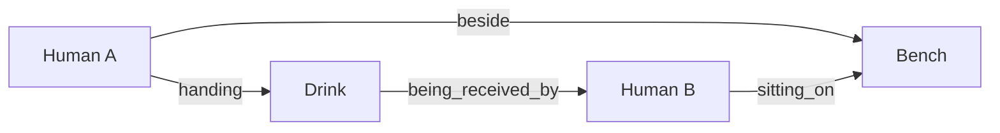

# Relation Engine

## Responsibility

The Relation Engine resolves an N:N scene graph. Humans, objects, environments, and regions are nodes; physical, spatial, action, attention, and support relations are edges. A flat multi-subject tag list cannot reliably retain attribute ownership or direction.



## Nodes

- Human
- Object
- Environment
- Region / Place

## Edge classes

| Class | `RelationKind` | Examples |
|---|---|---|
| Physical | `physical` | `holding`, `touching`, `sitting_on`, `leaning_against`, `holding_hands` |
| Spatial | `spatial` | `near`, `beside`, `behind`, `in_front_of`, `under` |
| Shared action | `shared_action` | `walking_together`, `standing_together` |
| Directed action | `directed_action` | `handing`, `being_received_by`, `waving_to` |
| Attention | `attention` | `looking_at`, `talking_to`, `smiling_at` |
| Support | `support` | `supported_by`, `standing_on`, `leaning_on` |

## Observed strength

- Strong: physical, support, object relations, shared whole-body actions.
- Medium: directed physical actions.
- Weak: attention, subtle expression relation, precise gaze.

This strength is evidence for planning and warnings, not a universal model guarantee.

## Directed handoff resolution

`giving a drink` alone produced drinks and a two-person social/drinking scene, often gave both people drinks, and did not reliably form a directed handoff. A directed relation should resolve:

```text
A state
+ B state
+ Object
+ A action
+ B counter-action
+ Spatial relation
+ Contact stage
```

The compiler version bound a silver-haired girl as handing and a black-haired girl as receiving, then improved proximity and role difference. Adding `silver-haired girl standing beside the bench`, `black-haired girl sitting on the bench`, `silver-haired girl handing a drink`, and `black-haired girl reaching out her hand to receive` produced many near-handoff results. Direction was still not perfectly fixed and the bench social-scene cluster competed.

The formal graph representation is two binary edges:

```text
Human A --handing--> Object
Object --being_received_by--> Human B
```

The Object is a normal entity referenced by `sourceEntityId` or `targetEntityId`. A handoff must not be encoded as one Human-to-Human edge with an attached Object ID. The Relation Resolver obtains each edge's `kind` from its Relation Concept's `relationDefinition.kind` rather than hard-coding Concept IDs.

## Multi-subject requirements

- Attributes are bound per entity before relations are rendered.
- Shared actions do not replace individual states.
- Directed actions have explicit source and target.
- An object can mediate multiple edges.
- Camera/face resolution is an input when subtle expression or gaze ownership matters.
- Renderer phrases may repeat entity descriptors when necessary to preserve ownership.

## Scene relation examples

- `by the window` binds a human spatially to a window, not merely to a classroom tag.
- `under a street light` combines lighting context with a human–street-light spatial relation.
- `holding a folded transparent umbrella at her side` binds human, umbrella, holding, state/appearance, and position.
- `walking together` was stronger than `talking with each other`; precise conversation and gaze remained weak.
