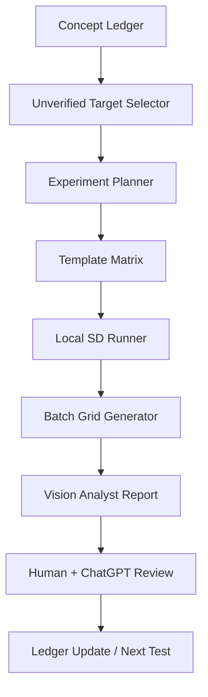

# Research Log

## Provenance and use

This log reorganizes the supplied `SD_Prompt_Studio_完全統合引継ぎ資料_v5.1_原文保持版.txt` without treating all statements as equally certain. The source has two chronological layers:

1. v3.0, integrating Part4–Part5 Prompt Compiler, Hair, Camera, Visibility, Lighting, Quality, and Pose State work.
2. Part6 v5.1 addendum, which explicitly supersedes conflicting v3.0 interpretations and expands the project into a Visual Concept / Visual Scene Compiler.

Detailed experimental records are split by subject:

- [Pose Research](Pose_Research.md)
- [Camera Research](Camera_Research.md)
- [Lighting Research](Lighting_Research.md)
- [Relation Research](Relation_Research.md)

This file retains cross-domain findings, historical corrections, research method, and future work. “Specification” in engine documents means a compiler-side decision, while generation claims remain scoped observations.

## Research method

### Baselines

The Camera clean baseline was:

```text
1girl,
silver hair, bob cut,
simple white shirt,
simple background
```

It excluded `studio lighting`, `soft lighting`, `masterpiece`, `best quality`, `very aesthetic`, and related aesthetic/detail clusters to avoid framing, scale, scene, and pose contamination.

Pose initially used a similar simple template. Arm/hand research later changed clothing to `plain oversized white t-shirt + black shorts` because `simple white shirt` allowed lower-body outfit completion, exposure, and hem movement to add noise.

Many recorded comparisons use six images. Six is useful for detecting a direction, not for confirmation. The proposed automated framework recommends 12 for exploration and 24–32 for confirmation.

### Investigation depth

Do not exhaustively test every tag. Test representative phrases to establish a structure, sample neighbors, and deeply investigate exceptions. Continue when another axis changes, order substantially changes meaning, a combination suddenly activates, the expected range fails, or unrelated domains such as clothing/eye color/pose change.

### Evidence gaps

The supplied source does not consistently provide checkpoint name, seed, sampler, steps, CFG, or resolution. Results must therefore remain context/model dependent even when repeated six of six. Missing metadata is unknown rather than implied.

## Project evolution

### Part4–Part5 framing

The working system was a Prompt Compiler combining phrase parsing, axis/containment/conflict/region/visibility/pose/camera/cross-domain resolution, sorting, and prompt building. The core hypothesis was that a prompt is structured data containing phrase, domain, axis, role, scope, visible-region requirements/prohibitions, state constraints, containment/conflict, order, cross-domain leakage, fallback, activation mode, model dependence, stability, and observability.

### Part6 framing

Part6 generalized Hair’s component model to pose, objects, relations, and scenes. The system became:

```text
Visual Scene Compiler
= Entity Resolver
+ Visual Concept Resolver
+ Concept Expander
+ Constraint Solver
+ Relation Graph Resolver
+ Model Adapter
+ Prompt Renderer
```

The decisive additions were per-entity attribute binding, native versus expandable composites, support/balance/orientation in Pose, object entities with appearance/state/relation/position, and N:N relation graphs.

## Cross-domain observations

### Hair

- `bob cut` behaved as a whole silhouette constraint rather than only short hair.
- Global shape coexisted with front/side/rear structures.
- Rear structures could move sideways or over shoulders with camera changes.
- Reapplying `messy hair` after regional structure may change state strength; this remains a hypothesis.
- `twin braids` and similar learned composites should not be decomposed automatically.
- `contains` must be evidence-backed, not inferred.

### Visibility and attribute transfer

Prompt:

```text
upper body,
standing,
black boots
```

Observed: upper-body framing and standing semantics remained, boots were hidden, and black transferred to waist/skirt/pants. Interpretation: upper body forbids foot visibility, standing prevents sitting-based fallback, and boots require feet/lower legs. With `full body + standing + black boots`, all elements were present. This motivated explicit required/forbidden/evidence regions and minimum framing.

### POV, gaze, and viewer interaction

- `pov`: weak alone; context-dependent viewer-relation modifier.
- `looking at viewer`: gaze-to-viewer, not guaranteed face-front; compatible with side view.
- `reaching toward viewer`: required visible arm/hand and strongly affected perspective, viewer relation, and camera distance.

Head, gaze, body, and camera direction must remain separate axes.

### Detail and aesthetic cluster

The historical block `masterpiece, best quality, 4k, very aesthetic, high resolution, ultra-detailed` was shown not to be a pure quality block.

| Trial | Result | Current interpretation |
|---|---|---|
| Clean full body, no quality terms | 6/6 standing | No intrinsic pose compression from `full body`. |
| `4k + high resolution + ultra-detailed` | 6/6 standing | Comparatively safe detail/resolution cluster in scope. |
| `very aesthetic` | 5/6 standing, 1/6 floor | Possible weak aesthetic bias. |
| `masterpiece + best quality` | 5/6 floor poses | Strong aesthetic composition/pose and large-subject bias. |
| `masterpiece` at front | 4/6 floor, 2/6 standing | Primary cause; front placement more strongly sets initial cluster. |
| `masterpiece` at end | 3/6 floor, 3/6 standing | Weaker but not removed. |
| `best quality` alone | 4/6 standing, 2/6 floor | Weaker amplifier. |
| `masterpiece + best quality` at end | Fewer floor poses than front | Order influences strength, not the whole semantic interaction. |

`masterpiece` leaked into aesthetic pose, subject scale, avoidance of static standing, leg/body-line emphasis, outfit styling, and camera. Detail and aesthetic should be separate dictionary domains.

### Constraint priority

`full body + standing + masterpiece` and the variant with `best quality` both produced standing 6/6. `standing` therefore acted as a strong state constraint above the aesthetic effect in this scope. `sitting + full body + masterpiece` remained sitting 6/6 while aesthetic terms changed how the subject sat. `sitting + upper body + masterpiece` retained visible seated evidence. `kneeling + upper body` showed forward lean, knees, low waist, floor contact, and kneeling/crawling-like configurations.

### Conflicting state history

`standing + sitting` produced sitting 4/6 and standing 2/6; seated cases retained upright posture/leg alignment. This observed fallback is not a recommended output strategy. The compiler should flag same-axis conflict rather than emit both.

## Superseded interpretations

| Superseded interpretation | Later evidence/current conclusion |
|---|---|
| `full body` causes sitting. | Clean full body was standing 6/6. Pose compression came from aesthetic/portrait/large-subject pressure. |
| `studio lighting` destroys wide shot. | Wide shot remained; the spatial budget became studio/stage structure with visible equipment. |
| `negative space` alone makes a subject small. | Weak alone; cooperative with a spatial budget such as wide shot. |
| `centered composition` clearly centers. | Effect unconfirmed because upper body baseline already centers. |
| `rule of thirds` is a weak but usable placement control. | Left/right variants did not reverse; unsupported/unverified on the tested checkpoint. |
| `standing` remains visibly obvious in upper body. | Semantic state can remain while evidence is cropped and therefore unobservable. |
| `dynamic composition` is weak. | High-variance, context-dependent effect amplified by scene context and detailed background. |
| `diagonal composition` tilts the person. | It directs scene flow through lines, repetition, depth, and vanishing points. |
| `legs crossed` and `crossed legs` are synonyms. | They are distinct visual concepts; the former is seated-biased. |
| `one leg raised` is a standing balance pose. | It is state-independent free-leg configuration; balance belongs to `standing on one leg`. |
| `tiptoes` means only upright tiptoe. | Toe support plus balance and crouch/sneak/light-motion bias. |
| `front split` means floor front split. | It produced high-leg extension/high kick on the tested checkpoint. |
| A canonical English phrase is enough for an open-leg forward fold. | Component assembly was substantially more effective. |
| Bridge support phrases imply a supine bridge. | Prone/quadruped also satisfies support; face-up/supine orientation is required. |
| Object attributes can simply be independent tags. | Component graph plus natural renderer bundling improved ownership/state. |
| Multi-subject scenes can remain a flat tag list. | Per-entity bundles and N:N relations are required. |

## Auto Research Assistant proposal

The requested MVP supports, rather than replaces, human/ChatGPT research:



Required templates: character stability, pose state, lower body, camera structure, scene context, lighting contamination, aesthetic global, object relation, and multi-subject relation.

Suggested result fields:

```text
run_id, target, baseline, variants, checkpoint, seed, settings,
image_paths, observations, axis_candidates, cross_domain_leakage,
hypothesis_diff, confidence, human_review, next_experiments
```

JSON/YAML/SQLite is the preferred canonical source; spreadsheets are for viewing.

## External evidence policy

External evidence must be Stable Diffusion/SDXL-specific and preferably include traceable prompt, checkpoint, settings, and samples.

| Grade | Use |
|---|---|
| A | Official SDXL or reproducible comparison. |
| B | SDXL explicitly named with prompt/settings and multiple samples. |
| C | SDXL explicitly named with prompt and image. |
| D | SD-specialized but model unknown; candidate discovery only. |
| X | Primarily ChatGPT/Midjourney; do not use for adoption evidence. |

General composition articles may suggest candidate phrases but are not evidence of SDXL behavior.

## Consolidated roadmap

Current priority order from the source:

1. Complete Pose gaps, beginning with bridge/wheel pose.
2. Object/Equipment Engine.
3. Lighting.
4. Effects: particles, fog, smoke, rain, glow, aura, motion lines, weather.
5. Auto Research Framework.
6. Japanese Scene Compiler.
7. Complex multi-subject relations, including adult cases.

Earlier Camera research still leaves sampled roll/perspective/composition combinations and lighting contamination audits. These remain valid open tasks but are no longer listed ahead of the Part6 Pose priority.

The immediate re-test prompt is preserved in [Pose Research](Pose_Research.md#bridge--wheel-pose).
