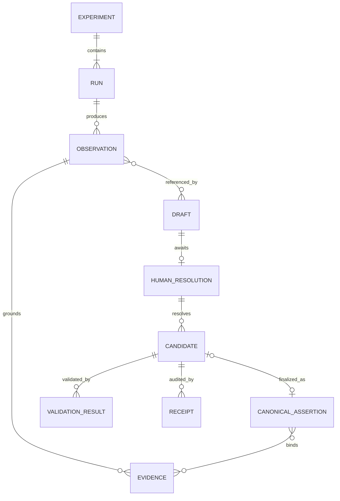
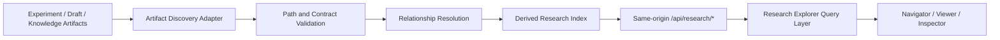
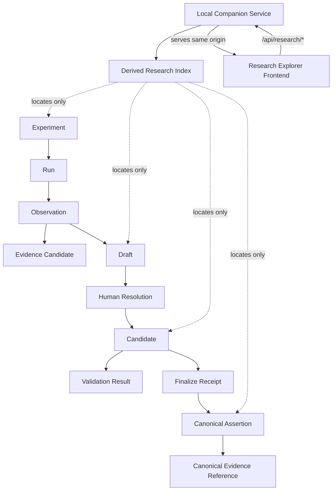

# Research Explorer Architecture Design

## 1. 目的

Research Explorerは、SD Prompt StudioのResearch Workspace上で、ExperimentからCanonical Assertionまでの研究Artifactを探索し、関係とPipeline状態を読み取り専用で確認するためのUIである。

このUIは研究判断やKnowledge生成を行う機能ではない。既存のExperiment、Observation、Observation-to-Claim Draft Pipeline、Research Claim Validatorが生成・検証したArtifactを、利用者が追跡可能な形へ整理して表示する。

設計上の成功条件は次のとおり。

- RunからObservation、Draft、Candidate、Receipt、Canonical Assertionへ辿れる。
- Artifactの原文と、そこから機械的に導出した表示状態を区別できる。
- Identity Hash、Schema Version、Validation結果、Artifact間参照を確認できる。
- Prompt BuilderのDomain StateおよびResearch Artifactを変更しない。
- 将来のHuman Resolution UIやValidator UIを、既存契約を迂回せず追加できる。

## 2. 対象ユーザー

主な対象は次の利用者である。

- Experiment RunとObservationの整合性を確認する研究者
- Draft、Candidate、Validation結果を監査するReviewer
- Pipeline FailureやHash Bindingを追跡する開発者・運用者
- 将来、Research Artifactを参照するAgentやResearch Assistant

Promptを組み立てる一般利用者向けのPrompt Builderとは利用目的を分離する。

## 3. Responsibility Boundary

### 3.1 Research Workspaceが担当すること

- Artifact探索
- Artifact原文の表示
- Pipeline状態の派生表示
- Validation結果とDiagnosticsの表示
- ID、Version、Hash、PathなどのMetadata表示
- Artifact間Relationshipの表示
- Source Artifactへ戻れるNavigation

### 3.2 Research Workspaceが担当しないこと

- Claim本文、Interpretation、Causal Hypothesisの生成
- Evidence Fact、Evidence Binding、Observationの変更
- Canonical Knowledgeの直接編集
- Validatorの代替、Validation結果の推測
- Draft GeneratorやCandidate Generatorの代替
- Review、Approval、Promotionの自動実行
- Prompt Builderの状態をResearch Domainへ流用すること

表示用StatusやRelationshipはRead Modelとして導出できるが、元Artifactへ書き戻してはならない。

## 4. Existing SD Prompt Studioとの境界

```text
SD Prompt Studio
├─ Prompt Studio
│  ├─ User Prompt Creation
│  ├─ Prompt Builder Domain State
│  └─ Prompt Preview / Rendering
└─ Research Workspace
   ├─ Research Explorer Read Model
   ├─ Artifact Viewer
   └─ Validation / Relationship Inspector
```

共有してよいもの：

- Application shell
- Routing
- Theme、Typography、Spacing token
- 汎用Panel、Tree、Table、Code Viewer、Badge、Empty State
- キーボード操作やAccessibility基盤

共有してはいけないもの：

- Prompt BuilderのZustand Domain State
- Prompt group、tag、modifierなどのPrompt編集ロジック
- Research ArtifactのMutation処理
- Research StatusからPrompt選択状態への暗黙同期
- Prompt Builderの永続化領域へのResearch Entity保存

Research Workspace用Stateは独立したStoreまたはFeature境界に置く。共有UI ComponentはResearch Entityを知らない汎用Propsで受け取る。

## 5. Domain Model

UI EntityはArtifactを置き換えるDomain Objectではなく、Source Artifactを参照するRead Modelである。

| Entity | ID | Source Artifact | Relationship | Display Name | Display Status | Read Only項目 |
|---|---|---|---|---|---|---|
| Experiment | Experiment Group IDまたは研究系列ID | `experiments/{domain}/`、Run ID規則、Index Metadata | 1:N Run | Experiment名、Domain、比較系列名 | `available` | ID、Domain、Run一覧、Source Path |
| Run | `run_id` | `experiments/{domain}/{run_id}/manifest.yaml` | N:1 Experiment、1:N Observation | Run IDとcondition label | `available`、`incomplete` | Manifest、Prompt、Model、Seed、Path |
| Observation | Run ID + Module + Artifact Path | `observation.json`、Optional Module Observation | N:1 Run、1:N Evidence | Module名とObservation Artifact名 | `discovered`、`validated`、`failed` | Schema Version、Panel Count、Aggregate、Uncertainty、Hash |
| Evidence | `evidence_ref_id`またはstaged Evidence ID | Draftの`staged_evidence`、Canonical Assertion Fileの`evidence_refs` | N:1 Observation、N:M Draft/Candidate/Assertion | MetricとRun ID | `staged`、`canonical`、`unresolvable` | Observation Path、Metric、Count、Total、Content Hash |
| Draft | `draft_id` | `inbox/claim-drafts/{draft_id}/pre-schema-draft.yaml` | N:1 Observation集合、1:N Candidate | Draft ID短縮表記とRun集合 | `generated`、`failed`、`tampered` | Input Identity、Generator Version、Registry Binding、Unresolved Fields |
| Human Resolution | `resolution_id` | Draft配下の`human-resolution.yaml` | 1:1 Draft Identity、1:N Candidate候補 | Resolution IDとdecided_by | `waiting`、`completed`、`invalid` | Source Draft Hash、Decision Metadata、Content Hash |
| Candidate | `candidate_id` | `claim-candidates/{candidate_id}/claim-candidate.yaml` | N:1 Draft、N:1 Human Resolution、0..1 Canonical Assertion | Candidate ID短縮表記とAssertion ID | `created`、`validated`、`failed`、`finalized` | Projection Version、Artifact Hash、Semantic Hash、Generator Version |
| Validation Result | `validation.<context>.<identifier>`形式のnamespace付きUI ID | Validator JSON出力、Generation/Finalize ReceiptのValidation step | N:1 Artifact Snapshot | Contextと実行時刻 | `passed`、`failed`、`infrastructure_error` | Context、Exit Code、Error/Warning Count、Diagnostics |
| Receipt | `receipt_id` | `generation-receipts/{receipt_id}.json` | N:1 Lifecycle Event、N:M Artifact | Receipt TypeとRecorded At | Receiptの`result`をそのまま表示 | Artifact IDs、Artifact Hashes、Steps、Diagnostics |
| Canonical Assertion | `assertion_id` | `knowledge/assertions/*.yaml` | N:M Evidence、0..1 Candidate、N:M Claim関係 | Assertion IDとClaim statement要約 | Canonical Artifactの既存Status | Claim Family、Subject、Evidence Binding、Promotion Metadata |

### 5.1 Domain Model Diagram

この図はUIが表示するRead Model上の関係を示す。保存ContractやCardinalityを新たに定義するものではなく、実際のRelationshipはArtifact内の明示参照から解決する。



### 5.2 Entity ID方針

- Source Artifactが安定IDを持つ場合はそのIDを使用する。
- Artifact Pathだけで識別されるObservationやValidation出力は、ModuleとRepository-relative Pathを組み合わせたUI Locatorを使用する。
- UI内部のReact keyやselection keyを新しい研究IDとしてArtifactへ保存しない。
- IDの短縮表示は許可するが、Inspectorでは完全値を表示・コピーできるようにする。

### 5.3 Relationship方針

Relationshipは保存場所の近接ではなく、Artifact内の明示参照から構築する。

- Run → Observation: Run directoryとManifest
- Observation → Evidence: `observation_path`とmetric
- Draft → Observation: `source_files`
- Draft → Human Resolution: `source_draft_id`と`source_draft_identity_hash`
- Candidate → Draft/Human Resolution: Wrapper metadata
- Candidate → Receipt: `related_artifact_ids`
- Candidate → Canonical Assertion: Candidate ID、成功したFinalize Receipt、Canonical Assertion Artifact Hash Bindingの三者一致
- Canonical Assertion → Evidence: `evidence_refs`と`evidence_bindings`

参照先が見つからない場合、UIはRelationshipを捏造せず`unresolved reference`として表示する。

Candidate Wrapper内のAssertion IDとCanonical Assertion IDが一致するだけでは、Finalize済みと判定してはならない。成功したFinalize Receiptが対象Candidate IDを参照し、そのReceiptに保存されたCanonical Assertion Artifact Hashが発見したCanonical Artifactと一致する場合に限り、`finalized_as` Relationshipと`finalized` Display Statusを生成する。

Validation Resultのnamespaceは`generation`、`candidate_generation`、`registry_compatibility_check`、`finalize_attempt`、`rollback`を少なくとも区別する。完全な`identifier`生成規則と衝突回避はPR74で決定するが、異なるcontextの結果を同じUI IDへ統合してはならない。

## 6. Artifact Discovery

### 6.1 選択肢比較

| 方式 | 実装容易性 | Performance | Consistency | Future Agent利用 | 主な問題 |
|---|---|---|---|---|---|
| A. Filesystem Scan | CLI/desktopでは容易、Browserでは困難 | Artifact増加に比例して低下 | 常に現物を見られるが走査途中のSnapshot差がある | Agentは利用しやすい | Web UIへ直接filesystem権限を持ち込む必要がある |
| B. Index File生成 | Generatorが必要 | UI読込と検索が高速 | Source Hashと生成時刻で鮮度を監査できる | AgentとUIが同じRead Modelを利用可能 | Indexのstale検知と再生成導線が必要 |
| C. Manifest Registry | 初期は簡単 | 高速 | 手動更新ではArtifactと乖離しやすい | Registry API化しやすい | 正本が二重化し、Append漏れが探索漏れになる |

### 6.2 採用案

**B. 再生成可能なIndex File**を採用する。

Filesystem上のArtifactが引き続き正本であり、IndexはRead Model用の派生成果物とする。Indexを直接編集してはならず、削除してもArtifact Scanから再生成できることを必須とする。

Indexの生成とArtifact DiscoveryはLocal Companion Serviceだけが担当する。Vite静的Frontendはfilesystem scan、Repository Path解決、Hash Verificationを行わず、Companion Service APIからIndex Read Modelと選択されたArtifactを取得する。

概念フロー：



Indexは次の情報だけを持つ。

- Artifact IDとArtifact Type
- Repository-relative Source Path
- Display用Metadata
- 既存Pipelineが生成したArtifact Hash、Semantic Hash、Identity Hashへの参照
- Relationship先ID
- 機械的に導出したDisplay Status
- Validation/Receipt Locator

Observation本文、Claim全文、画像、Receipt全文をIndexへ複製しない。Artifact Viewerは選択時にSource Artifactを取得する。

Indexの具体的なファイル名、JSON Schema、生成CLI、配置先はPR74以降で決定する。本設計は新しい保存契約をFreezeしない。

### 6.3 Research Artifact Transport Contract

実Research Modeの正式サポート方式は、**Local Companion ServiceによるFrontendとResearch APIの同一Origin配信**とする。

```text
Local Companion Service
├─ Research Explorer Frontend
└─ /api/research/*
   ├─ Artifact Discovery
   ├─ Derived Index Generation
   ├─ Artifact Read
   └─ Existing Hash Contract Verification
      └─ Research Repository Artifact
```

責務境界は次のとおり。

- Frontend: 同一Originから配信されるNavigation、Artifact表示、Read Model rendering
- Local Companion Service: Frontend配信、`/api/research/*`、Artifact Discovery、Index生成、Path/Contract Validation、Artifact Read、既存Hash ContractのVerification
- Research Repository Artifact: 正本。Frontend bundleやDerived Indexへ本文を複製しない

Cloudflare PagesまたはGitHub Pagesで配信された公開HTTPS Frontendからlocalhost Companion Serviceを直接呼び出す構成は禁止する。CORS、Mixed Content、Private Network Accessへ依存する構成は正式Architectureに含めない。

FrontendはLocal Companion Serviceが到達不能な場合、実Dataが空であるかのように扱わず、`service unavailable`を明示する。FrontendからRepository filesystemへ直接fallbackする方式はサポートしない。Local Companion Serviceの起動方式、port、session token lifecycle、Index Formatの詳細はPR74で決定する。

### 6.4 Public Deployment Boundary

Cloudflare Pages、GitHub Pages、その他の公開静的Deploymentは実Research Dataの配布経路ではない。

禁止事項：

- Research ArtifactをFrontendのpublic bundleへ含める
- Cloudflare PagesまたはGitHub Pagesへ実Dataを配置する
- Derived IndexへObservation、Claim、Receipt、画像などの本文を複製する
- Repository PathをURL、query parameter、client-side logへ無条件に露出する
- Local/External StorageのCredential、Token、接続SecretをIndexへ保存する

Preview環境で利用できるのは、実Dataから分離され、公開を前提に作成されたfixture Artifactだけである。実Research DataはLocal Companion Service経由でのみ取得する。公開DeploymentでCompanion Serviceが存在しない場合は、fixture modeまたは明示的なunavailable stateを表示する。

公開PreviewからLocal Companion Serviceへ接続する機能、設定、fallbackを提供してはならない。Cloudflare Pagesではfixture Artifactだけを使用し、実Research Dataの探索・取得・表示を行わない。

### 6.5 Existing Hash Contract Boundary

Research Explorerは独自のUI用Hash、Hash Projection、Hash Algorithmを定義しない。表示対象は既存Pipelineが生成した次の値に限定する。

- `candidate_wrapper_artifact_hash_v1`
- `canonical_assertion_artifact_hash_v1`
- `assertion_content_v1_hash`
- `draft_input_identity_hash`

Hash計算の意味契約と計算責務は既存Pipelineだけが持つ。Local Companion Serviceは既存PipelineのContractと検証処理を利用してHash Bindingを確認し、Frontendは受け取った値、Algorithm/Contract名、検証結果を表示するだけとする。UI表示都合のHash追加、既存Hashの別名化、複数Hashの合成は禁止する。

PR74でIndexへ保存するArtifact Content Hashは、既存Pipeline Hashへの参照またはIndex Snapshotのstale検知に必要な既存値として扱い、新しいResearch/Audit Hash Contractを定義しない。

### 6.6 Discovery Root候補

Discovery Adapterは少なくとも次の既存領域を対象にする。

```text
research/sd-prompt-research/
├─ experiments/**
├─ ledgers/run-index.yaml
├─ inbox/claim-drafts/**
├─ inbox/claim-draft-failures/**
├─ knowledge/assertions/**
└─ reports/**
```

`.gitignore`対象の画像や外部Storage Artifactは、存在確認可能なLocatorとして扱う。存在しないBinaryをValidation Failureと同一視しない。

## 7. Status Model

### 7.1 原則

- Source Statusを変更・再定義しない。
- UI Statusは`display_status`として明確に派生値扱いする。
- Display StatusはLocal Companion Service内のIndex Generatorが、既存ReceiptとValidator結果から閉じたmapping規則で生成する。
- Research Explorer UIは受け取ったDisplay Statusと根拠Locatorを表示するだけで、Status計算、Hash判定、Validator結果の再解釈を行わない。
- Receiptの`result`、Validatorの`valid/passed/exit_code`を独自解釈で上書きしない。
- Artifact未発見、Validation未実行、Validation失敗を別状態として扱う。
- 1つの集約Statusだけで詳細を隠さず、Inspectorに根拠Artifactを表示する。

### 7.2 Entity別Display Status

| Entity | Display Status | 導出根拠 |
|---|---|---|
| Experiment | `available`、`incomplete` | Run発見数、Index参照欠落 |
| Run | `available`、`incomplete` | Manifestと必要Artifactの存在 |
| Observation | `discovered`、`validated`、`failed`、`not_validated` | Observation Artifactと対応Validation結果 |
| Draft | `generated`、`failed`、`tampered` | Generation Report、Generation Receipt、Hash Binding |
| Human Resolution | `waiting`、`completed`、`invalid` | Artifact存在、Schema/Hash Validation |
| Candidate | `created`、`validated`、`failed`、`finalized` | Candidate Generation/Finalize ReceiptとCanonical Locator |
| Finalize | `pending`、`succeeded`、`failed` | `finalize_attempt` Receipt。推測で成功扱いしない |
| Validation Result | `passed`、`failed`、`infrastructure_error` | Validatorの既存出力契約 |
| Receipt | `succeeded`、`failed`、`inconclusive`、`not_applicable` | Receiptの`result`値 |

Status BadgeはUI用語とSource値を区別して表示する。例えばCandidateの`validated`はResearch Claim Assertionの`status`ではない。

Index Generatorのmapping規則は既存Pipeline/Validator Contractを参照するRead Model規則であり、それらの代替実装ではない。未知のReceipt Type、未解決参照、必要なHash Binding不足を推測で成功状態へ変換せず、`unknown`または対応するdiagnosticとしてUIへ渡す。具体的なmapping tableはPR74で定義する。

### 7.3 Freshness

Validation Resultには次を併記する。

- Validation Context
- Evaluated At
- 対象Artifact HashまたはSnapshot Hash
- Current Artifactと一致するか

Hashが一致しない過去結果は削除せず`stale`補助Badgeを付ける。`stale`はValidationの合否を変更するStatusではなく、現在Artifactへの適用可否を示すUI Metadataである。

## 8. UI Architecture

### 8.1 3ペイン構成

```text
ResearchWorkspaceRoute
└─ ResearchExplorerShell
   ├─ ResearchNavigator                  # Left
   │  ├─ ScopeTabs
   │  ├─ ArtifactSearch
   │  ├─ ArtifactTree
   │  └─ StatusFilter
   ├─ ArtifactViewer                     # Center
   │  ├─ ArtifactHeader
   │  ├─ JsonViewer
   │  ├─ YamlViewer
   │  ├─ ReportViewer
   │  ├─ ReceiptViewer
   │  └─ EmptyOrUnavailableState
   └─ ArtifactInspector                  # Right
      ├─ IdentitySection
      ├─ VersionSection
      ├─ StatusSection
      ├─ RelationshipSection
      ├─ ValidationSection
      └─ SourceLocatorSection
```

### 8.2 Left: Research Navigator

Navigatorは次のLogical Scopeを切り替える。

- Experiments
- Runs
- Drafts
- Candidates
- Claims

Tree展開はRelationshipに基づく。Filesystem directory treeをそのままDomain hierarchyとして見せない。検索対象はID、Display Name、Run ID、Assertion ID、Artifact Typeとし、Claim本文の全文検索は将来拡張とする。

### 8.3 Center: Artifact Viewer

Artifact ViewerはSource Artifactを改変せず表示する。

- JSON/YAML: Syntax highlight、line number、copy、折り畳み
- Report: Raw表示と機械的なSection表示の切替
- Receipt: Lifecycle step、Artifact Hash、Diagnosticsを構造表示
- Binary/画像: LocatorとMetadataを表示し、利用可能な場合だけPreview

整形表示とRaw表示を切り替えられるようにし、整形表示がSource原文であるかのように見せない。編集Control、Save、Auto Fixは置かない。

### 8.4 Right: Inspector

Inspectorは選択Artifactについて次を表示する。

- 完全ID
- Source Path
- Schema/Contract/Generator Version
- Identity Hash、Artifact Hash、Semantic Hashの種別
- Display Statusとその根拠
- Incoming/Outgoing Relationship
- Validation結果、Warning、Infrastructure Error
- Receipt timeline

HashはAlgorithm名を常に併記し、Artifact HashとSemantic Hashを同じラベルへまとめない。

### 8.5 Responsive boundary

Desktopでは3ペインを基本とする。狭い画面ではCenterを主画面とし、NavigatorとInspectorをDrawerへ退避する。選択中Artifact IDとViewer scroll位置を維持するが、Prompt BuilderのPanel Stateとは共有しない。

## 9. Data Flow



UI読込フロー：

1. Local Companion ServiceがArtifactを探索・検証し、Derived Indexを生成する。
2. Research Workspace RouteがCompanion Service APIからIndex Metadataを取得する。
3. Query LayerがEntityとRelationshipを正規化する。
4. NavigatorがIDとDisplay Metadataだけを読む。
5. Artifact選択時にViewerがCompanion Service APIから本文を取得する。
6. InspectorがIndex Metadata、Source Metadata、Receipt、Validation Resultを合成する。
7. Hash不一致や参照欠落はDiagnostic表示し、Source Artifactを修復しない。

## 10. State Management

Stateを3種類に分離する。

### 10.1 Artifact Source State

- Source Artifact本文
- Derived Index Snapshot
- Validation/Receipt Metadata

Query Cacheで管理し、UIから変更しない。Cache keyはArtifact Type、完全ID、Source Hashを含む。

### 10.2 Explorer Navigation State

- 選択Scope
- 選択Artifact ID
- 展開Tree Node
- Search Query
- Filter
- Viewer tab
- Inspector sectionの開閉

これはUI Stateであり、Research Artifactへ保存しない。URLへ安全に表現できる選択IDとScopeはdeep linkへ使用できる。

### 10.3 Derived View State

- Display Status
- Relationship graph
- Validation freshness
- Missing reference diagnostics

同じIndex SnapshotとArtifact Hashから決定的に再構成できる。独立した正本として永続化しない。

### 10.4 Store境界

Research用StoreはPrompt Builder Storeから分離する。推奨Interfaceは次の責務単位とする。

- `ResearchIndexRepository`: Local Companion Service APIからIndex Snapshot取得
- `ResearchArtifactRepository`: Local Companion Service APIからSource Artifact読込
- `ResearchExplorerQuery`: Entity検索とRelationship解決
- `ResearchExplorerUiState`: 選択・Filter・Layout

これらのFrontend RepositoryはHTTP等のtransport adapterであり、filesystem adapterを持たない。具体的なライブラリやファイル配置は実装PRで決定する。既存Zustand StoreへのField追加を本設計では要求しない。

## 11. UI Component Boundary

| Component | 入力 | 出力/イベント | 禁止事項 |
|---|---|---|---|
| `ResearchExplorerShell` | Route、Layout State | Pane resize、responsive切替 | Artifact Mutation |
| `ResearchNavigator` | Entity summary、Relationship、Filter | `selectArtifact(id)` | Source本文の保持、Status推測 |
| `ArtifactViewer` | Artifact content、format、source hash | tab/copy/scroll | Save、format結果の書戻し |
| `ArtifactInspector` | Metadata、Validation、Relationship | related Artifact選択 | Validation実行の代替 |
| `StatusBadge` | namespaced display status、source result | なし | Source Statusの上書き |
| `HashDisplay` | algorithm、full hash、label | copy | Hash種別の省略 |
| `ValidationSummary` | Validator出力 | Diagnostic選択 | Error/Warning再分類 |
| `ReceiptTimeline` | Receipt summary配列 | Receipt選択 | Lifecycle順序の推測補完 |

汎用ComponentはResearch-specific Entityを直接importせず、Feature Adapterが表示Propsへ変換する。

## 12. Error、Empty、Unavailable State

次を別々に表示する。

- Artifactがまだ生成されていない
- IndexにはあるがSourceが見つからない
- SourceはあるがParseできない
- Schema Validationが失敗した
- Infrastructure ErrorでValidationが完了しなかった
- Artifact HashがIndex Snapshotから変化した
- BinaryがGit管理外または外部Storageにある

「存在しない」「未実行」「失敗」「stale」を単一の`unknown`へまとめない。UIは復旧手順へのLinkやCLI例を提示できるが、自動修復しない。

## 13. Future Extension Points

### 13.1 PR74以降

- Local Companion Service API、Derived Research IndexのFormat、生成処理、鮮度Validation
- Display Statusの閉じたmapping tableとValidation Result ID生成規則
- Read-only Research Explorer shellと3ペインUI
- Claim Editor
- Human Resolution UI
- Validator実行・結果Viewer
- Experiment Planner

Claim EditorとHuman Resolution UIは同一ではない。Human ResolutionはPR69/PR71契約に従う専用Artifact作成Flowとし、Canonical Assertionを直接編集しない。

### 13.2 PR74 Success Criteria

PR74は次の条件をすべて満たす必要がある。

Local Companion Service：

- loopback interfaceだけへbindする
- wildcard CORSを許可しない
- session tokenによってResearch API accessを制限する
- Research Repository Root containmentを強制する
- symlinkを介したRoot外参照を拒否する
- raw filesystem pathを受け取るAPIを提供せず、Indexが発行したArtifact ID/Locatorだけを受け取る
- Research Explorer Frontendと`/api/research/*`を同一Originで配信する

Derived Index：

- `index_snapshot_id`を持つ
- 各Artifactへ既存Contractに基づくArtifact Content HashまたはHash参照を保持する
- Index生成後のArtifact変更を`stale`として検出する
- SnapshotまたはArtifact Hash mismatch時に処理を停止し、古いStatusや本文を正常値として表示しない

CI/Public Preview：

- Research ArtifactがFrontend bundleへ含まれていないことを検証する
- Frontend importから`research/**`を直接参照することを禁止する
- Cloudflare Pages/GitHub Pages Previewがfixture-onlyであることを検証する
- 公開PreviewからLocal Companion Serviceへ接続するcode pathがないことを検証する

### 13.3 Phase後半

- Agent Integration
- Prompt CompilerとのResearch Knowledge参照接続
- External Artifact Storage Locator
- Large Artifactのpagination/streaming
- Cross-run comparison view
- Provenance graph visualization

AgentもUIと同じIndex/Artifact Repository境界を使用し、filesystemを独自解釈して別のRelationshipを生成しない。

## 14. Future Extension Plan

| Phase | 目的 | 成果物 | 本設計で禁止する先行実装 |
|---|---|---|---|
| PR73 | Architecture確定 | 本文書 | UI、Schema、Pipeline変更 |
| PR74 | Companion Service / Discovery Read Model | Local API、Index Format、鮮度検証、Repository Interface | Claim Mutation、Frontend filesystem access |
| PR75候補 | Read-only Explorer | Navigator、Viewer、Inspector | Human Resolution自動生成 |
| 後続 | Human workflow | Human Resolution/Validator UI | Canonical直接編集 |
| 後半 | Agent/Compiler接続 | 共通Query API、Provenance | 研究判断の自動確定 |

## 15. 未決定事項

次はPR74以降で、既存契約と実行環境を確認して決定する。

- Derived Indexの配置先、ファイル名、Schema Version
- Local Companion Serviceの起動方式、port、session tokenの発行・更新・失効手順
- Display Status mapping tableとValidation Resultの完全なID生成規則
- Git管理外画像と外部Storage Locatorの認証・可用性表示
- 大規模Artifactに対する分割読込と検索Index
- Validation Resultを一時出力から永続Artifactとして発見する境界
- Deep linkに含めてよいRepository Pathと機密Metadataの範囲

これらが未決定でも、Artifactを正本、Indexを派生Read Model、UIをread-onlyとするArchitecture境界は変更しない。

## 16. 今回の実装範囲

今回追加するのは本設計文書のみである。UI、Index Generator、Schema、Validator、Observation-to-Claim Pipeline、PR69 Freeze Contract、PR71 Implementation Contract、既存Research Dataは変更しない。
