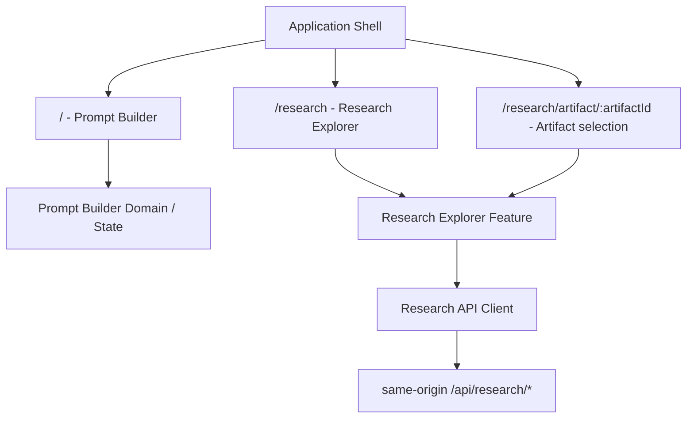
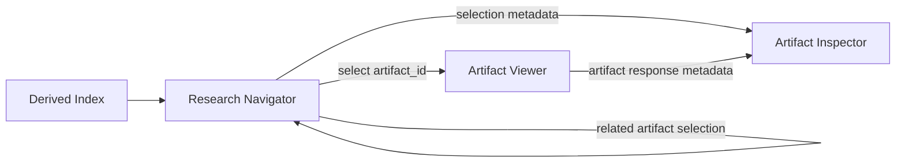

# Research Explorer UI Foundation Design

## 1. 文書の位置づけ

本書は、Local Companion ServiceとRead-only Research APIを利用するResearch Explorer FrontendのArchitecture Designである。実装コード、UI実装、Backend変更、Schema変更、Research Artifact変更は含まない。

Research Explorerは既存Prompt Builderとは別Route・別Domain・別Stateとして設計し、研究Pipelineが生成したArtifactを読み取り専用で探索・表示する。

### 1.1 正本となる既存契約

本書は次の既存文書とSchemaを参照し、それらを変更または再定義しない。

- [Research Explorer Architecture Design](./research-explorer-design.md)
- [Research Explorer Local Companion Service](../../research/sd-prompt-research/docs/research-explorer-companion-service.md)
- [Research Explorer Derived Index Schema](../../research/sd-prompt-research/schemas/research-explorer-index.schema.json)
- [Observation-to-Claim Draft Pipeline Freeze Specification](../../research/sd-prompt-research/docs/specifications/pipelines/observation-to-claim-draft-pipeline-freeze.md)
- [Observation-to-Claim Draft Pipeline Operations](../../research/sd-prompt-research/docs/observation-to-claim-draft-pipeline-operations.md)
- [Research Claim Path Contract](../../research/sd-prompt-research/docs/research-claim-path-contract.md)

競合時は上記の契約が本書より優先される。本書の型名やComponent名はFrontend責務を説明するための設計名であり、新しいResearch Schemaまたは保存契約ではない。

## 2. 目的と成功条件

Research Explorer UIの目的は、利用者がResearch Artifactとその関係、既存Pipelineが確定したStatus、Hash、Version、Diagnosticsを、Source Artifactを変更せず追跡できるようにすることである。

成功条件は次のとおり。

- `/`のPrompt Builderと`/research`のResearch Explorerが明確に分離される。
- NavigatorからArtifactを選択し、Viewerで本文、InspectorでMetadataを確認できる。
- FrontendはLocal Companion Serviceの`/api/research/*`だけを利用する。
- `display_status`、Research/Audit Hash、Source Freshness Fingerprintを再計算しない。
- Prompt Builder StateとResearch Explorer Stateを共有しない。
- Artifact本文をUI StoreまたはPrompt Builderの永続化領域へ保存しない。
- Backend/API Contractに不足がある場合、Frontend側で迂回実装せずIssueとして残す。

## 3. Non-goals

今回の設計および初期Read-only UIでは、次を行わない。

- Claim生成
- Candidate生成
- Evidence、Observation、Human Resolution、Canonical Knowledgeの編集
- Finalize、Promotion、Validatorの実行
- StatusまたはHashの再計算
- ArtifactのSave、Upload、Mutation
- UI Componentからのfilesystemアクセス
- Repository PathをAPI入力として送信
- Pipeline Scriptの直接呼び出し
- Prompt Builder StoreへのResearch State追加
- Graph Viewer、Diff Viewer、Image Viewer、Editorの実装

## 4. Page / Routing Architecture

### 4.1 Route構成

```text
Vite Application
├─ /                              Prompt Builder
├─ /research                      Research Explorer
└─ /research/artifact/:artifactId Research Explorer - Artifact selection
```

既存Vite Application内のRouterを利用する。同じApplication Shellを共有するが、Route配下のDomain、State、Feature、API Clientを分離する。Artifact詳細Routeの`:artifactId`にはopaque `artifact_id`だけを設定し、Source Pathを含めない。



### 4.2 共有可能な領域

- Application Shell
- Theme、Typography、Spacing token
- Route基盤
- Research Domainを知らない汎用Button、Panel、Drawer、Code表示部品
- Focus管理、Keyboard操作、Accessibility utility
- Error Boundaryなどの汎用Application utility

### 4.3 共有しない領域

- Prompt BuilderのZustand Stateおよびpersist領域
- Prompt生成Logic、Tag選択、Group、Modifier
- Research ArtifactのQuery Cacheおよび選択状態
- Research Artifactの解析・Relationship表示Logic
- Prompt BuilderとResearch Explorer間の暗黙State同期

### 4.4 Route State

Routeまたはquery parameterへ含めてよい値は、公開可能なUI Stateに限定する。

- Scope
- opaque `artifact_id`
- Viewer tab

`source_path`、session token、filesystem root、Artifact本文をURLへ含めない。`entity_id`は表示・検索に利用できるが、Artifact取得のAPI keyとして使用しない。

### 4.5 Direct navigation境界

`/research`と`/research/artifact/:artifactId`は既存Vite Application内のRouterで解決する。Frontend独自の別Application、hash Route、filesystem Routeを追加しない。直接読込時はLocal Companion Serviceが提供するVite SPA fallbackを利用する。

## 5. Frontend Responsibility Boundary

### 5.1 Frontendが担当すること

- Derived Indexの取得と表示用Query
- Artifact一覧、Tree、Search、Filter
- Artifact選択
- 選択Artifact本文の取得とread-only表示
- Metadata、Relationship、Diagnosticsの表示
- `display_status`の値とsourceの表示
- 既存Research/Audit HashとFreshness情報の分類表示
- Loading、Empty、Unavailable、Stale、Parse failureの表示
- Responsive LayoutとAccessibility

### 5.2 Frontendが担当しないこと

- Artifact DiscoveryとIndex生成
- Source Path解決、Root containment、symlink判定
- Hash、Fingerprint、Status、Finalize関係の導出
- Receipt、Candidate、Canonical Assertionの整合判定
- Validatorの再実装
- ArtifactまたはPipeline Stateの修復
- Companion Serviceの起動、session token生成、Repository選択

## 6. Backend / API Boundary

正式なData Flowは次の一方向とする。

```text
React Component
    ↓ view event / query request
Research Feature Hook
    ↓ typed client operation
ResearchApiClient
    ↓ same-origin HTTP GET
Local Companion Service
    ↓ secure read / derived index
Research Artifact
```

禁止される経路：

```text
React Component ─X→ filesystem
React Component ─X→ research/sd-prompt-research import
React Component ─X→ Pipeline Script
React Component ─X→ raw Repository Path API
Public Preview  ─X→ localhost Companion Service
```

### 6.1 利用可能なAPI

| Operation | Endpoint | Frontend用途 |
|---|---|---|
| Index取得 | `GET /api/research/index` | Artifact summary、snapshot、relationship、diagnosticの取得 |
| Artifact取得 | `GET /api/research/artifacts/<opaque-artifact-id>` | 選択Artifactのexact bytes取得 |

`POST`、`PUT`、`PATCH`、`DELETE`、`OPTIONS`をFrontendから発行しない。Mutation操作は設計しない。

### 6.2 Session境界

Companion ServiceがFrontendを配信した時点で、HttpOnlyかつ`SameSite=Strict`のsession cookieが設定される。Frontendはtoken値を読まず、同一Origin RequestへBrowserがcookieを付与する方式だけを利用する。

禁止事項：

- session tokenをJavaScriptへ露出する
- tokenをURL、query、localStorage、sessionStorageへ保存する
- CORSを前提とする別Origin Request
- Login Formとしてtoken入力を要求する

### 6.3 Snapshot Header

Artifact取得時は、現在表示中のIndexに含まれる`index_snapshot_id`を次のHeaderへ設定する。

```http
X-Research-Index-Snapshot: snapshot.<sha256>
```

Artifact Responseの次のHeaderは、Request/Response照合とDiagnostics表示に利用できる。

- `X-Research-Artifact-Id`
- `X-Research-Index-Snapshot`
- `ETag`

Header値を新しいResearch Identityとして保存しない。

### 6.4 API Client責務

`ResearchApiClient`だけがHTTP詳細を知る。

- Request URL構築
- same-origin GET
- Snapshot Header付与
- Content-Typeとresponse bytesの受領
- `{ error: { code, message } }`のError Mapping
- Network failureとHTTP failureの分離
- `INDEX_SNAPSHOT_MISMATCH`と`ARTIFACT_STALE`の明示的処理
- AbortSignalによる選択変更時のRequest cancel
- pending / success / error lifecycleをFeature Hookへ返す

ComponentはHTTP status、cookie、Header名を直接扱わない。`useResearchIndexQuery`と`useResearchArtifactQuery`に相当するFeature HookがClientのRequest lifecycleをLoading Stateへ変換し、Client自体はUI Stateを永続保持しない。

### 6.5 Error Mapping

| HTTP / Code | Frontend State | 処理 |
|---|---|---|
| Network failure | `service_unavailable` | 実Dataが空であるように見せず、Companion Service unavailableを表示 |
| 401 `SESSION_REQUIRED` | `session_unavailable` | Artifactを表示せず、Local Companion配信元からの再読込を案内 |
| 403 `HOST_NOT_ALLOWED` | `security_configuration_error` | Host設定問題として表示し、CORS fallbackしない |
| 403 `ORIGIN_NOT_ALLOWED` | `security_configuration_error` | Origin設定問題として表示し、別Originへ切り替えない |
| 404 `ARTIFACT_ID_INVALID` | `artifact_not_found` | 選択を維持し、Index再取得または別Artifact選択を案内 |
| 404 `API_ROUTE_NOT_FOUND` | `api_contract_mismatch` | Unsupported APIとして表示 |
| 409 `INDEX_SNAPSHOT_MISMATCH` | `snapshot_mismatch` | 現在の本文を破棄し、Indexを再取得。新snapshot時だけ1回再試行 |
| 409 `ARTIFACT_STALE` | `artifact_stale` | stale本文を表示せず、Metadataと警告だけを残す |
| 405 `READ_ONLY_API` | `client_contract_error` | UIがMutationを発行した実装不具合として扱う |
| Other structured error | `api_error` | codeとmessageを失わず表示 |

Snapshot再取得後も同じsnapshotで409が続く場合、無限retryしない。Index再生成APIは現契約にないため、再起動・再生成の運用案内に留める。

## 7. Frontend Feature Structure

目標Feature境界は次のとおり。既存Prompt Builderの大規模移動を本設計の前提にしない。

```text
src/
└─ features/
   ├─ prompt-builder/                    # 既存Domainの将来境界
   └─ research-explorer/
      ├─ pages/
      │  └─ ResearchExplorerPage
      ├─ components/
      │  ├─ ResearchWorkspace
      │  ├─ ResearchNavigator
      │  ├─ ArtifactTree
      │  ├─ ArtifactViewer
      │  ├─ ArtifactInspector
      │  ├─ HashBadge
      │  └─ StatusBadge
      ├─ hooks/
      ├─ api/
      │  └─ ResearchApiClient
      ├─ state/
      └─ types/
```

依存方向：

```text
pages → components → hooks → api
                    ↘ state
types はFeature内部から参照可能
```

`api`、`state`、`types`はPrompt BuilderのStoreまたはPrompt生成Moduleをimportしない。UI実装PRではFrontend sourceから`research/sd-prompt-research/**`へのimportを禁止する既存boundary validationを維持する。

## 8. Research Explorer UI Architecture

### 8.1 3ペイン構成

```text
ResearchExplorerPage
└─ ResearchWorkspace
   ├─ ResearchNavigator                 # Left: 探索
   │  ├─ Scope selector
   │  ├─ Search
   │  ├─ Filter
   │  └─ ArtifactTree
   ├─ ArtifactViewer                    # Center: 本文表示
   │  ├─ Artifact header
   │  ├─ Viewer tabs
   │  ├─ Parsed view
   │  ├─ Raw view
   │  └─ Empty / Error / Stale state
   └─ ArtifactInspector                 # Right: 詳細確認
      ├─ Identity
      ├─ Version
      ├─ Display status
      ├─ Research/Audit hashes
      ├─ Source freshness
      ├─ Relationships
      └─ Diagnostics
```



### 8.2 Layout ownership

- `ResearchExplorerPage`: RouteとFeature boundary
- `ResearchWorkspace`: 3ペイン配置とresponsive mode
- 各Pane: 自身のscrollを所有
- Page全体: Artifact本文をscrollさせるための単一巨大scroll containerを持たない
- Prompt BuilderのPane幅、collapse state、Inspector stateを再利用しない

### 8.3 Responsive boundary

DesktopではNavigator / Viewer / Inspectorを同時表示する。狭い画面ではViewerを主画面にし、NavigatorとInspectorをDrawerまたは切替Paneへ退避する。

Responsive切替時も次を維持する。

- selected `artifact_id`
- selected scope
- Viewer tab
- Viewer scroll position
- 展開済みTree Node

具体的なbreakpoint値、Pane幅、resize UIは実装PRで既存Application Shellを確認して決定する。

## 9. Research Navigator Design

### 9.1 目的

NavigatorはArtifactの探索と選択だけを担当し、Artifact本文を保持しない。

### 9.2 対象Scope

- Runs
- Observations
- Drafts
- Candidates
- Canonical Assertions
- Receipts
- Validation Results

Derived Indexの`artifact_type`を正本とする。現在のDerived Indexに正式なExperiment Entityは存在しないため、v1 NavigatorはExperiment階層を表示しない。FrontendがPath、Directory構造、Run、またはArtifact間の類似性からExperimentを推測・生成してはならない。Experiment階層は、将来Index/APIへ正式なEntityとRelationshipが追加された後に対応する。

### 9.3 Tree構築

Treeはfilesystem階層ではなく、Indexの`relationships`とArtifact summaryから構築する。

- Node key: `artifact_id`
- Secondary identity: `entity_id`（存在する場合）
- Label: `display_name`
- State: `display_status.value`と`display_status.source`
- Navigation edge: `relation`、`target_entity_id`、任意の`target_artifact_id`

Incoming Relationshipは同一snapshot内のoutgoing edgeを反転した表示用Viewとして構築できる。新しいRelationshipを永続化せず、参照先が見つからない場合はunresolvedとして残す。

### 9.4 Search / Filter

v1は取得済みIndex summaryだけを対象にclient-side検索する。

- `artifact_id`
- `entity_id`
- `display_name`
- `artifact_type`
- `display_status.value`

Artifact本文の全文検索は行わない。Search query、Filter、expanded nodeはUI Stateであり、Artifactへ保存しない。

## 10. Artifact Viewer Design

### 10.1 目的

Viewerは選択Artifactのexact response bytesをread-only表示する。整形表示とSource原文を明確に区別する。

### 10.2 v1 Viewer対象

| Format | 表示 | v1表示依存 |
|---|---|---|
| JSON | Parsed tree、raw text、copy | JSON表示 |
| YAML | Parsed tree、raw text、copy | YAML parser |
| Markdown | rendered preview、raw text、copy | Markdown renderer |
| Code | syntax highlight、raw text、copy | Syntax highlighter |
| Plain Text | raw text、line表示、copy | 追加parserなし |

JSON表示、YAML parser、Markdown renderer、Code syntax highlightingは、すべてread-onlyの表示adapterとしてだけ使用する。ParserまたはRendererの結果からStatus、Hash、Validation結果、Pipeline State、Research上の分類を生成してはならない。これらはValidatorの代替ではなく、Pipeline Logicを実装しない。

Viewer選択は`media_type`を第一基準とし、必要な場合だけ`source_path`のsuffixを表示adapter選択へ利用する。suffixからResearch上の意味を推測しない。未知またはparse不能なtextはPlain Textへfallbackし、parse成功として扱わない。

Binaryまたは未対応形式では本文を推測デコードせず、Inspector MetadataとUnsupported stateを表示する。

### 10.3 Parsed / Raw境界

- Raw view: APIから受け取ったbytesをdecode可能な範囲で忠実に表示
- Parsed view: 表示専用の構造化結果
- Parse failure: raw viewを維持し、parse diagnosticを表示
- Rendered Markdown: Source原文ではないことをlabelで示す

禁止事項：

- contentEditable
- Save / Apply / Auto Fix
- formatting結果の書き戻し
- mutation endpoint
- ArtifactをPrompt Builderへ暗黙適用

### 10.4 Fetch lifecycle

1. Navigatorが`artifact_id`を選択する。
2. Clientが現在の`index_snapshot_id`をHeaderへ付与する。
3. 新しい選択が発生した場合、前Requestをcancelする。
4. ResponseのArtifact IDとsnapshotを照合する。
5. 成功時だけ本文Cacheへ格納する。
6. 409時は本文をCacheへ格納しない。

## 11. Artifact Inspector Design

Inspectorは選択ArtifactのMetadataを確認する場所であり、Status、Hash、Validationを計算する場所ではない。

### 11.1 表示項目

- Artifact Type
- Artifact ID
- Entity ID
- Source Path（表示のみ。API入力にしない）
- Index Schema Version
- Artifact Schema / Contract Version（APIから利用可能な場合のみ）
- Display Status value / source
- Source Freshness Fingerprint contract / algorithm / value
- Research/Audit Hash name / value / source
- Outgoing / Incoming Relationships
- Artifactに関連付け可能なDiagnostics
- byte size / media type
- Index Snapshot ID / generated at

Schema / Contract VersionまたはHash AlgorithmがAPIから提供されない場合はFrontend Errorにせず、該当項目を`Not Provided`として表示する。Artifact本文から値を推測しない。

### 11.2 Diagnostics

Derived Index Schemaで定義されたcodeをそのまま表示する。

- `ARTIFACT_CHANGED_DURING_READ`
- `ARTIFACT_PARSE_FAILED`
- `ARTIFACT_PATH_OUTSIDE_ROOT`
- `ARTIFACT_READ_FAILED`
- `ARTIFACT_SYMLINK_BROKEN`
- `FINALIZE_BINDING_INVALID`
- `RECEIPT_HASH_MISMATCH`
- `RECEIPT_INVALID`

`artifact_id`または`source_path`で選択Artifactへ関連付けられるDiagnosticはInspectorへ表示し、それ以外はWorkspace-level Diagnosticsとして表示する。Frontendでseverityを再分類しない。

## 12. State Management Design

StateはServer StateとUI Stateへ分離する。

### 12.1 Server State

- Derived Index
- Artifact response bytes
- Response Metadata
- API Error

Server StateはQuery Cache等の揮発性Cacheで管理する。Cache keyには最低限次を含める。

```text
Index:    research-index
Artifact: index_snapshot_id + artifact_id + source_freshness_fingerprint.value
```

Artifact本文をpersistしない。Browser storage、Prompt Builder Store、Saved Promptへ保存しない。

### 12.2 UI State

- selected scope
- selected `artifact_id`
- selected `entity_id`（表示補助）
- expanded Tree Node
- Search query
- Filter
- active Viewer tab
- Navigator / Inspector表示状態
- Inspector section開閉
- Viewer scroll position

UI StateはResearch Artifactではない。必要なRoute State以外はlocal React stateまたはResearch Explorer専用Stateへ置く。

### 12.3 State transition

```mermaid
stateDiagram-v2
    [*] --> LoadingIndex
    LoadingIndex --> IndexReady: GET index success
    LoadingIndex --> ServiceUnavailable: network failure
    IndexReady --> LoadingArtifact: select artifact
    LoadingArtifact --> ArtifactReady: GET artifact success
    LoadingArtifact --> SnapshotMismatch: 409 snapshot mismatch
    LoadingArtifact --> ArtifactStale: 409 stale
    SnapshotMismatch --> LoadingIndex: refetch index
    ArtifactStale --> IndexReady: select another artifact
    ArtifactReady --> LoadingArtifact: select another artifact
```



Prompt Builder Stateとのtransitionは定義しない。Route移動時もPrompt Builder選択をResearch Artifactへ変換しない。

## 13. Component Boundary

| Component | Responsibility | Input | Output / Event | State ownership |
|---|---|---|---|---|
| `ResearchExplorerPage` | `/research` Route、Feature Error Boundary、Page title | Route params、Application Shell context | Route-level retry、Workspace mount | Route Stateのみ |
| `ResearchWorkspace` | Index query、3ペイン配置、Workspace-level state | Research API hooks、responsive context | Pane切替、global retry | selected Artifact、scope、Pane stateの調停 |
| `ResearchNavigator` | Search、Filter、Artifact探索 | Artifact summary、relationship、diagnostic summary | `selectArtifact(artifact_id, entity_id?)` | Search、Filter、expanded node |
| `ArtifactTree` | Tree node表示とkeyboard navigation | Tree view model、selection | select、expand、collapse | transient focusのみ |
| `ArtifactViewer` | Artifact本文のread-only表示 | bytes、media type、fetch state、snapshot | tab change、copy、retry | Viewer tab、scroll、parsed view |
| `ArtifactInspector` | Metadata、Relationship、Diagnostics表示 | selected summary、response metadata、related diagnostics | related Artifact selection、copy | section開閉のみ |
| `ResearchApiClient` | same-origin read-only HTTP、Header、Error Mapping | endpoint operation、artifact ID、snapshot、AbortSignal | typed success / error | stateを保持しない |
| `HashBadge` | Hash分類と省略表示 | exact label、value、source、利用可能なalgorithm | copy full value | なし |
| `StatusBadge` | `display_status`の視覚表示 | value、source | なし | なし |

### 13.1 Component禁止事項

- `ResearchNavigator`: Artifact本文を保持しない。
- `ArtifactViewer`: Save、Mutation、Status計算を行わない。
- `ArtifactInspector`: Validator、Hash、Freshnessを実行しない。
- `HashBadge`: Hashを生成・変換・合成しない。
- `StatusBadge`: Statusを再判定しない。
- `ResearchApiClient`: filesystem adapterまたはraw path APIを持たない。

## 14. Status Display Contract

Statusの正本はDerived Indexの次の構造である。

```json
{
  "display_status": {
    "value": "<server-derived value>",
    "source": "<derivation source>"
  }
}
```

Frontendは`value`と`source`を常に対で保持する。Badge色やIconはpresentation mappingであり、別のStatus値を生成してはならない。

### 14.1 Unknown status

Derived Index Schemaは`display_status.value`をopen stringとしている。未知の値をErrorとして捨てず、neutral badgeでexact valueを表示する。既知値への強制変換、`success`へのfallback、Frontend独自のfinalized判定を行わない。

### 14.2 Freshnessとの分離

`ARTIFACT_STALE`またはFingerprint mismatchは、`display_status`を書き換える理由にしない。Status BadgeとFreshness warningを別表示にする。

## 15. Hash Display Contract

Hashは用途別に明確に分離する。

### 15.1 Research / Audit Hash

Derived Indexが提供する既存Hashだけを表示する。

- `draft_input_identity_hash`
- `candidate_wrapper_artifact_hash_v1`
- `canonical_assertion_artifact_hash_v1`
- `assertion_content_v1_hash`

表示項目：

- exact `name`
- full `value`
- `source`

短縮表示は許可するが、copyとInspectorでは完全値を利用できるようにする。

### 15.2 Source Freshness Fingerprint

Research/Audit Hashと別Section・別Labelで表示する。

- contract: `source_freshness_fingerprint_v1`
- algorithm: `sha256_raw_bytes`
- value

FingerprintをResearch Evidence、Semantic Equality、Claim Identityとして表示しない。

### 15.3 Frontend禁止事項

- UI独自Hash生成
- Hash値のnormalization
- 複数Hashの合成
- Hash名の別名化
- FingerprintをResearch/Audit Hashとして扱う
- Hash一致だけによるFinalize判定

## 16. Loading / Empty / Error Design

次の状態を別々に表現する。

| State | 意味 | 表示原則 |
|---|---|---|
| Initial loading | Index取得中 | Workspace skeleton。空Artifactとは表示しない |
| Empty index | Indexは成功したがArtifact 0件 | Empty stateとsnapshot metadata |
| No search result | Filter結果0件 | Filter解除導線。Index emptyと区別 |
| Service unavailable | Companionへ到達不能 | Local Research Modeが利用不可と明示 |
| Session unavailable | 401 | Companion配信元からのreloadを案内 |
| Artifact missing | Index参照先を取得不能 | Metadataを残し、本文だけUnavailable |
| Parse failure | bytes取得成功、構造化失敗 | Raw表示とparse error |
| Snapshot mismatch | IndexとRequestが不一致 | 本文を破棄してIndex再取得 |
| Artifact stale | SourceがIndex生成後に変更 | stale本文を表示せずFingerprint情報を表示 |
| Unsupported media | v1 Viewer対象外 | Metadataのみ。推測decodeしない |
| Diagnostic present | Index生成時問題 | exact codeと対象を表示 |

Error stateからPipeline、Validator、Index Generatorを自動実行しない。

## 17. Security and Public Preview Boundary

### 17.1 Local Research Mode

- Local Companion Serviceと同一Origin
- session cookieはHttpOnly
- opaque Artifact IDだけをAPI入力にする
- raw path、Repository Root、tokenをRequestへ含めない
- Response ArtifactをBrowser storageへ永続化しない

### 17.2 Public Preview

Cloudflare Pages / GitHub Pagesはfixture-onlyまたは明示的unavailable stateとする。

Public Fixtureが提供されていない場合はFrontend Errorにせず、Research Dataを`Unavailable`として表示する。Frontendが実Artifact、推測データ、または暗黙のsample dataを生成して補完しない。

禁止事項：

- 実Research Artifactをbundleまたは`public/`へ含める
- 公開Previewからlocalhostへ接続する
- localhost URLをproduction fallbackとして埋め込む
- fixtureをCanonical Research Dataとして扱う
- Preview上で実Artifactが空であるように偽装する

## 18. Accessibility and Interaction

- ArtifactTreeはkeyboardでfocus、expand、collapse、selectできること。
- Scope、Filter、Viewer tabは現在状態をARIAで表現すること。
- StatusとDiagnosticは色だけに依存しないこと。
- Hashのcopy actionには完全なlabelを付けること。
- Drawer化したNavigator / Inspectorはfocus trapと復帰先を持つこと。
- Loading、Error、Staleの更新は適切なlive regionで通知すること。
- Raw Viewerは長い行と大きなArtifactに対して横・縦scrollを分離すること。

## 19. Contract Availability and Future Issue Candidates

Frontend都合で既存Contractを変更しない。APIから提供されない情報は取得失敗と区別し、`Not Provided`または`Unavailable`として表示する。提供を必須にする将来要件が生じた場合だけ、Index/API側のIssueとして整理する。

### 19.1 Artifact単位Schema Version

Derived IndexにはIndex自体の`schema_version`はあるが、ArtifactごとのSchema / Contract Versionを正規化したFieldはない。FrontendはArtifact本文から推測して統一表示せず、未提供の場合は`Not Provided`と表示する。正規化が必要ならIndex/API Issueとする。

### 19.2 Research/Audit Hash Algorithm Metadata

`research_audit_hashes`は`name`、`value`、`source`を持つが、algorithm Fieldを持たない。Frontendでcontract semanticsを複製せず、exact contract nameを表示し、Algorithmは`Not Provided`と表示する。Algorithmの構造表示が必須ならSchema/API Issueとする。

### 19.3 Stale後のIndex更新

`ARTIFACT_STALE`を返した後に、同一Service process内でIndexを再生成するread-only Refresh APIはない。Refresh操作を`Unavailable`として扱い、Frontend Errorにはしない。Frontendは無限retryまたはfilesystem fallbackを実装せず、運用上の再生成・再起動案内を表示する。自動refreshが必要ならCompanion Service Issueとする。

### 19.4 Public Fixture

Public Preview用Fixtureが提供されない構成を許容する。この場合はResearch Dataを`Unavailable`として表示し、Local Research Modeの障害として扱わない。

### 19.5 Experiment Entity

Derived Index/APIに正式なExperiment Entityが追加されるまで、v1 NavigatorはExperiment階層を表示しない。FrontendによるPathまたはRunベースの推測階層は追加しない。

### 19.6 Large Artifact

Artifact APIはexact bytesを一括返却する。pagination、range、streaming contractはない。v1は既存上限内でread-only表示し、大規模Artifact対応はAPI Contract Issueとして分離する。

## 20. Future Extension Boundary

今回の対象外として、後続PRへ残す。

- Claim Draft Editor
- Human Resolution UI
- Evidence Inspector
- Validation Dashboard
- Graph Explorer
- Diff Viewer
- Image Viewer
- Cross-run comparison
- Large Artifact pagination / streaming
- Agent Integration

後続の編集機能も、Read-only ViewerへMutationを混在させず、専用Route、専用API Contract、専用Authorization boundaryを必要とする。Human Resolution UIは既存PR69/PR71 Contractに従い、Canonical Assertionを直接編集しない。

## 21. Contract Preservation Checklist

本設計の実装・レビュー時に次を確認する。

- [ ] PR69 Freeze Contractを変更していない。
- [ ] PR71 Observation-to-Claim Pipeline Contractを変更していない。
- [ ] PR73 Research Explorer Architectureを変更していない。
- [ ] PR75 Companion Service / API Contractを変更していない。
- [ ] Derived Index Schemaを変更していない。
- [ ] Research Claim / Observation Schemaを変更していない。
- [ ] Canonical Research Dataを変更していない。
- [ ] UIからfilesystemまたはPipeline Scriptへアクセスしていない。
- [ ] Prompt Builder StateとResearch Explorer Stateを共有していない。
- [ ] Status、Hash、FingerprintをFrontendで再計算していない。
- [ ] Artifact本文をUI Storeへ永続保存していない。
- [ ] Public Previewへ実Research Dataを含めていない。

## 22. 今回のDeliverable

今回作成するのは本設計文書だけである。

```text
docs/research/research-explorer-ui-design.md
```

Frontend code、UI、Route、Store、API Client、Backend、Schema、Validator、Pipeline、Canonical Research Dataは変更しない。
